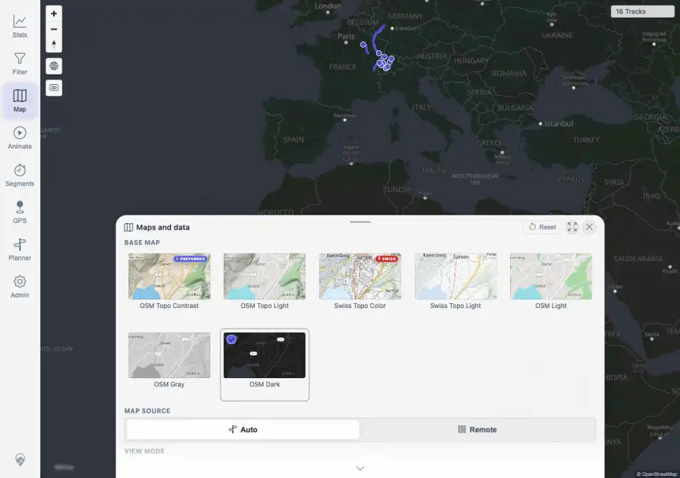
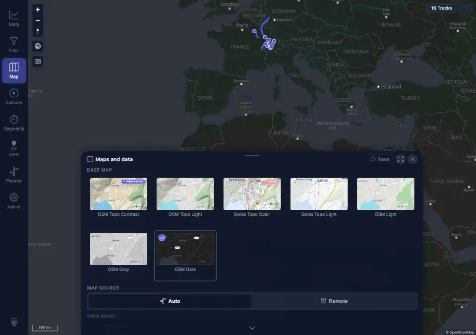

# Packet: APP_06

## Scope

- Coverage source: `documentation/testing/frontend-regression-test-plan.md`
- Coverage ID or run packet: APP_06
- In scope: Selecting each available base map style under both light and dark UI themes.
- Out of scope: Map-style persistence after reload; covered by APP_07.

## Prerequisites

- Required previous coverage IDs or run packets: APP_05 terminal.
- Required app/data state: Authenticated desktop map with Map settings reachable.
- Required browser context: Desktop Chromium against the remote target.

## Allowed Mutations

- Allowed: Change local UI theme and map style preferences.
- Not allowed: Change track data or server configuration.

## Actions And Results

| Coverage ID | Action | Expected result | Actual result | Status | Evidence |
|---|---|---|---|---|---|
| APP_06 | In Light UI mode and then Dark UI mode, opened Maps and data and selected all seven available base map styles: OSM Topo Contrast, OSM Topo Light, Swiss Topo Color, Swiss Topo Light, OSM Light, OSM Gray, and OSM Dark. | Map theme is independent: each available map style can be selected with either UI theme. | PASS. All 14 UI-theme/map-style combinations selected successfully. Each selection left the requested UI theme unchanged, marked the requested map-style tile active, saved the expected `mtl.map.settings.theme` code, and kept the map canvases rendered. | PASS | [assets/APP_06-map-theme-independence.txt](../assets/APP_06-map-theme-independence.txt); [assets/APP_06-light-all-map-styles.webp](../assets/APP_06-light-all-map-styles.webp); [assets/APP_06-dark-all-map-styles.webp](../assets/APP_06-dark-all-map-styles.webp) |

## Issues

| ID | Severity | Summary | Reproduction | Expected | Actual | Evidence | Release impact |
|---|---|---|---|---|---|---|---|
|  |  |  |  |  |  |  |  |

## Evidence Files

| File | Purpose |
|---|---|
| [assets/APP_06-map-theme-independence.txt](../assets/APP_06-map-theme-independence.txt) | Matrix of all 14 UI-theme/map-style selection assertions. |
| [assets/APP_06-light-all-map-styles.webp](../assets/APP_06-light-all-map-styles.webp) | Light UI after the map-style matrix. |
| [assets/APP_06-dark-all-map-styles.webp](../assets/APP_06-dark-all-map-styles.webp) | Dark UI after the map-style matrix. |

## Screenshot Evidence

## Timings

| Step | Timing |
|---|---:|
| 14 map-style selections | ~1 min |

## Handoff Notes

- Completed: APP_06 is terminal PASS.
- Remaining unfinished coverage: APP_07 onward.
- Blocked or not applicable: none.
- State left for the next packet: Authenticated desktop browser remains in dark UI mode with map style `OSM Dark`.
