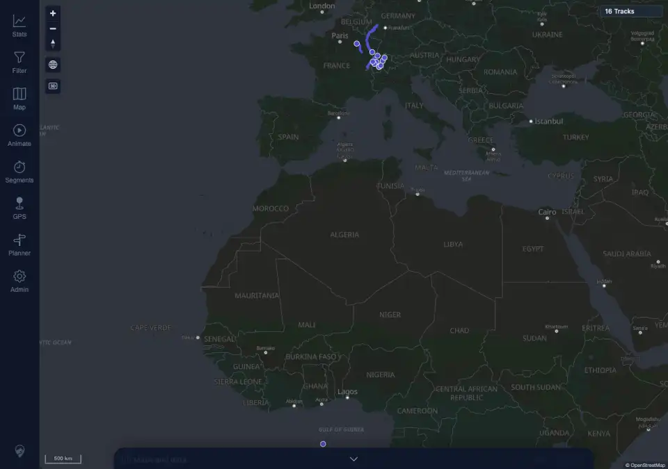

# Packet: APP_07

## Scope

- Coverage source: `documentation/testing/frontend-regression-test-plan.md`
- Coverage ID or run packet: APP_07
- In scope: Persisting the selected base map style across reload.
- Out of scope: Selecting every map style; covered by APP_06.

## Prerequisites

- Required previous coverage IDs or run packets: APP_06 terminal.
- Required app/data state: Authenticated desktop browser with map style `OSM Dark` selected.
- Required browser context: Desktop Chromium against the remote target.

## Allowed Mutations

- Allowed: Reload the browser page and open Map settings.
- Not allowed: Change track data or server configuration.

## Actions And Results

| Coverage ID | Action | Expected result | Actual result | Status | Evidence |
|---|---|---|---|---|---|
| APP_07 | Verified `mtl.map.settings.theme` was `dark`, reloaded the page, waited for the map, opened Maps and data, and checked the active tile. | Selected map style persists across reload. | PASS. Before reload, after reload, and after opening Map settings, stored map theme remained `dark`; the active map-style tile was `OSM Dark`; canvases remained rendered and no page/console errors occurred. | PASS | [assets/APP_07-map-style-persistence.txt](../assets/APP_07-map-style-persistence.txt); [assets/APP_07-map-style-after-reload.webp](../assets/APP_07-map-style-after-reload.webp) |

## Issues

| ID | Severity | Summary | Reproduction | Expected | Actual | Evidence | Release impact |
|---|---|---|---|---|---|---|---|
|  |  |  |  |  |  |  |  |

## Evidence Files

| File | Purpose |
|---|---|
| [assets/APP_07-map-style-persistence.txt](../assets/APP_07-map-style-persistence.txt) | Stored theme and active tile checks before and after reload. |
| [assets/APP_07-map-style-after-reload.webp](../assets/APP_07-map-style-after-reload.webp) | Map settings after reload with `OSM Dark` active. |

## Screenshot Evidence

## Timings

| Step | Timing |
|---|---:|
| Map-style reload check | <1 min |

## Handoff Notes

- Completed: APP_07 is terminal PASS.
- Remaining unfinished coverage: APP_08 onward.
- Blocked or not applicable: none.
- State left for the next packet: Authenticated desktop browser remains in dark UI mode with map style `OSM Dark`.
