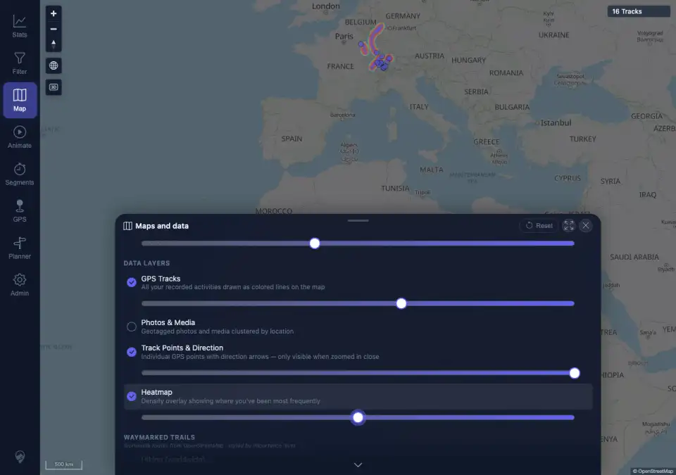
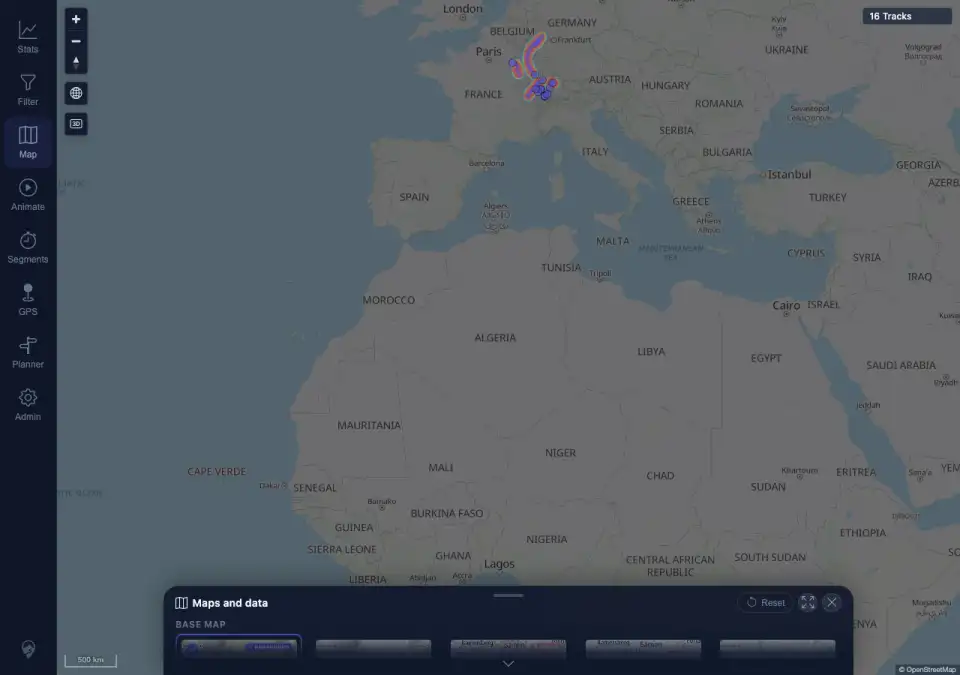
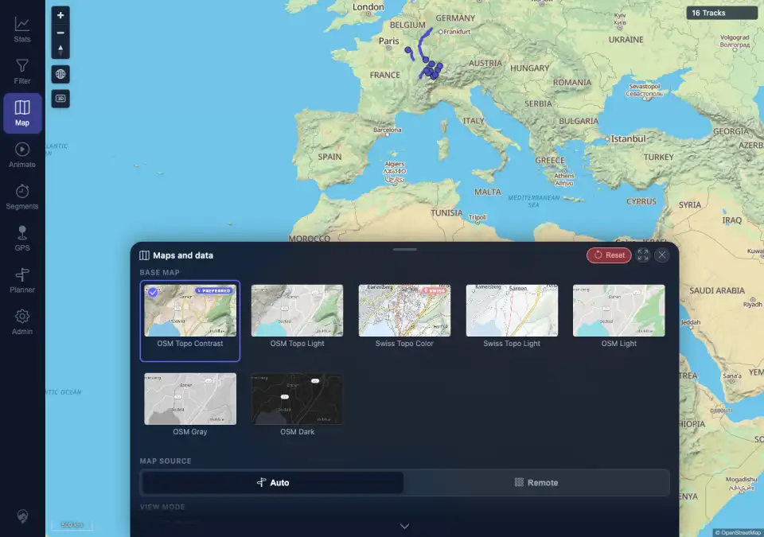

# Packet: APP_08

## Scope

- Coverage source: `documentation/testing/frontend-regression-test-plan.md`
- Coverage ID or run packet: APP_08
- In scope: Layer opacity sliders, basemap dimming, persistence after reload, and Reset defaults.
- Out of scope: Overlay-specific route layer behavior; covered by HMO packets.

## Prerequisites

- Required previous coverage IDs or run packets: APP_07 terminal.
- Required app/data state: Authenticated desktop map with Maps and data reachable.
- Required browser context: Desktop Chromium against the remote target.

## Allowed Mutations

- Allowed: Change and reset local map settings preferences.
- Not allowed: Change track data or server configuration.

## Actions And Results

| Coverage ID | Action | Expected result | Actual result | Status | Evidence |
|---|---|---|---|---|---|
| APP_08 | Opened Maps and data, set Base Map opacity to 40, GPS Tracks to 60, enabled Heatmap and set it to 50 using keyboard slider controls, reloaded, then clicked Reset. | Layer opacity sliders, basemap dimming, and reset-to-defaults all behave and persist. | PASS. Custom settings saved as basemap `40`, tracks `60`, heatmap `50`, `heatmapVisible=true`; `.map-base` dimmed to opacity `0.4` with `grayscale(0.6) brightness(1.24)`. After reload the same values and dimming persisted. Reset restored `topo-contrast`, `auto`, heatmap hidden, all tested opacities to `100`, and basemap style to opacity `1` / `filter: none`. | PASS | [assets/APP_08-layer-opacity-reset.txt](../assets/APP_08-layer-opacity-reset.txt); [assets/APP_08-custom-opacities.webp](../assets/APP_08-custom-opacities.webp); [assets/APP_08-persisted-opacities.webp](../assets/APP_08-persisted-opacities.webp); [assets/APP_08-after-reset.webp](../assets/APP_08-after-reset.webp) |

## Issues

| ID | Severity | Summary | Reproduction | Expected | Actual | Evidence | Release impact |
|---|---|---|---|---|---|---|---|
|  |  |  |  |  |  |  |  |

## Evidence Files

| File | Purpose |
|---|---|
| [assets/APP_08-layer-opacity-reset.txt](../assets/APP_08-layer-opacity-reset.txt) | Slider values, persisted storage, basemap dimming style, and reset assertions. |
| [assets/APP_08-custom-opacities.webp](../assets/APP_08-custom-opacities.webp) | Custom opacity settings in Maps and data. |
| [assets/APP_08-persisted-opacities.webp](../assets/APP_08-persisted-opacities.webp) | Same custom opacities after reload. |
| [assets/APP_08-after-reset.webp](../assets/APP_08-after-reset.webp) | Defaults after Reset. |

## Screenshot Evidence

## Timings

| Step | Timing |
|---|---:|
| Opacity, reload, and reset check | <1 min |

## Handoff Notes

- Completed: APP_08 is terminal PASS.
- Remaining unfinished coverage: LOC_01 onward.
- Blocked or not applicable: none.
- State left for the next packet: Authenticated desktop browser remains in dark UI mode with map settings reset to defaults.
