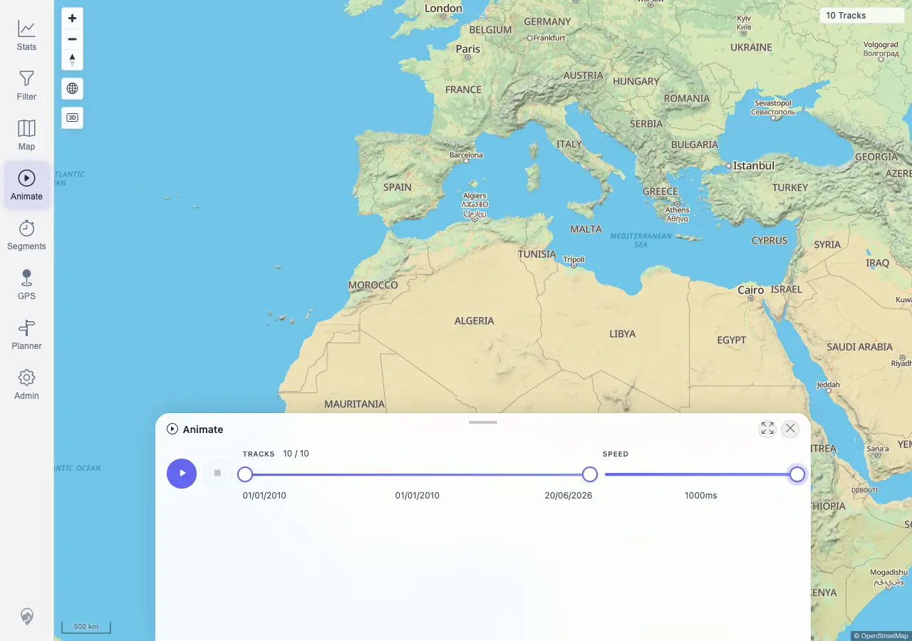
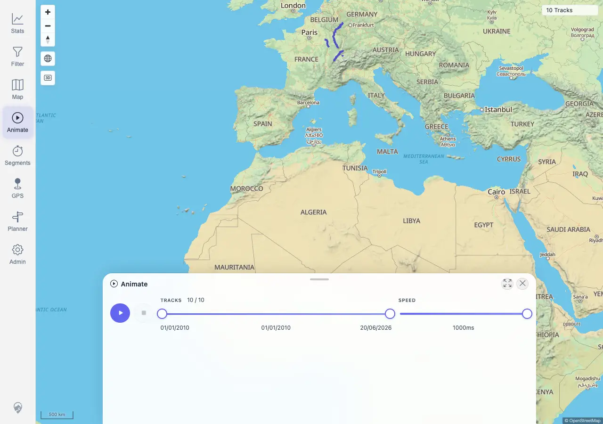

# Packet: AVR_01

## Scope

- Coverage source: `documentation/testing/frontend-regression-test-plan.md`
- Coverage ID or run packet: AVR_01
- In scope: Standalone Animate tool playback, pause, reset/stop, and speed control.
- Out of scope: Segment-based virtual race, covered by AVR_02 and AVR_04.

## Prerequisites

- Required previous coverage IDs or run packets: MCT_06
- Required app/data state: Imported tracks visible on the map.
- Required browser context: Authenticated desktop browser context against `http://178.104.209.132:18080/mtl/`.

## Allowed Mutations

- Allowed: Open Animate, change temporary animation speed, start/pause/resume/stop playback.
- Not allowed: Modify imported track metadata or persisted application data.

## Actions And Results

| Coverage ID | Action | Expected result | Actual result | Status | Evidence |
|---|---|---|---|---|---|
| AVR_01 | Opened Animate, set playback speed to `1000ms`, clicked Play, Pause, Play again, and Stop. | Tracks play back smoothly; pause, reset/stop, and speed controls work. | PASS. Animate opened with `10 / 10` tracks. Speed changed to `1000ms`. Play changed the button to `Pause animation`, enabled Stop, advanced visible count to `2 / 10`, and showed playhead `left: 11.1111%`. Pause returned the button to `Play animation`; resume advanced to `3 / 10` and playhead `left: 22.2222%`; Stop reset to `10 / 10`, removed the playhead, and disabled Stop. | PASS | [assets/AVR_01-animation-controls.txt](../assets/AVR_01-animation-controls.txt); [assets/AVR_01-speed-slow.webp](../assets/AVR_01-speed-slow.webp); [assets/AVR_01-playing.webp](../assets/AVR_01-playing.webp); [assets/AVR_01-paused.webp](../assets/AVR_01-paused.webp); [assets/AVR_01-resumed.webp](../assets/AVR_01-resumed.webp); [assets/AVR_01-stopped-reset.webp](../assets/AVR_01-stopped-reset.webp) |

## Issues

| ID | Severity | Summary | Reproduction | Expected | Actual | Evidence | Release impact |
|---|---|---|---|---|---|---|---|
|  |  |  |  |  |  |  |  |

## Evidence Files

| File | Purpose |
|---|---|
| [assets/AVR_01-animation-controls.txt](../assets/AVR_01-animation-controls.txt) | Control-state log and assertions for speed/play/pause/resume/stop. |
| [assets/AVR_01-speed-slow.webp](../assets/AVR_01-speed-slow.webp) | Animate open with speed set to `1000ms`. |
| [assets/AVR_01-playing.webp](../assets/AVR_01-playing.webp) | Playback running with visible playhead. |
| [assets/AVR_01-paused.webp](../assets/AVR_01-paused.webp) | Playback paused. |
| [assets/AVR_01-resumed.webp](../assets/AVR_01-resumed.webp) | Playback resumed and advanced. |
| [assets/AVR_01-stopped-reset.webp](../assets/AVR_01-stopped-reset.webp) | Playback stopped/reset to full range. |

## Screenshot Evidence

## Timings

| Step | Timing |
|---|---:|
| Open Animate, set speed, play/pause/resume/stop | ~9 s |

## Handoff Notes

- Completed: AVR_01 passed for standalone Animate playback controls and speed control.
- Remaining unfinished coverage: AVR_02 onward.
- Blocked or not applicable: None for AVR_01.
- State left for the next packet: Browser context closed; Animate was stopped/reset.
