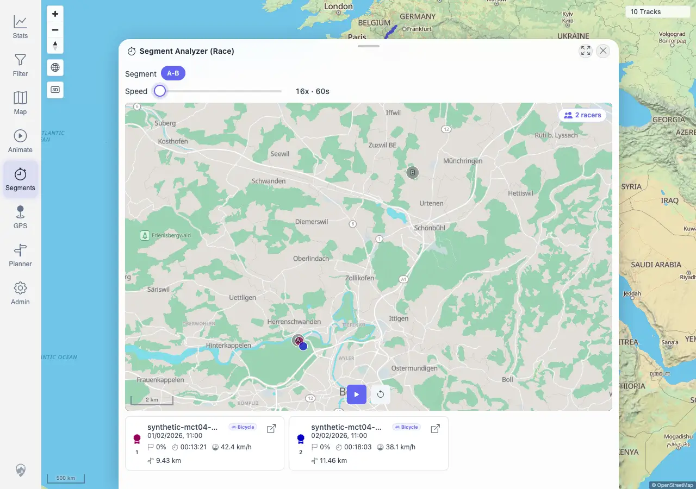
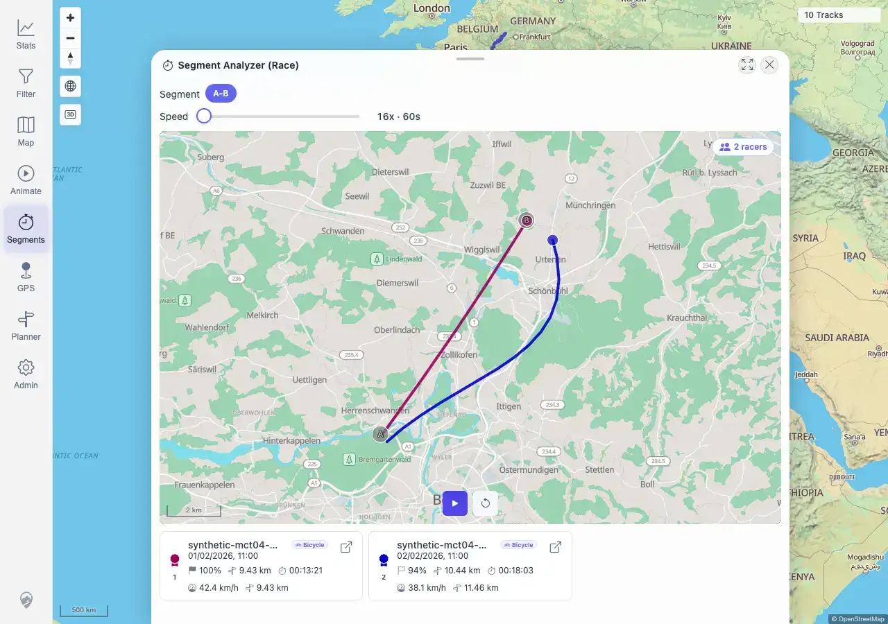

# Packet: AVR_02

## Scope

- Coverage source: `documentation/testing/frontend-regression-test-plan.md`
- Coverage ID or run packet: AVR_02
- In scope: Segment Analyzer virtual race with multiple racers, playback, ranking/racer-card progress, and mini-map rendering.
- Out of scope: Standalone Animate tool covered by AVR_01; post-stop usability covered by AVR_03; race geometry regression covered by AVR_04.

## Prerequisites

- Required previous coverage IDs or run packets: AVR_01, MCT_04
- Required app/data state: Synthetic shared-zone tracks `100017` and `100018` are imported.
- Required browser context: Authenticated desktop browser context against `http://178.104.209.132:18080/mtl/`.

## Allowed Mutations

- Allowed: Recreate temporary Segment Analyzer zones, open Race, adjust race playback speed, start/pause race.
- Not allowed: Modify imported track metadata or delete tracks.

## Actions And Results

| Coverage ID | Action | Expected result | Actual result | Status | Evidence |
|---|---|---|---|---|---|
| AVR_02 | Recreated the two-track A/B Segment Analyzer result, opened Race, set playback to the `60s` slow setting, started the race, sampled running state twice, then paused. | Multiple racers move together; ranking and racer cards update in real time. | PASS. Race opened on segment `A-B` with `2 racers`, a `896x567` mini-map, and two racer cards. Starting switched the play icon to pause. Racer progress moved from `0%/0%` to `4%/3%`, then to `68%/50%`; pausing restored the play icon with progress still visible (`100%/94%`). | PASS | [assets/AVR_02-virtual-race.txt](../assets/AVR_02-virtual-race.txt); [assets/AVR_02-results-before-race.webp](../assets/AVR_02-results-before-race.webp); [assets/AVR_02-race-ready.webp](../assets/AVR_02-race-ready.webp); [assets/AVR_02-race-running.webp](../assets/AVR_02-race-running.webp); [assets/AVR_02-race-paused.webp](../assets/AVR_02-race-paused.webp) |

## Issues

| ID | Severity | Summary | Reproduction | Expected | Actual | Evidence | Release impact |
|---|---|---|---|---|---|---|---|
|  |  |  |  |  |  |  |  |

## Evidence Files

| File | Purpose |
|---|---|
| [assets/AVR_02-virtual-race.txt](../assets/AVR_02-virtual-race.txt) | Race ready/running/paused state log and assertions. |
| [assets/AVR_02-results-before-race.webp](../assets/AVR_02-results-before-race.webp) | Segment Analyzer result before opening Race. |
| [assets/AVR_02-race-ready.webp](../assets/AVR_02-race-ready.webp) | Race ready with two racers. |
| [assets/AVR_02-race-running.webp](../assets/AVR_02-race-running.webp) | Race running with progress. |
| [assets/AVR_02-race-paused.webp](../assets/AVR_02-race-paused.webp) | Race paused with progress preserved. |

## Screenshot Evidence

## Timings

| Step | Timing |
|---|---:|
| Recreate Segment Analyzer result and open Race | ~8 s |
| Race playback sampling and pause | ~5 s |

## Handoff Notes

- Completed: AVR_02 passed for multi-racer virtual race playback, progress updates, pause state, and mini-map rendering.
- Remaining unfinished coverage: AVR_03 onward.
- Blocked or not applicable: None for AVR_02.
- State left for the next packet: Browser context closed; no data mutation.
