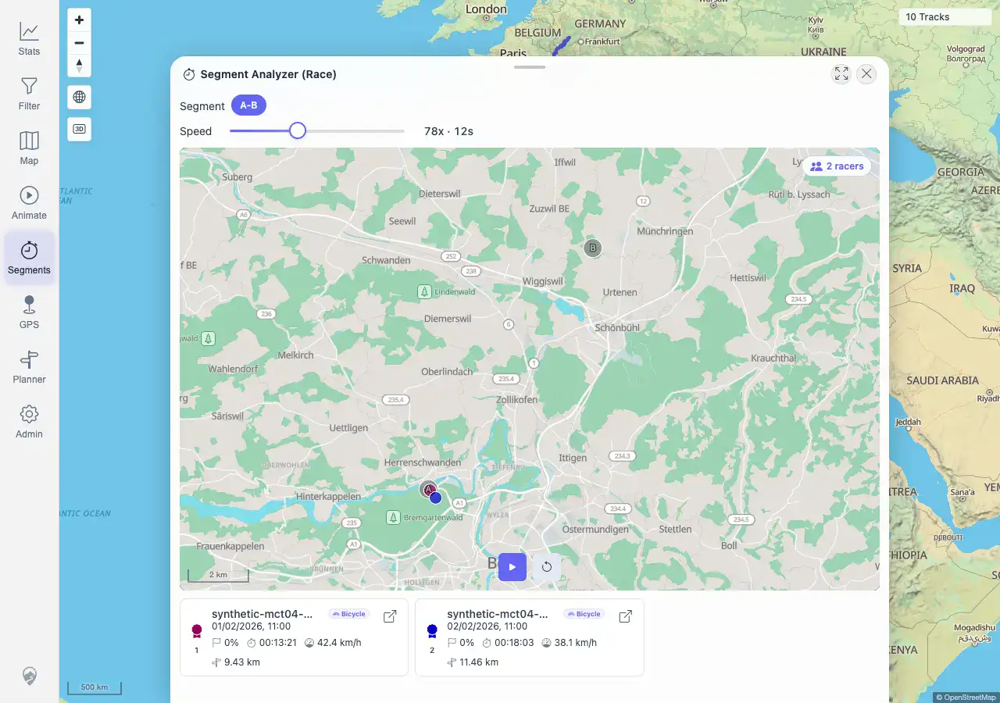
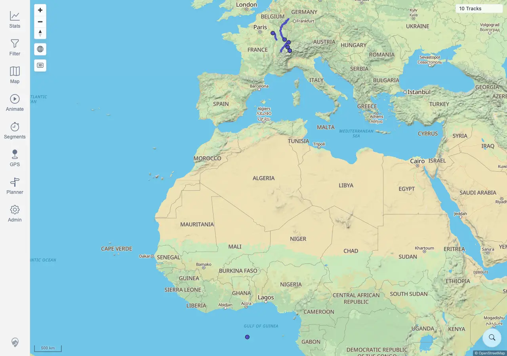
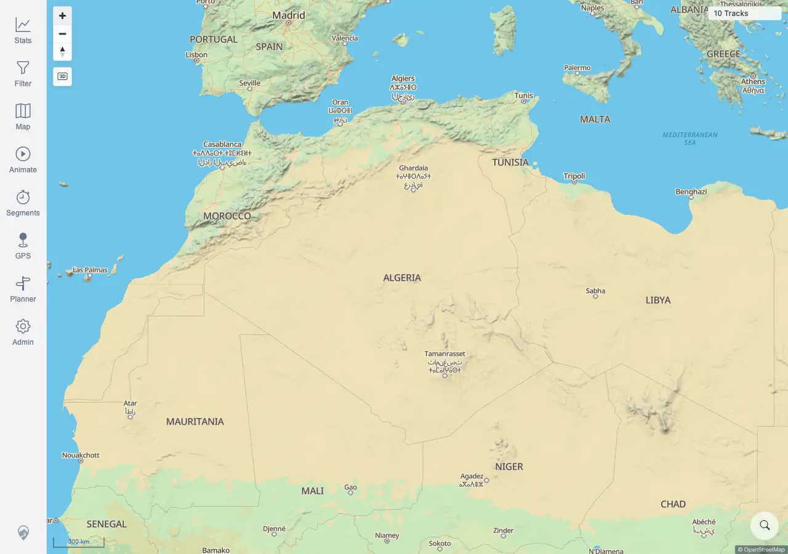
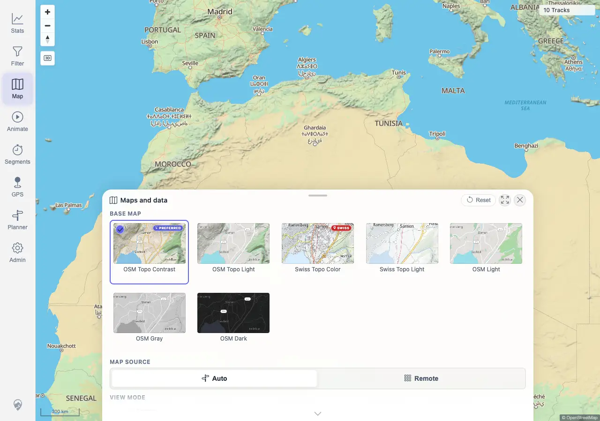

# Packet: AVR_03

## Scope

- Coverage source: `documentation/testing/frontend-regression-test-plan.md`
- Coverage ID or run packet: AVR_03
- In scope: Verify stopping/resetting a race and closing sheets leaves map gestures and tools usable.
- Out of scope: Race progress/ranking covered by AVR_02 and race geometry regression covered by AVR_04.

## Prerequisites

- Required previous coverage IDs or run packets: AVR_02
- Required app/data state: Synthetic shared-zone tracks `100017` and `100018` are imported.
- Required browser context: Authenticated desktop browser context against `http://178.104.209.132:18080/mtl/`.

## Allowed Mutations

- Allowed: Recreate temporary Segment Analyzer Race, start/reset it, close sheets, zoom the map, and open Map settings.
- Not allowed: Modify imported track metadata or delete tracks.

## Actions And Results

| Coverage ID | Action | Expected result | Actual result | Status | Evidence |
|---|---|---|---|---|---|
| AVR_03 | Recreated the synthetic A/B virtual race, started it briefly, clicked Reset, closed the stacked Race/Segment Analyzer sheets with Escape, clicked map Zoom In, then opened Map settings. | Stopping or finishing animation/race leaves map gestures and tools usable with no stuck markers, listeners, or panels. | PASS. Reset returned both racer cards to `0%`. Closing the stack returned to `/mtl/` with no open sheets, Race UI, result table, or measure sheet. Zoom In changed scale `500 km` to `300 km`, and the Map tool opened `/mtl/map-settings` with map controls visible. | PASS | [assets/AVR_03-post-race-usability.txt](../assets/AVR_03-post-race-usability.txt); [assets/AVR_03-race-reset.webp](../assets/AVR_03-race-reset.webp); [assets/AVR_03-sheets-closed.webp](../assets/AVR_03-sheets-closed.webp); [assets/AVR_03-map-zoomed.webp](../assets/AVR_03-map-zoomed.webp); [assets/AVR_03-map-tool-opened.webp](../assets/AVR_03-map-tool-opened.webp) |

## Issues

| ID | Severity | Summary | Reproduction | Expected | Actual | Evidence | Release impact |
|---|---|---|---|---|---|---|---|
|  |  |  |  |  |  |  |  |

## Evidence Files

| File | Purpose |
|---|---|
| [assets/AVR_03-post-race-usability.txt](../assets/AVR_03-post-race-usability.txt) | Reset, close, zoom, Map-tool state, and assertions. |
| [assets/AVR_03-race-reset.webp](../assets/AVR_03-race-reset.webp) | Race reset state with racer progress back to zero. |
| [assets/AVR_03-sheets-closed.webp](../assets/AVR_03-sheets-closed.webp) | Race/result/measure sheets closed. |
| [assets/AVR_03-map-zoomed.webp](../assets/AVR_03-map-zoomed.webp) | Map zoom control changed scale. |
| [assets/AVR_03-map-tool-opened.webp](../assets/AVR_03-map-tool-opened.webp) | Map settings opened after race cleanup. |

## Screenshot Evidence

## Timings

| Step | Timing |
|---|---:|
| Recreate race, reset, close, zoom, open Map settings | ~13 s |

## Handoff Notes

- Completed: AVR_03 passed for race cleanup and post-race map/tool usability.
- Remaining unfinished coverage: AVR_04 onward.
- Blocked or not applicable: None for AVR_03.
- State left for the next packet: Browser context closed; map returned to usable state.
