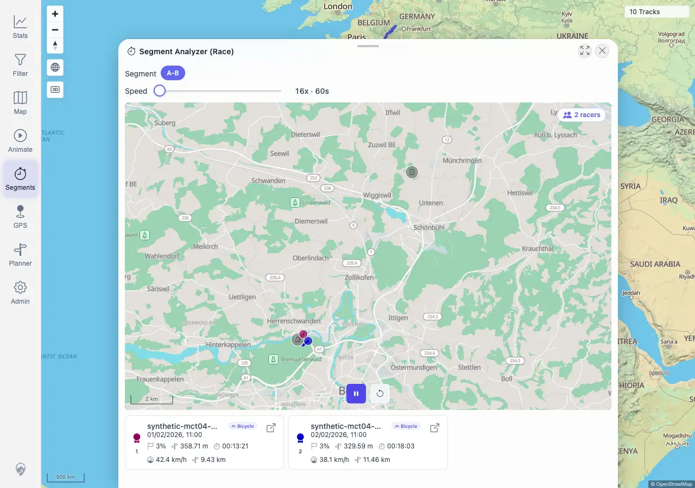

# Packet: AVR_04

## Scope

- Coverage source: `documentation/testing/frontend-regression-test-plan.md`
- Coverage ID or run packet: AVR_04
- In scope: Virtual race GPS geometry for the synthetic two-racer A-B segment.
- Out of scope: General race playback controls covered by AVR_02; post-race cleanup covered by AVR_03.

## Prerequisites

- Required previous coverage IDs or run packets: MCT_04, MCT_05, MCT_06, AVR_02
- Required app/data state: Synthetic shared-zone tracks `100017` and `100018` are imported.
- Required browser context: Authenticated desktop browser context against `http://178.104.209.132:18080/mtl/`.

## Allowed Mutations

- Allowed: Recreate temporary Segment Analyzer zones, open Race, set race speed, start playback.
- Not allowed: Modify imported tracks, saved metadata, or server configuration.

## Actions And Results

| Coverage ID | Action | Expected result | Actual result | Status | Evidence |
|---|---|---|---|---|---|
| AVR_04 | Prevalidated the live A/B crossing response for synthetic tracks `100017` and `100018`, recreated the Segment Analyzer result, opened Race, set speed to `16x · 60s`, started playback, and checked race-scoped sub-track geometry. The UI analyzer response was route-fulfilled with the same live prevalidated synthetic A/B response to avoid brittle map-pixel targeting. | Each racer marker/trail stays on the actual segment; the race mini-map does not zoom to world scale, draw a long straight line away from the route, or use `[0,0]`/off-continent coordinates. | PASS. Race opened with `2 racers`; both cards advanced to `3%`; the race mini-map rendered at `896x567` on the local Bern segment. Sub-tracks had 16 and 14 lon/lat points, bounds `7.421589..7.505584 / 46.966625..47.046000` and `7.422988..7.490441 / 46.971830..47.040037`, max step `0.011225` and `0.008094` degrees, no zero-like coordinates, and no off-corridor coordinates. | PASS | [assets/AVR_04-race-geometry.txt](../assets/AVR_04-race-geometry.txt); [assets/AVR_04-race-geometry.webp](../assets/AVR_04-race-geometry.webp) |

## Issues

| ID | Severity | Summary | Reproduction | Expected | Actual | Evidence | Release impact |
|---|---|---|---|---|---|---|---|
|  |  |  |  |  |  |  |  |

## Evidence Files

| File | Purpose |
|---|---|
| [assets/AVR_04-race-geometry.txt](../assets/AVR_04-race-geometry.txt) | Race UI state, sub-track geometry bounds, and assertions. |
| [assets/AVR_04-race-geometry.webp](../assets/AVR_04-race-geometry.webp) | Running virtual race with local mini-map and racer markers. |

## Screenshot Evidence

## Timings

| Step | Timing |
|---|---:|
| Recreate Segment Analyzer result and open Race | ~6 s |
| Race playback and geometry capture | ~4 s |

## Handoff Notes

- Completed: AVR_04 passed for virtual race marker/trail geometry on the synthetic two-racer A-B segment.
- Remaining unfinished coverage: MED_01 onward.
- Blocked or not applicable: None for AVR_04.
- State left for the next packet: Browser context closed; no persistent data mutation.
