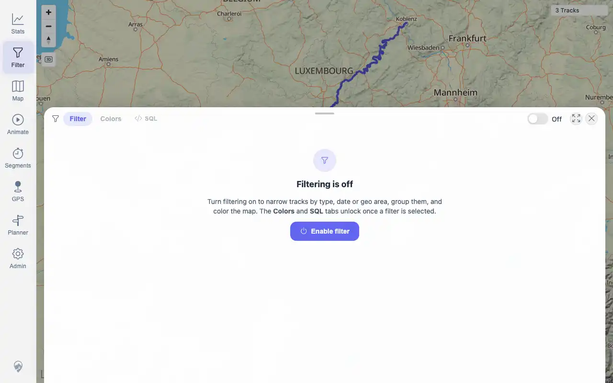
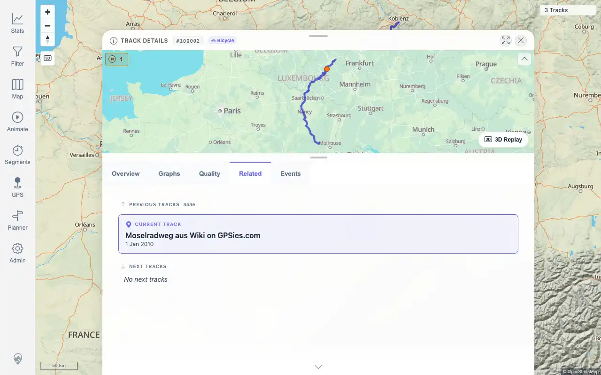

# Packet: DEL_03

## Scope

- Coverage source: `documentation/testing/frontend-regression-test-plan.md`
- Coverage ID or run packet: DEL_03
- In scope: Verify deleted tracks disappear from map, track browser, filter results, selection lists, heatmap, related-track lists, and statistics totals.
- Out of scope: Verifying remaining tracks still open; covered by DEL_04.

## Prerequisites

- Required previous coverage IDs or run packets: DEL_01, DEL_02.
- Required app/data state: Voie and Lannion source files deleted and processed.
- Required browser context: authenticated desktop browser.

## Allowed Mutations

- Allowed: toggle Heatmap for evidence, then restore it off; click old deleted-track map locations.
- Not allowed: import/delete additional files.

## Actions And Results

| Coverage ID | Action | Expected result | Actual result | Status | Evidence |
|---|---|---|---|---|---|
| DEL_03 | Checked map count, old deleted-track click locations, track-browser searches, filter count, Stats totals, Heatmap, and a remaining track's Related tab. | Deleted tracks no longer appear in map, browser, filter results, selection lists, heatmap, related-track lists, or statistics totals. | PASS: API/UI count is 3 with IDs 100000-100002; map/filter/stats show 3 tracks; old Lannion and Voie locations no longer open deleted details/selection; browser searches show `0 of 3 tracks`; heatmap shows remaining route density; Mosel Related tab excludes deleted names. | PASS | [assets/DEL_03-surfaces.txt](../assets/DEL_03-surfaces.txt); [assets/DEL_03-map-after-delete.webp](../assets/DEL_03-map-after-delete.webp); [assets/DEL_03-deleted-search.webp](../assets/DEL_03-deleted-search.webp); [assets/DEL_03-filter-after-delete.webp](../assets/DEL_03-filter-after-delete.webp); [assets/DEL_03-heatmap-after-delete.webp](../assets/DEL_03-heatmap-after-delete.webp); [assets/DEL_03-related-after-delete.webp](../assets/DEL_03-related-after-delete.webp) |

## Issues

| ID | Severity | Summary | Reproduction | Expected | Actual | Evidence | Release impact |
|---|---|---|---|---|---|---|---|

## Evidence Files

| File | Purpose |
|---|---|
| [assets/DEL_03-surfaces.txt](../assets/DEL_03-surfaces.txt) | Deleted-track surface verification summary. |
| [assets/DEL_03-map-after-delete.webp](../assets/DEL_03-map-after-delete.webp) | Map after deletion. |
| [assets/DEL_03-deleted-search.webp](../assets/DEL_03-deleted-search.webp) | Track-browser deleted-name search empty state. |
| [assets/DEL_03-filter-after-delete.webp](../assets/DEL_03-filter-after-delete.webp) | Filter panel after deletion. |
| [assets/DEL_03-heatmap-after-delete.webp](../assets/DEL_03-heatmap-after-delete.webp) | Heatmap after deletion. |
| [assets/DEL_03-related-after-delete.webp](../assets/DEL_03-related-after-delete.webp) | Related tab on remaining track after deletion. |

## Screenshot Evidence

## Timings

| Step | Timing |
|---|---:|
| Deleted-surface verification | ~2 minutes |
| Heatmap restore check | included |

## Handoff Notes

- Completed: DEL_03 is terminal.
- Remaining unfinished coverage: DEL_04 onward.
- Blocked or not applicable: none.
- State left for the next packet: Heatmap confirmed off; remaining GPX IDs are 100000, 100001, and 100002.
