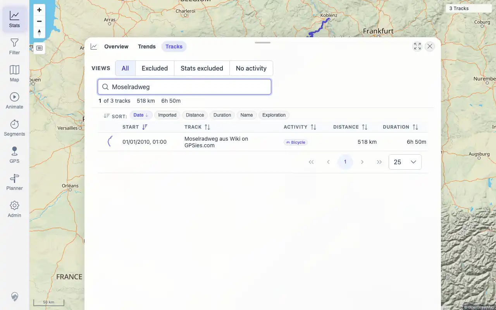

# Packet: DEL_04

## Scope

- Coverage source: `documentation/testing/frontend-regression-test-plan.md`
- Coverage ID or run packet: DEL_04
- In scope: Verify remaining imported tracks still display and open correctly after deleting two source files.
- Out of scope: Deleted-track absence checks; covered by DEL_03.

## Prerequisites

- Required previous coverage IDs or run packets: DEL_01 through DEL_03.
- Required app/data state: three GPX tracks remain visible.
- Required browser context: authenticated desktop browser.

## Allowed Mutations

- Allowed: search and open remaining track details.
- Not allowed: import/delete data.

## Actions And Results

| Coverage ID | Action | Expected result | Actual result | Status | Evidence |
|---|---|---|---|---|---|
| DEL_04 | Searched and opened the three remaining GPX tracks from Stats > Tracks. | Remaining imported tracks still display and open correctly. | PASS: `Jura Route 7`, `Vitry`, and `Moselradweg` were searchable and opened detail pages for IDs 100000, 100001, and 100002 respectively. | PASS | [assets/DEL_04-remaining-tracks.txt](../assets/DEL_04-remaining-tracks.txt); [assets/DEL_04-remaining-tracks-search.webp](../assets/DEL_04-remaining-tracks-search.webp) |

## Issues

| ID | Severity | Summary | Reproduction | Expected | Actual | Evidence | Release impact |
|---|---|---|---|---|---|---|---|

## Evidence Files

| File | Purpose |
|---|---|
| [assets/DEL_04-remaining-tracks.txt](../assets/DEL_04-remaining-tracks.txt) | Search/open results for the three remaining tracks. |
| [assets/DEL_04-remaining-tracks-search.webp](../assets/DEL_04-remaining-tracks-search.webp) | Representative remaining-track search result. |

## Screenshot Evidence

## Timings

| Step | Timing |
|---|---:|
| Remaining-track search/open checks | ~42 seconds |

## Handoff Notes

- Completed: DEL_04 is terminal.
- Remaining unfinished coverage: DEL_05 onward.
- Blocked or not applicable: none.
- State left for the next packet: remaining GPX IDs are 100000, 100001, and 100002.
