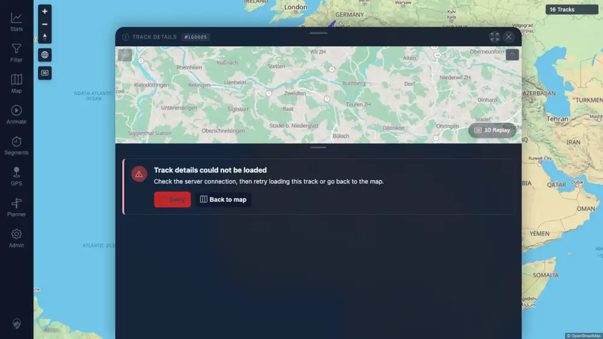
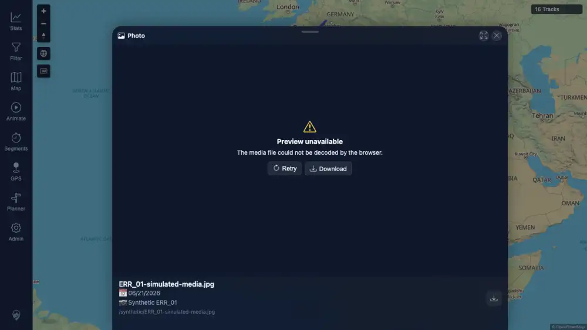
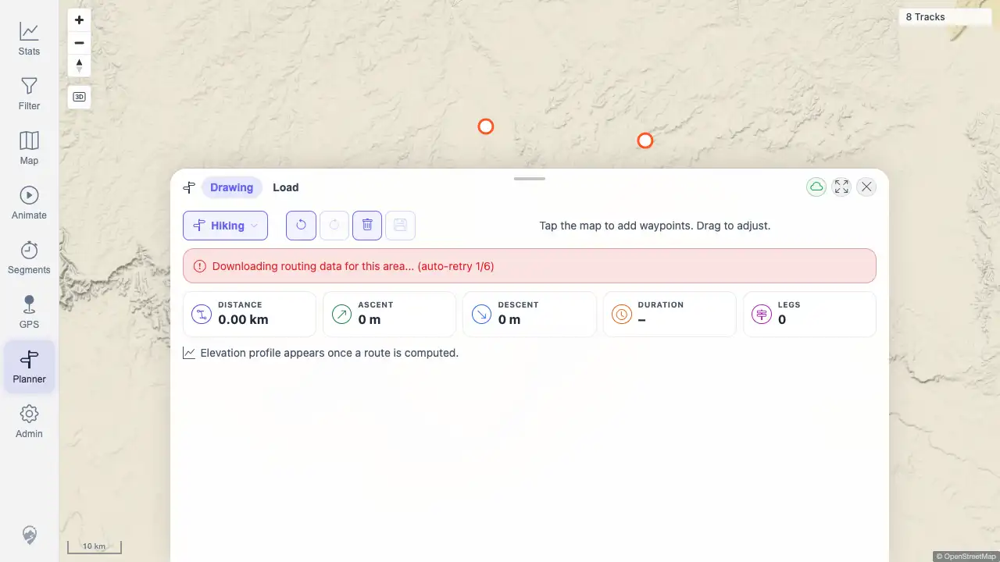

# Packet: ERR_01

## Scope

- Coverage source: `documentation/testing/frontend-regression-test-plan.md` section 20.
- Coverage ID or run packet: ERR_01.
- In scope: Failed track load, failed map config/startup API, failed media preview, failed planner route, and expired-session handling.
- Out of scope: Server shutdown, real private media seeding, or permanent data mutation.

## Prerequisites

- Required previous coverage IDs or run packets: NET_02, NET_03, PLN_09.
- Required app/data state: Synced 16-track app state; planner and map UI available.
- Required browser context: Disposable authenticated desktop contexts.

## Allowed Mutations

- Allowed: Browser-context request interception; synthetic in-browser media point; transient UI actions.
- Not allowed: Change server data, seed local/private media files, save planner routes, or alter shared storage-state files.

## Actions And Results

| Coverage ID | Action | Expected result | Actual result | Status | Evidence |
|---|---|---|---|---|---|
| ERR_01 | Failed required track detail API `/mtl/api/tracks/get/100005?precisionInMeter=1` with HTTP 503 while opening `/mtl/track/100005`. | Failed track load shows an actionable message and does not blank or freeze. | Track detail showed `Track details could not be loaded`, explanatory text, Retry, and Back to map; page was nonblank with canvases still present. | PASS | [assets/ERR_01-error-recovery.txt](../assets/ERR_01-error-recovery.txt); [assets/ERR_01-track-load-failure.webp](../assets/ERR_01-track-load-failure.webp) |
| ERR_01 | Used same-run NET_02 evidence for failed startup/map-config API handling. | Failed map config/startup path shows retry/recovery rather than a blank app. | NET_02 aborted `/mtl/api/**`, including map config, and showed a nonblank `Unable to load tracks... Retry` state; after restoring requests and clicking Retry, the map returned with `16 Tracks`. | PASS | [assets/NET_02-flaky-recovery.txt](../assets/NET_02-flaky-recovery.txt); [assets/NET_02-flaky-error.webp](../assets/NET_02-flaky-error.webp); [assets/NET_02-retry-recovered.webp](../assets/NET_02-retry-recovered.webp) |
| ERR_01 | Simulated a media point in the browser context and failed its `/mtl/api/media/get/424242/content` preview request with HTTP 503. | Failed media preview shows an actionable message/control and does not blank the app. | Media preview sheet opened with `Preview unavailable`, Retry, and Download; the app remained nonblank. | PASS | [assets/ERR_01-error-recovery.txt](../assets/ERR_01-error-recovery.txt); [assets/ERR_01-media-preview-failure.webp](../assets/ERR_01-media-preview-failure.webp) |
| ERR_01 | Used same-run PLN_09 evidence for failed planner route handling. | Failed planner route shows actionable feedback instead of an unhandled error or blank page. | PLN_09 intercepted planner route with `segment-downloading`; UI showed a clear auto-retry notice, kept stats at zero, disabled Save route, and did not fire a page error. | PASS | [assets/PLN_09-segment-downloading.txt](../assets/PLN_09-segment-downloading.txt); [assets/PLN_09-segment-downloading.webp](../assets/PLN_09-segment-downloading.webp) |
| ERR_01 | Used same-run NET_03 evidence for expired-session handling. | Expired session redirects to login/re-login instead of keeping a broken authenticated UI. | NET_03 simulated 401 and 403 auth-probe responses; both redirected to `/mtl/login`, showed `Session expired. Sign in again.`, and cleared local JWT in disposable contexts. | PASS | [assets/NET_03-auth-redirects.txt](../assets/NET_03-auth-redirects.txt); [assets/NET_03-401-login-redirect.webp](../assets/NET_03-401-login-redirect.webp); [assets/NET_03-403-login-redirect.webp](../assets/NET_03-403-login-redirect.webp) |

## Issues

| ID | Severity | Summary | Reproduction | Expected | Actual | Evidence | Release impact |
|---|---|---|---|---|---|---|---|

## Evidence Files

| File | Purpose |
|---|---|
| [assets/ERR_01-error-recovery.txt](../assets/ERR_01-error-recovery.txt) | Track-detail and media-preview failure logs plus same-run cross-reference summary. |
| [assets/ERR_01-track-load-failure.webp](../assets/ERR_01-track-load-failure.webp) | Track detail error with Retry and Back to map. |
| [assets/ERR_01-media-preview-failure.webp](../assets/ERR_01-media-preview-failure.webp) | Media preview error with Retry and Download. |
| [assets/NET_02-flaky-recovery.txt](../assets/NET_02-flaky-recovery.txt) | Same-run map-config/startup retry evidence. |
| [assets/NET_03-auth-redirects.txt](../assets/NET_03-auth-redirects.txt) | Same-run 401/403 expired-session redirect evidence. |
| [assets/PLN_09-segment-downloading.txt](../assets/PLN_09-segment-downloading.txt) | Same-run planner route failure feedback evidence. |

## Screenshot Evidence

## Timings

| Step | Timing |
|---|---:|
| Track and media failure simulations | 2026-06-21 06:29 CEST |
| Same-run evidence references | NET_02, NET_03, PLN_09 packets |

## Handoff Notes

- Completed: ERR_01 passed for track load, map config/startup, media preview, planner route, and expired-session error recovery.
- Remaining unfinished coverage: ERR_02, RUN_CLEANUP.
- Blocked or not applicable: none.
- State left for the next packet: No server mutation; browser interception and synthetic media point existed only in closed disposable contexts.
