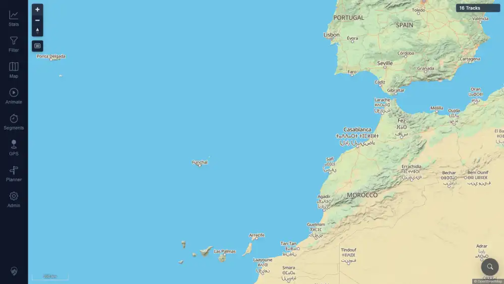

# Packet: ERR_02

## Scope

- Coverage source: `documentation/testing/frontend-regression-test-plan.md` section 20.
- Coverage ID or run packet: ERR_02.
- In scope: Rapid switching between main tools and post-switch checks for stale visible sheets, markers, popups, cursor locks, or broken map interaction.
- Out of scope: Deep functional checks inside each tool; those are covered by their feature-specific packets.

## Prerequisites

- Required previous coverage IDs or run packets: RUN_SETUP, MOB_05, ERR_01.
- Required app/data state: Synced 16-track map state.
- Required browser context: Authenticated desktop context.

## Allowed Mutations

- Allowed: Open and close tools, drag the map, click zoom controls.
- Not allowed: Save plans, upload/delete tracks, or persist settings intentionally.

## Actions And Results

| Coverage ID | Action | Expected result | Actual result | Status | Evidence |
|---|---|---|---|---|---|
| ERR_02 | Rapidly clicked Stats, Filter, Planner, Map, Animate, Segments, GPS, and Admin across three rounds, opened Map once more, pressed Escape to close sheets, then dragged the map and clicked zoom-in twice. | Switching tools quickly should leave no previous-tool markers, popups, cursor locks, or stale visible sheets; the map should remain usable. | After 24 tool opens, no visible sheets remained after Escape; planner markers, popups, measure markers, race markers, GPS markers, location markers, and media preview artifacts were all `0`; canvas cursors were `auto`/`grab`; map zoom changed scale from `500 km` to `200 km`; `16 Tracks` remained visible and no page errors fired. | PASS | [assets/ERR_02-rapid-switching.txt](../assets/ERR_02-rapid-switching.txt); [assets/ERR_02-after-rapid-switch.webp](../assets/ERR_02-after-rapid-switch.webp) |

## Issues

| ID | Severity | Summary | Reproduction | Expected | Actual | Evidence | Release impact |
|---|---|---|---|---|---|---|---|

## Evidence Files

| File | Purpose |
|---|---|
| [assets/ERR_02-rapid-switching.txt](../assets/ERR_02-rapid-switching.txt) | Tool sequence, stale artifact counts, cursor styles, map scale change, console/page error summary. |
| [assets/ERR_02-after-rapid-switch.webp](../assets/ERR_02-after-rapid-switch.webp) | Clean map surface after rapid tool switching and zoom interaction. |

## Screenshot Evidence

## Timings

| Step | Timing |
|---|---:|
| Rapid tool switching and map interaction check | 2026-06-21 06:36 CEST |

## Handoff Notes

- Completed: ERR_02 passed with no stale visible tool artifacts and successful post-switch map interaction.
- Remaining unfinished coverage: none before the finalization gate; RUN_CLEANUP remains gated.
- Blocked or not applicable: none.
- State left for the next packet: All required coverage IDs are terminal; run must pass finalization gate before report assembly or cleanup.
