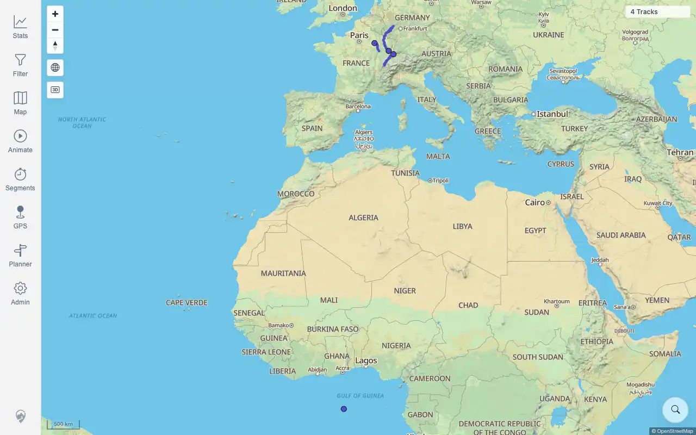
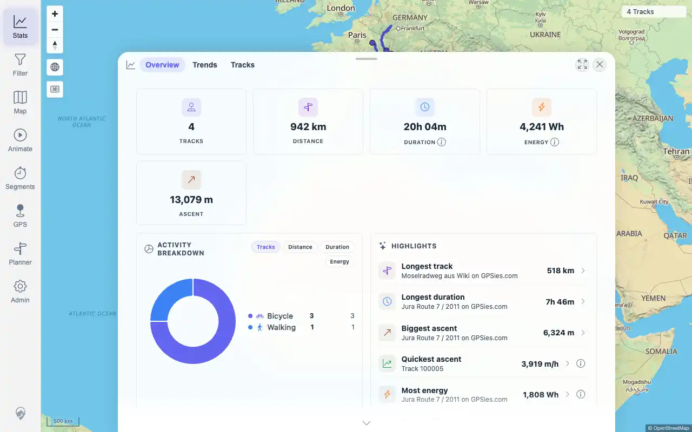
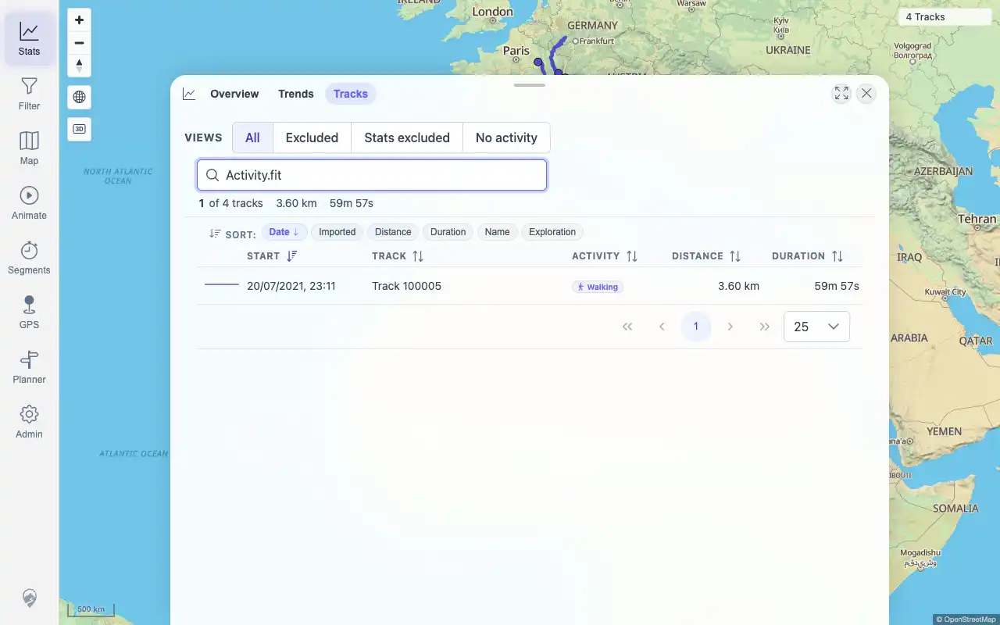

# Packet: FIT_02

## Scope

- Coverage source: `documentation/testing/frontend-regression-test-plan.md`
- Coverage ID or run packet: FIT_02
- In scope: Verify FIT acceptance/import, successful indexing, map display, track-browser search, and statistics inclusion.
- Out of scope: FIT-backed detail tabs and downloads; covered by FIT_03 through FIT_05.

## Prerequisites

- Required previous coverage IDs or run packets: FIT_01.
- Required app/data state: `Activity.fit` present in the watched import folder.
- Required browser context: authenticated desktop browser.

## Allowed Mutations

- Allowed: wait for conversion/indexing and refresh UI surfaces.
- Not allowed: import additional files.

## Actions And Results

| Coverage ID | Action | Expected result | Actual result | Status | Evidence |
|---|---|---|---|---|---|
| FIT_02 | Waited for FIT conversion/index jobs, then checked Map, Stats overview, and Stats > Tracks search for the FIT-backed track. | FIT file is accepted, indexed successfully, visible on the map, searchable in the browser, and included in statistics. | PASS: `Activity.fit` imported as track ID `100005`, load status `SUCCESS`, indexer status `COMPLETED_WITH_SUCCESS`, 3,600 points, and visible UI name `Track 100005`; map shows `4 Tracks`; Stats includes `Track 100005` as one Walking activity; track-browser search for `Activity.fit` returns `Track 100005` with 3.60 km and 59m 57s. | PASS | [assets/FIT_02-import-index-ui.txt](../assets/FIT_02-import-index-ui.txt); [assets/FIT_02-map-4-tracks.webp](../assets/FIT_02-map-4-tracks.webp); [assets/FIT_02-stats-overview.webp](../assets/FIT_02-stats-overview.webp); [assets/FIT_02-track-search.webp](../assets/FIT_02-track-search.webp) |

## Issues

| ID | Severity | Summary | Reproduction | Expected | Actual | Evidence | Release impact |
|---|---|---|---|---|---|---|---|

## Evidence Files

| File | Purpose |
|---|---|
| [assets/FIT_02-import-index-ui.txt](../assets/FIT_02-import-index-ui.txt) | Server/index mapping and UI text evidence. |
| [assets/FIT_02-map-4-tracks.webp](../assets/FIT_02-map-4-tracks.webp) | Map surface after FIT import showing four tracks. |
| [assets/FIT_02-stats-overview.webp](../assets/FIT_02-stats-overview.webp) | Statistics overview including Track 100005. |
| [assets/FIT_02-track-search.webp](../assets/FIT_02-track-search.webp) | Track-browser search returning the FIT-backed track. |

## Screenshot Evidence

## Timings

| Step | Timing |
|---|---:|
| FIT conversion/index settle | ~52 seconds |
| UI surface verification | ~20 seconds |

## Handoff Notes

- Completed: FIT_02 is terminal.
- Remaining unfinished coverage: FIT_03 onward.
- Blocked or not applicable: none.
- State left for the next packet: FIT-backed track is `Track 100005` at `/mtl/track/100005`; total visible track count is 4.
