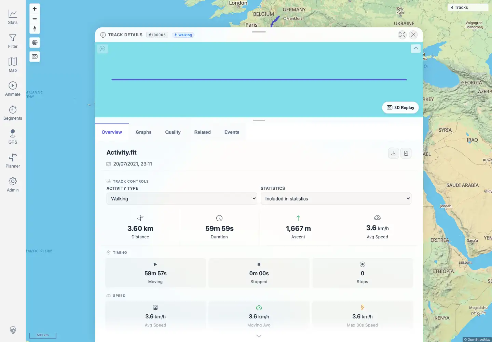

# Packet: FIT_04

## Scope

- Coverage source: `documentation/testing/frontend-regression-test-plan.md`
- Coverage ID or run packet: FIT_04
- In scope: Verify the FIT-backed detail `Download original` control returns the original FIT file and checksum.
- Out of scope: GPX conversion download; covered by FIT_05.

## Prerequisites

- Required previous coverage IDs or run packets: FIT_02.
- Required app/data state: `Activity.fit` imported and indexed as `Track 100005`.
- Required browser context: authenticated desktop browser with downloads enabled.

## Allowed Mutations

- Allowed: download the original indexed file to a temporary local browser download path.
- Not allowed: import, delete, or edit tracks.

## Actions And Results

| Coverage ID | Action | Expected result | Actual result | Status | Evidence |
|---|---|---|---|---|---|
| FIT_04 | Opened `/mtl/track/100005`, clicked `Download original`, and verified filename, size, SHA-256, and FIT header marker. | The downloaded file remains FIT and matches the uploaded checksum. | PASS: browser suggested `Activity.fit`; downloaded size was 94,096 bytes; SHA-256 matched the public source metadata; bytes 8-11 were `.FIT`. | PASS | [assets/FIT_04-original-download.txt](../assets/FIT_04-original-download.txt); [assets/FIT_04-download-control.webp](../assets/FIT_04-download-control.webp) |

## Issues

| ID | Severity | Summary | Reproduction | Expected | Actual | Evidence | Release impact |
|---|---|---|---|---|---|---|---|

## Evidence Files

| File | Purpose |
|---|---|
| [assets/FIT_04-original-download.txt](../assets/FIT_04-original-download.txt) | Filename, size, checksum, and FIT marker verification for the original download. |
| [assets/FIT_04-download-control.webp](../assets/FIT_04-download-control.webp) | UI screenshot showing the FIT detail page with the download controls available. |

## Screenshot Evidence

## Timings

| Step | Timing |
|---|---:|
| Original download and verification | ~8 seconds |

## Handoff Notes

- Completed: FIT_04 is terminal.
- Remaining unfinished coverage: FIT_05 onward.
- Blocked or not applicable: none.
- State left for the next packet: FIT-backed track remains `Track 100005` at `/mtl/track/100005`.
