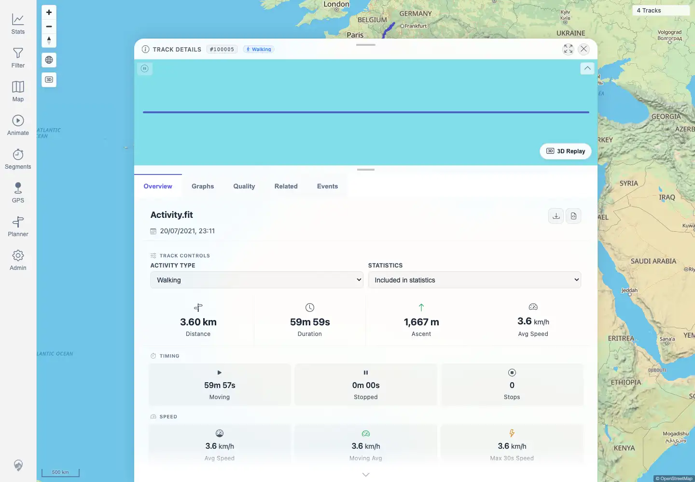

# Packet: FIT_05

## Scope

- Coverage source: `documentation/testing/frontend-regression-test-plan.md`
- Coverage ID or run packet: FIT_05
- In scope: Verify the FIT-backed detail `Download GPX` control returns valid GPX with real trackpoints.
- Out of scope: Original FIT download; covered by FIT_04.

## Prerequisites

- Required previous coverage IDs or run packets: FIT_02.
- Required app/data state: `Activity.fit` imported and indexed as `Track 100005`.
- Required browser context: authenticated desktop browser with downloads enabled.

## Allowed Mutations

- Allowed: download the generated GPX to a temporary local browser download path.
- Not allowed: import, delete, or edit tracks.

## Actions And Results

| Coverage ID | Action | Expected result | Actual result | Status | Evidence |
|---|---|---|---|---|---|
| FIT_05 | Opened `/mtl/track/100005`, clicked `Download GPX`, and parsed the downloaded GPX file for GPX root, track, segment, `trkpt`, `wpt`, and `rtept` counts. | A valid GPX file downloads and contains real `trkpt` trackpoints, not only waypoints. | PASS: browser suggested `Activity.gpx`; file had a GPX root, track and segment elements, 3,601 `trkpt` elements, 0 `wpt` elements, and 0 `rtept` elements. | PASS | [assets/FIT_05-gpx-download.txt](../assets/FIT_05-gpx-download.txt); [assets/FIT_05-gpx-download-control.webp](../assets/FIT_05-gpx-download-control.webp) |

## Issues

| ID | Severity | Summary | Reproduction | Expected | Actual | Evidence | Release impact |
|---|---|---|---|---|---|---|---|

## Evidence Files

| File | Purpose |
|---|---|
| [assets/FIT_05-gpx-download.txt](../assets/FIT_05-gpx-download.txt) | Download filename, file size, checksum, and GPX element counts. |
| [assets/FIT_05-gpx-download-control.webp](../assets/FIT_05-gpx-download-control.webp) | UI screenshot showing the FIT detail page with the GPX download control available. |

## Screenshot Evidence

## Timings

| Step | Timing |
|---|---:|
| GPX download and parsing | ~7 seconds |

## Handoff Notes

- Completed: FIT_05 is terminal.
- Remaining unfinished coverage: FIT_06 onward.
- Blocked or not applicable: none.
- State left for the next packet: FIT-backed track remains `Track 100005` at `/mtl/track/100005`.
