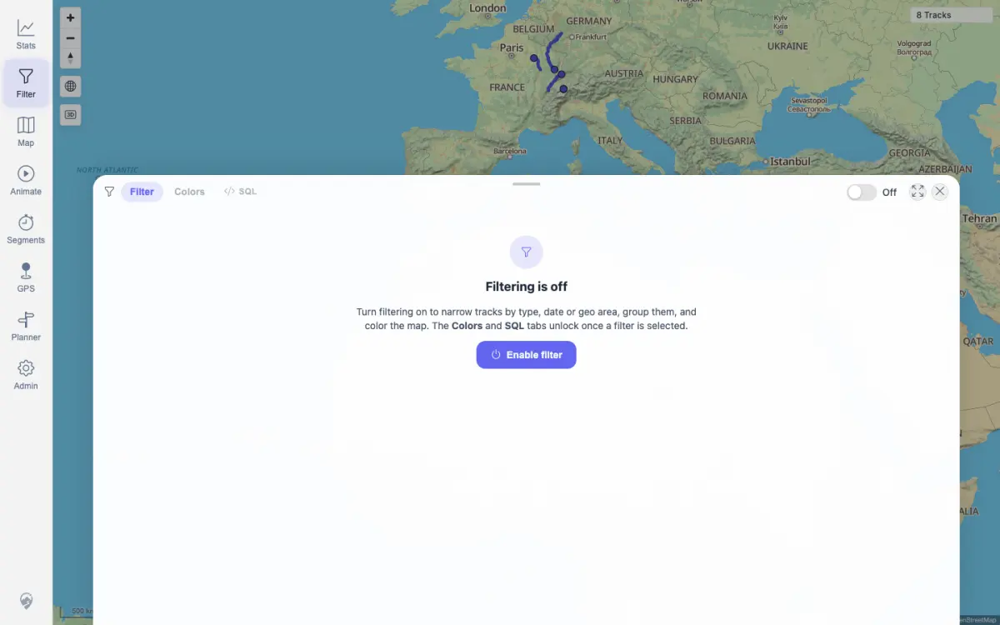

# Packet: FLT_01

## Scope

- Coverage source: `documentation/testing/frontend-regression-test-plan.md`
- Coverage ID or run packet: FLT_01
- In scope: Opening the filter panel and verifying that a previously saved active filter is still active and shown as a map chip.
- Out of scope: Creating a new saved active filter as a substitute precondition.

## Prerequisites

- Required previous coverage IDs or run packets: SGN_02, MAP_02
- Required app/data state: A previously saved active filter must exist in the browser's persisted client filter configuration.
- Required browser context: Authenticated desktop browser context using the persisted run storage state.

## Allowed Mutations

- Allowed: Open the filter panel and inspect persisted client filter state.
- Not allowed: Create or modify a filter to manufacture the saved-active-filter precondition.

## Actions And Results

| Coverage ID | Action | Expected result | Actual result | Status | Evidence |
|---|---|---|---|---|---|
| FLT_01 | Opened `/mtl/filter`, inspected the map chip, filter toggle, off-card, selected catalog rows, and persisted `mtl.filter.client-config` local storage entry. | Previously saved filter remains active and is shown as a chip. | No previously saved active filter was present. The persisted config is the standard `SmartBaseFilter` with empty params and no palette, the filter toggle is `Off`, the off-card is visible, and the map chip reads `8 Tracks` with no funnel indicator. | BLOCKED | [assets/FLT_01-filter-state.txt](../assets/FLT_01-filter-state.txt); [assets/FLT_01-filter-inactive.webp](../assets/FLT_01-filter-inactive.webp) |

## Issues

| ID | Severity | Summary | Reproduction | Expected | Actual | Evidence | Release impact |
|---|---|---|---|---|---|---|---|
| None |  |  |  |  |  |  |  |

## Evidence Files

| File | Purpose |
|---|---|
| [assets/FLT_01-filter-state.txt](../assets/FLT_01-filter-state.txt) | Persisted filter config, map chip state, toggle state, and console counts. |
| [assets/FLT_01-filter-inactive.webp](../assets/FLT_01-filter-inactive.webp) | Filter panel with inactive default filter state. |

## Screenshot Evidence

## Timings

| Step | Timing |
|---|---:|
| Open filter panel and inspect persisted state | < 10 s |

## Handoff Notes

- Completed: FLT_01 was checked against the persisted browser state.
- Remaining unfinished coverage: FLT_02 onward.
- Blocked or not applicable: FLT_01 is blocked because the required previously saved active filter does not exist in the current run state.
- State left for the next packet: Filter state was not mutated; the browser remains on the inactive standard filter configuration.
