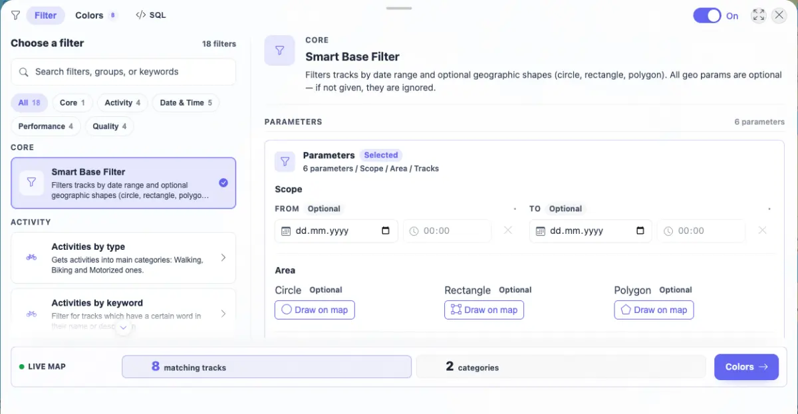
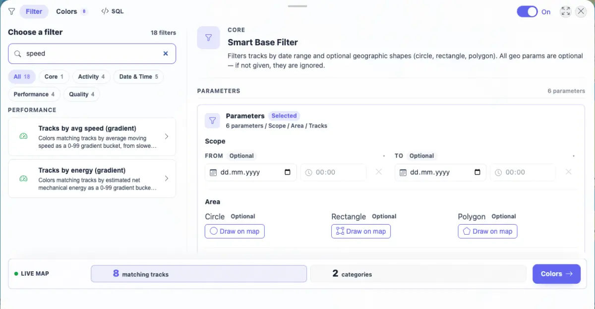
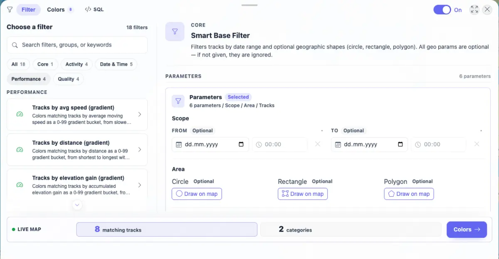

# Packet: FLT_02

## Scope

- Coverage source: `documentation/testing/frontend-regression-test-plan.md`
- Coverage ID or run packet: FLT_02
- In scope: Filter catalog browsing, search, and group chips.
- Out of scope: Applying filter parameters or validating map/stat updates from a selected filter.

## Prerequisites

- Required previous coverage IDs or run packets: SGN_02, MAP_02
- Required app/data state: Filter panel can be opened and filtering can be enabled.
- Required browser context: Authenticated desktop browser context.

## Allowed Mutations

- Allowed: Enable filtering in browser client state, type in catalog search, and select catalog group chips.
- Not allowed: Change imported track data.

## Actions And Results

| Coverage ID | Action | Expected result | Actual result | Status | Evidence |
|---|---|---|---|---|---|
| FLT_02 | Opened `/mtl/filter`, enabled filtering, captured the default catalog, searched for `speed`, cleared search, and selected the Performance group chip. | Filter catalog browsing, search, and grouping work. | Catalog showed 18 filters grouped as Core, Activity, Date & Time, Performance, and Quality. Searching `speed` narrowed the visible list to two Performance rows. Clearing search and selecting Performance showed four Performance filters with the Performance chip active. | PASS | [assets/FLT_02-catalog-search-grouping.txt](../assets/FLT_02-catalog-search-grouping.txt); [assets/FLT_02-catalog-default.webp](../assets/FLT_02-catalog-default.webp); [assets/FLT_02-catalog-search-speed.webp](../assets/FLT_02-catalog-search-speed.webp); [assets/FLT_02-catalog-performance-group.webp](../assets/FLT_02-catalog-performance-group.webp) |

## Issues

| ID | Severity | Summary | Reproduction | Expected | Actual | Evidence | Release impact |
|---|---|---|---|---|---|---|---|
| None |  |  |  |  |  |  |  |

## Evidence Files

| File | Purpose |
|---|---|
| [assets/FLT_02-catalog-search-grouping.txt](../assets/FLT_02-catalog-search-grouping.txt) | Catalog counts, visible group rows, active chips, screenshot sizes, and console counts. |
| [assets/FLT_02-catalog-default.webp](../assets/FLT_02-catalog-default.webp) | Default catalog with all filter groups. |
| [assets/FLT_02-catalog-search-speed.webp](../assets/FLT_02-catalog-search-speed.webp) | Search result narrowed to speed-related Performance filters. |
| [assets/FLT_02-catalog-performance-group.webp](../assets/FLT_02-catalog-performance-group.webp) | Performance group chip selected with four rows visible. |

## Screenshot Evidence

## Timings

| Step | Timing |
|---|---:|
| Catalog browsing, search, grouping, and evidence capture | < 10 s |

## Handoff Notes

- Completed: FLT_02 passed for filter catalog grouping and search.
- Remaining unfinished coverage: FLT_03 onward.
- Blocked or not applicable: None.
- State left for the next packet: Filtering is enabled in browser client state; Smart Base Filter remains selected and the Performance group chip is selected in the open panel.
