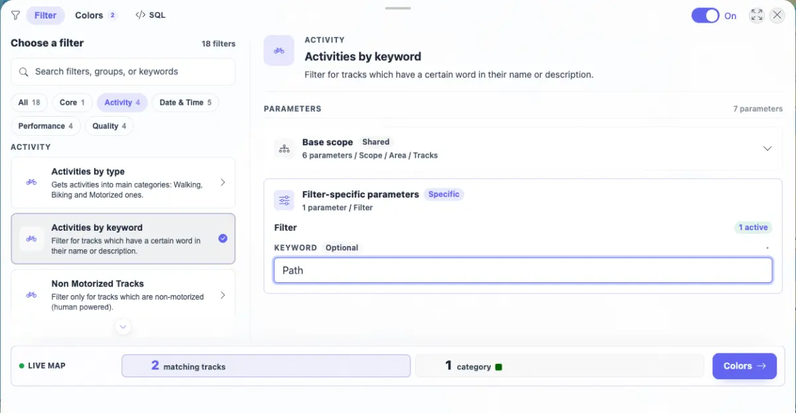
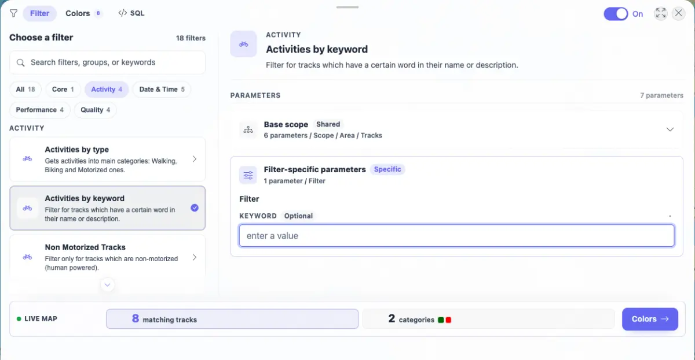
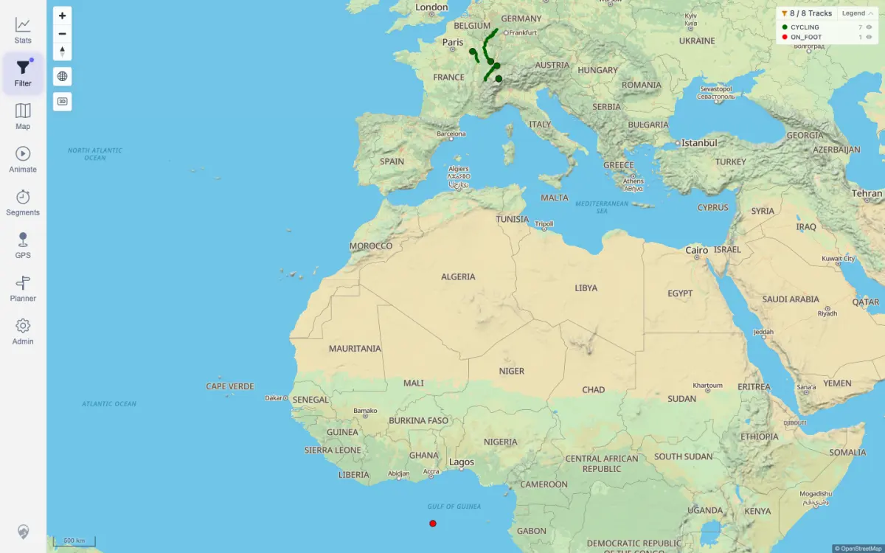

# Packet: FLT_03

## Scope

- Coverage source: `documentation/testing/frontend-regression-test-plan.md`
- Coverage ID or run packet: FLT_03
- In scope: Selecting a filter, rendering parameters, immediate parameter auto-apply, clearing parameter effects, and cross-surface count/map/legend/stats updates.
- Out of scope: Date and geo persistence after reload; those are covered by FLT_04 and FLT_05.

## Prerequisites

- Required previous coverage IDs or run packets: FLT_02
- Required app/data state: Current dataset has 8 visible tracks; filter panel can resolve filter preview results.
- Required browser context: Authenticated desktop browser context.

## Allowed Mutations

- Allowed: Select `Activities by keyword`, set and clear the `SEARCH_WORD` client filter parameter, and persist browser filter state.
- Not allowed: Change imported track data.

## Actions And Results

| Coverage ID | Action | Expected result | Actual result | Status | Evidence |
|---|---|---|---|---|---|
| FLT_03 | Selected `Activities by keyword`, verified the keyword parameter appeared, typed `Path`, waited for live preview/map/stats updates, then cleared the keyword and rechecked the same surfaces. | Parameters appear; parameter edits auto-apply immediately; clearing/removing parameters resets their effect; active chips, visible count, map, legend, and stats reflect current state without stale pending UI. | `SEARCH_WORD=Path` resolved to 2 of 8 tracks; the panel showed 2 matching tracks with no loading/error state, the map chip showed `2 / 8 Tracks` with funnel and CYCLING legend count 2, and Stats showed `Showing 2 of 8 tracks`. Clearing the input restored 8 of 8, two categories, map chip `8 / 8 Tracks`, Stats 8 tracks, and no filter banner. | PASS | [assets/FLT_03-keyword-param-auto-apply.txt](../assets/FLT_03-keyword-param-auto-apply.txt); [assets/FLT_03-keyword-path-applied.webp](../assets/FLT_03-keyword-path-applied.webp); [assets/FLT_03-map-filtered-path.webp](../assets/FLT_03-map-filtered-path.webp); [assets/FLT_03-stats-filtered-path.webp](../assets/FLT_03-stats-filtered-path.webp); [assets/FLT_03-keyword-cleared.webp](../assets/FLT_03-keyword-cleared.webp); [assets/FLT_03-map-cleared.webp](../assets/FLT_03-map-cleared.webp) |

## Issues

| ID | Severity | Summary | Reproduction | Expected | Actual | Evidence | Release impact |
|---|---|---|---|---|---|---|---|
| None |  |  |  |  |  |  |  |

## Evidence Files

| File | Purpose |
|---|---|
| [assets/FLT_03-keyword-param-auto-apply.txt](../assets/FLT_03-keyword-param-auto-apply.txt) | API expected counts, panel/map/stats UI states, persisted filter state, screenshot sizes, and console counts. |
| [assets/FLT_03-keyword-path-applied.webp](../assets/FLT_03-keyword-path-applied.webp) | Keyword parameter applied with 2 matching tracks. |
| [assets/FLT_03-map-filtered-path.webp](../assets/FLT_03-map-filtered-path.webp) | Map legend chip and category legend after filtering to `Path`. |
| [assets/FLT_03-stats-filtered-path.webp](../assets/FLT_03-stats-filtered-path.webp) | Stats overview reflecting 2 of 8 filtered tracks. |
| [assets/FLT_03-keyword-cleared.webp](../assets/FLT_03-keyword-cleared.webp) | Keyword parameter cleared and panel restored to 8 matching tracks. |
| [assets/FLT_03-map-cleared.webp](../assets/FLT_03-map-cleared.webp) | Map restored to all 8 matching tracks after clearing. |

## Screenshot Evidence

## Timings

| Step | Timing |
|---|---:|
| Keyword filter apply, cross-surface verification, clear/reset | < 1 min |

## Handoff Notes

- Completed: FLT_03 passed for parameter rendering, immediate auto-apply, and clear/reset behavior across panel, map, legend, and stats.
- Remaining unfinished coverage: FLT_04 onward.
- Blocked or not applicable: None.
- State left for the next packet: Filtering remains enabled with `Activities by keyword` selected and no string parameters persisted.
