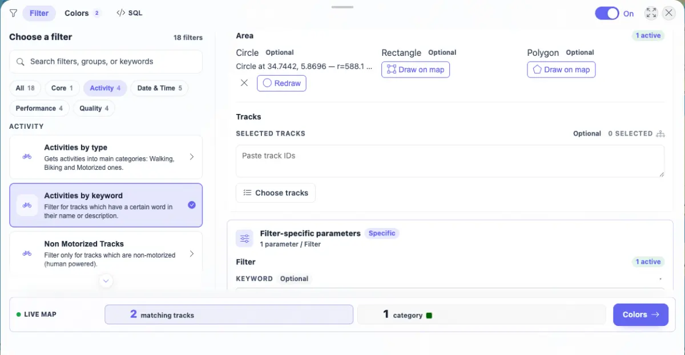
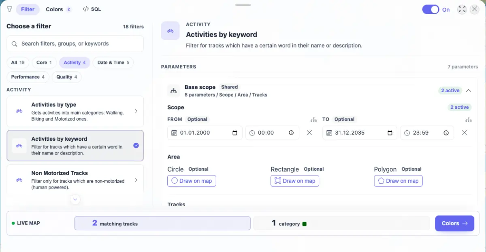

# Packet: FLT_04

## Scope

- Coverage source: `documentation/testing/frontend-regression-test-plan.md`
- Coverage ID or run packet: FLT_04
- In scope: Date, text, and geo parameter persistence and re-application after reload.
- Out of scope: Full geo drawing control matrix; FLT_05 covers draw/undo/cancel/finish/clear behavior.

## Prerequisites

- Required previous coverage IDs or run packets: FLT_03
- Required app/data state: Filtering enabled with `Activities by keyword` available.
- Required browser context: Authenticated desktop browser context.

## Allowed Mutations

- Allowed: Set browser filter parameters and reload the browser tab.
- Not allowed: Change imported track data.

## Actions And Results

| Coverage ID | Action | Expected result | Actual result | Status | Evidence |
|---|---|---|---|---|---|
| FLT_04 | Selected `Activities by keyword`, set keyword `Path`, set date range `2000-01-01 00:00` to `2035-12-31 23:59`, drew a circle in the Base scope, captured state, reloaded, and reopened the same filter/base scope. | Date, text, and geo parameters all save and re-apply correctly after reload. | Original failure: date and keyword persisted, but the drawn circle was not stored under `geoCircles` and disappeared after reload. FIXED locally: geo draw/clear now persists the current filter draft through the existing filter store save path; focused filter-store tests and type-check passed. | FIXED | [assets/FLT_04-params-persist-reapply.txt](../assets/FLT_04-params-persist-reapply.txt); [assets/FLT_04-params-before-reload.webp](../assets/FLT_04-params-before-reload.webp); [assets/FLT_04-params-after-reload.webp](../assets/FLT_04-params-after-reload.webp); [assets/FIXED-filter-planner-local-verification.txt](../assets/FIXED-filter-planner-local-verification.txt) |

## Issues

| ID | Severity | Summary | Reproduction | Expected | Actual | Evidence | Release impact |
|---|---|---|---|---|---|---|---|
| FLT-04-P2 | P2 | Geo circle parameter is not persisted or re-applied after reload. | Enable Filter, choose `Activities by keyword`, expand Base scope, set date/text params, draw a Circle, reload, and reopen Base scope. | The circle remains active in persisted params and UI after reload, and the live result includes the geo constraint. | FIXED locally: geo draw/clear now persists the current filter draft, including geo shape params, through the existing filter store save path. | [assets/FLT_04-params-persist-reapply.txt](../assets/FLT_04-params-persist-reapply.txt); [assets/FLT_04-params-before-reload.webp](../assets/FLT_04-params-before-reload.webp); [assets/FLT_04-params-after-reload.webp](../assets/FLT_04-params-after-reload.webp); [assets/FIXED-filter-planner-local-verification.txt](../assets/FIXED-filter-planner-local-verification.txt) | FIXED locally; full browser regression was not rerun after the code change. |

## Evidence Files

| File | Purpose |
|---|---|
| [assets/FLT_04-params-persist-reapply.txt](../assets/FLT_04-params-persist-reapply.txt) | Before/after values, storage keys, screenshot sizes, and console counts. |
| [assets/FLT_04-params-before-reload.webp](../assets/FLT_04-params-before-reload.webp) | Circle visible before reload with date/text set. |
| [assets/FLT_04-params-after-reload.webp](../assets/FLT_04-params-after-reload.webp) | Date/text restored after reload while Circle is empty. |
| [assets/FIXED-filter-planner-local-verification.txt](../assets/FIXED-filter-planner-local-verification.txt) | Local implementation and focused test evidence for the geo persistence fix. |

## Screenshot Evidence

## Timings

| Step | Timing |
|---|---:|
| Date/text/circle setup, reload, and comparison | < 5 min |

## Handoff Notes

- Completed: FLT_04 is terminal `FIXED` locally.
- Remaining unfinished coverage: FLT_05 onward.
- Blocked or not applicable: None.
- State left for the next packet: Original remote run state had `Activities by keyword`, keyword `Path`, and date range persisted with no geo shape. Local code now persists geo shapes for subsequent sessions.
