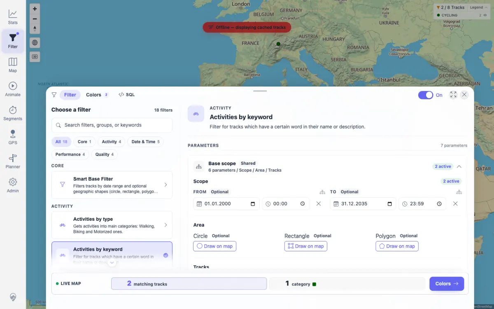
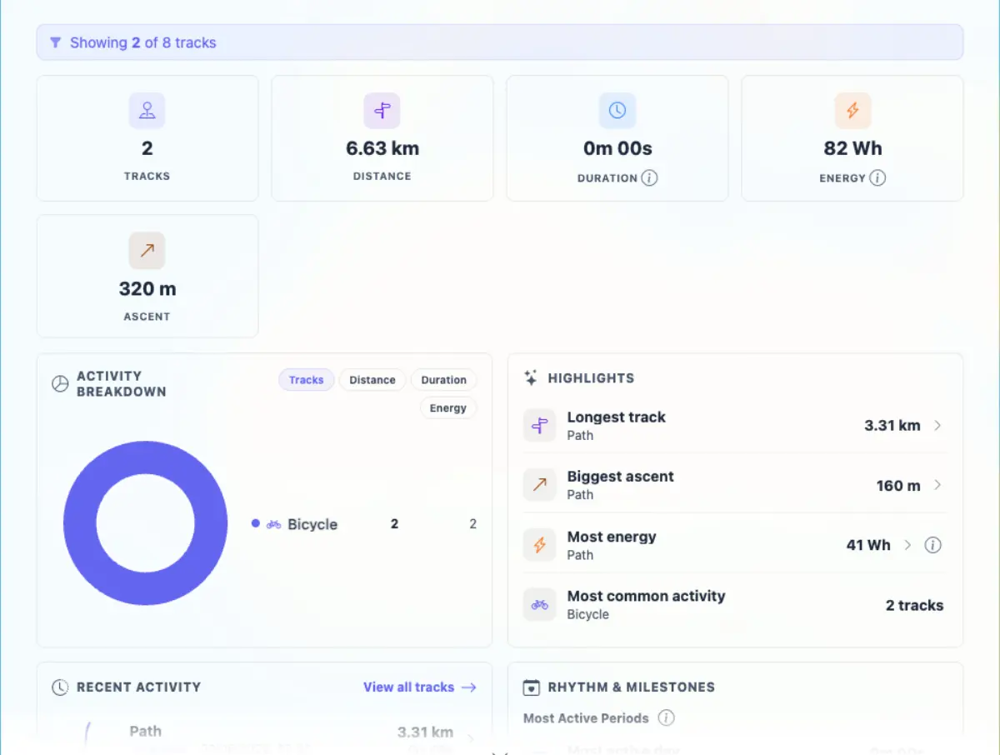

# Packet: FLT_06

## Scope

- Coverage source: `documentation/testing/frontend-regression-test-plan.md`
- Coverage ID or run packet: FLT_06
- In scope: Applied filter live updates for visible track count, map colors/legend, and stats without restarting the browser.
- Out of scope: Geo persistence; covered by FLT_04 and FLT_05.

## Prerequisites

- Required previous coverage IDs or run packets: FLT_03
- Required app/data state: Current dataset has 8 visible tracks and `Activities by keyword` is available.
- Required browser context: Authenticated desktop browser context.

## Allowed Mutations

- Allowed: Set and clear the keyword filter parameter in browser filter state.
- Not allowed: Change imported track data.

## Actions And Results

| Coverage ID | Action | Expected result | Actual result | Status | Evidence |
|---|---|---|---|---|---|
| FLT_06 | Opened the filter panel, selected `Activities by keyword`, cleared the keyword to restore 8 tracks, then set keyword `Path` and verified the panel, map legend, and Stats in the same browser session. | Applied filter updates visible track count, map colors, legend, and stats without a full page reload. | Clearing showed 8 matching tracks and 2 groups; applying `Path` showed 2 matching tracks and 1 group. The map legend showed `2 / 8 Tracks` with CYCLING count 2, and Stats showed `Showing 2 of 8 tracks`, 2 tracks, and 6.63 km. | PASS | [assets/FLT_06-live-filter-map-legend-stats.txt](../assets/FLT_06-live-filter-map-legend-stats.txt); [assets/FLT_06-filtered-map-legend.webp](../assets/FLT_06-filtered-map-legend.webp); [assets/FLT_06-filtered-stats.webp](../assets/FLT_06-filtered-stats.webp) |

## Issues

| ID | Severity | Summary | Reproduction | Expected | Actual | Evidence | Release impact |
|---|---|---|---|---|---|---|---|
| None |  |  |  |  |  |  |  |

## Evidence Files

| File | Purpose |
|---|---|
| [assets/FLT_06-live-filter-map-legend-stats.txt](../assets/FLT_06-live-filter-map-legend-stats.txt) | Panel, map, stats, screenshot size, and console summary. |
| [assets/FLT_06-filtered-map-legend.webp](../assets/FLT_06-filtered-map-legend.webp) | Filter panel and map legend after live update. |
| [assets/FLT_06-filtered-stats.webp](../assets/FLT_06-filtered-stats.webp) | Stats overview after live filter update. |

## Screenshot Evidence

## Timings

| Step | Timing |
|---|---:|
| Live filter update, map check, stats check | < 2 min |

## Handoff Notes

- Completed: FLT_06 passed for live filter updates across panel, map legend, and Stats.
- Remaining unfinished coverage: FLT_07 onward.
- Blocked or not applicable: None.
- State left for the next packet: `Activities by keyword` remains active with keyword `Path` and the wide date range from FLT_04.
