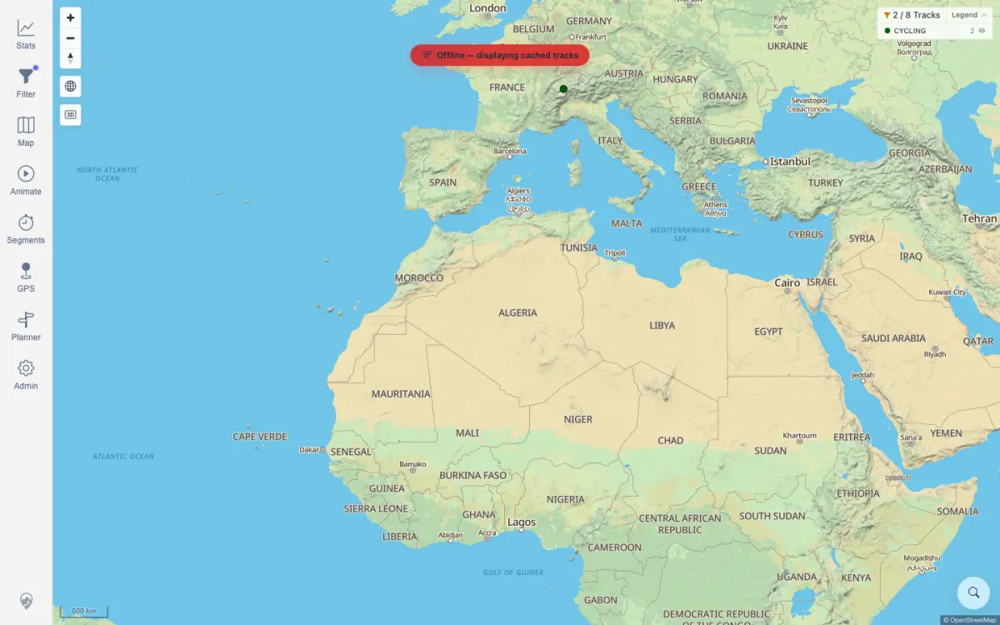
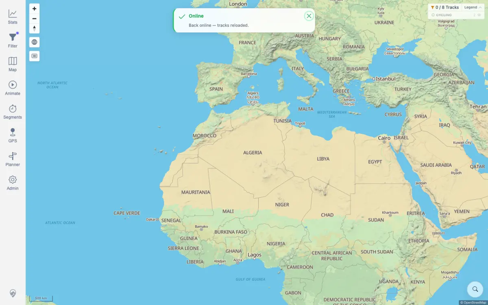
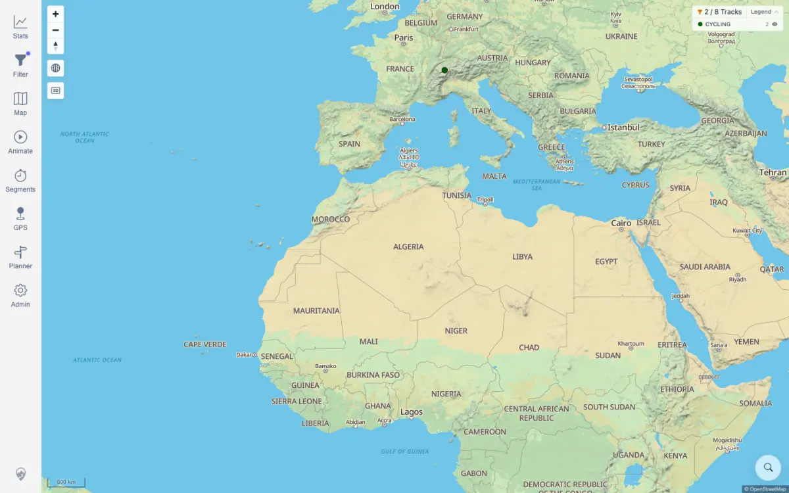

# Packet: FLT_07

## Scope

- Coverage source: `documentation/testing/frontend-regression-test-plan.md`
- Coverage ID or run packet: FLT_07
- In scope: Active filter legend category display and hiding/restoring legend groups.
- Out of scope: Gradient legend mode; categorical legend is sufficient for this coverage item.

## Prerequisites

- Required previous coverage IDs or run packets: FLT_06
- Required app/data state: `Activities by keyword` with keyword `Path` is active and produces the CYCLING legend group.
- Required browser context: Authenticated desktop browser context.

## Allowed Mutations

- Allowed: Toggle legend group visibility.
- Not allowed: Change filter parameters or imported track data.

## Actions And Results

| Coverage ID | Action | Expected result | Actual result | Status | Evidence |
|---|---|---|---|---|---|
| FLT_07 | Viewed the active CYCLING legend row, clicked it to hide the group, then clicked it again to restore the group. | Legend reflects the active filter, and hiding/restoring groups updates the map immediately. | Before hide, the map chip showed `2 / 8 Tracks` and CYCLING count 2. Hiding CYCLING disabled the legend row and changed the chip to `0 / 8 Tracks`. Restoring CYCLING returned the row to visible and the chip to `2 / 8 Tracks`. | PASS | [assets/FLT_07-legend-hide-show.txt](../assets/FLT_07-legend-hide-show.txt); [assets/FLT_07-legend-before-hide.webp](../assets/FLT_07-legend-before-hide.webp); [assets/FLT_07-legend-cycling-hidden.webp](../assets/FLT_07-legend-cycling-hidden.webp); [assets/FLT_07-legend-restored.webp](../assets/FLT_07-legend-restored.webp) |

## Issues

| ID | Severity | Summary | Reproduction | Expected | Actual | Evidence | Release impact |
|---|---|---|---|---|---|---|---|
| None |  |  |  |  |  |  |  |

## Evidence Files

| File | Purpose |
|---|---|
| [assets/FLT_07-legend-hide-show.txt](../assets/FLT_07-legend-hide-show.txt) | Legend row and map chip before, hidden, and restored. |
| [assets/FLT_07-legend-before-hide.webp](../assets/FLT_07-legend-before-hide.webp) | Active CYCLING legend before hiding. |
| [assets/FLT_07-legend-cycling-hidden.webp](../assets/FLT_07-legend-cycling-hidden.webp) | CYCLING hidden and map count changed to zero. |
| [assets/FLT_07-legend-restored.webp](../assets/FLT_07-legend-restored.webp) | CYCLING restored and map count back to two. |

## Screenshot Evidence

## Timings

| Step | Timing |
|---|---:|
| Legend hide and restore | < 1 min |

## Handoff Notes

- Completed: FLT_07 passed for categorical legend reflection and hide/restore behavior.
- Remaining unfinished coverage: FLT_08 onward.
- Blocked or not applicable: None.
- State left for the next packet: CYCLING legend group restored; keyword filter still active.
