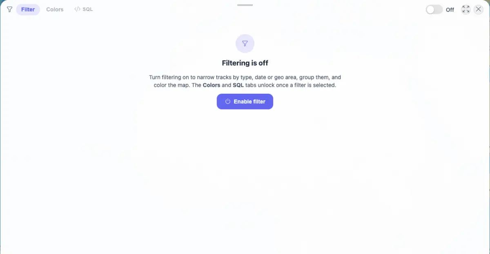
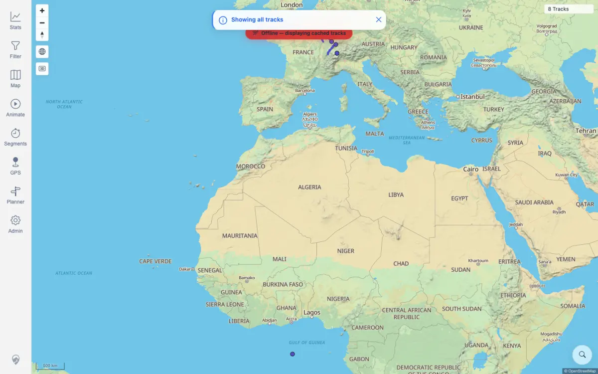
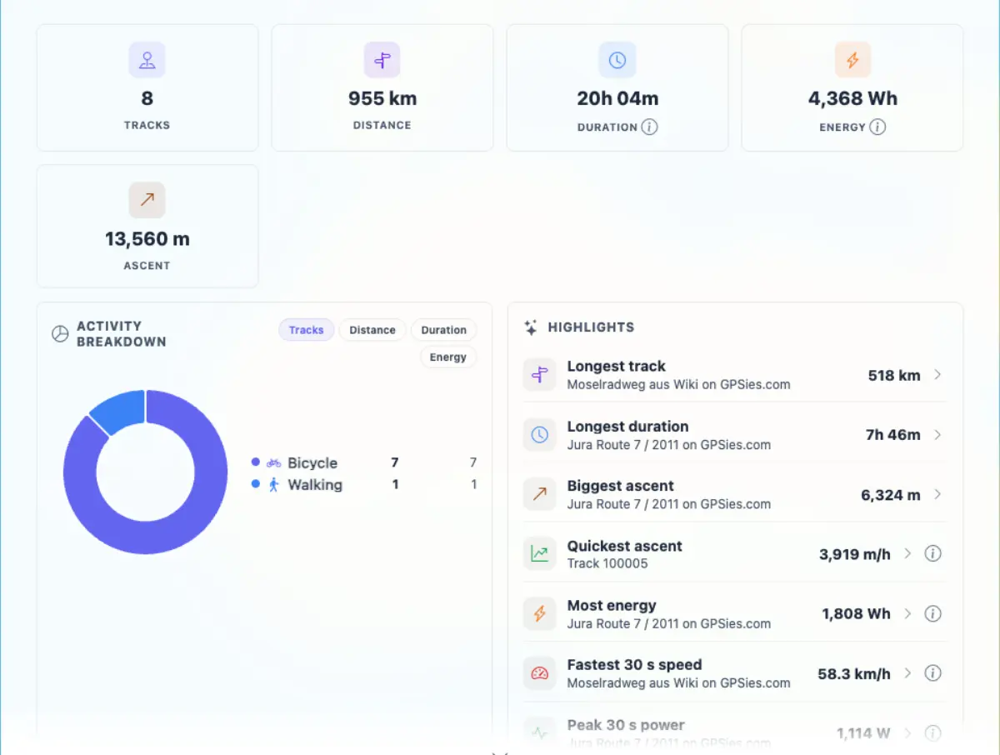

# Packet: FLT_08

## Scope

- Coverage source: `documentation/testing/frontend-regression-test-plan.md`
- Coverage ID or run packet: FLT_08
- In scope: Clearing/disabling the active filter and verifying all tracks return.
- Out of scope: Revalidating individual filter parameter behavior.

## Prerequisites

- Required previous coverage IDs or run packets: FLT_06, FLT_07
- Required app/data state: Active keyword filter currently narrows the map to 2 of 8 tracks.
- Required browser context: Authenticated desktop browser context.

## Allowed Mutations

- Allowed: Disable filtering in browser state.
- Not allowed: Change imported track data.

## Actions And Results

| Coverage ID | Action | Expected result | Actual result | Status | Evidence |
|---|---|---|---|---|---|
| FLT_08 | Verified the active filtered map state, opened the filter panel, switched filtering Off, closed the panel, and checked map and Stats. | Clearing the filter restores all tracks. | Before clearing, the map chip showed `2 / 8 Tracks` with a funnel and CYCLING legend. After switching Off, the filter panel showed `Filtering is off`, the map chip showed `8 Tracks` with no funnel, and Stats showed 8 tracks / 955 km with no filter banner. | PASS | [assets/FLT_08-clear-filter-restores-all.txt](../assets/FLT_08-clear-filter-restores-all.txt); [assets/FLT_08-before-clear-active-filter.webp](../assets/FLT_08-before-clear-active-filter.webp); [assets/FLT_08-filter-off-panel.webp](../assets/FLT_08-filter-off-panel.webp); [assets/FLT_08-filter-disabled-map.webp](../assets/FLT_08-filter-disabled-map.webp); [assets/FLT_08-filter-disabled-stats.webp](../assets/FLT_08-filter-disabled-stats.webp) |

## Issues

| ID | Severity | Summary | Reproduction | Expected | Actual | Evidence | Release impact |
|---|---|---|---|---|---|---|---|
| None |  |  |  |  |  |  |  |

## Evidence Files

| File | Purpose |
|---|---|
| [assets/FLT_08-clear-filter-restores-all.txt](../assets/FLT_08-clear-filter-restores-all.txt) | Before/after map and stats state summary. |
| [assets/FLT_08-before-clear-active-filter.webp](../assets/FLT_08-before-clear-active-filter.webp) | Active filtered map before clearing. |
| [assets/FLT_08-filter-off-panel.webp](../assets/FLT_08-filter-off-panel.webp) | Filter panel Off state. |
| [assets/FLT_08-filter-disabled-map.webp](../assets/FLT_08-filter-disabled-map.webp) | Map restored to all tracks. |
| [assets/FLT_08-filter-disabled-stats.webp](../assets/FLT_08-filter-disabled-stats.webp) | Stats restored to all tracks. |

## Screenshot Evidence

## Timings

| Step | Timing |
|---|---:|
| Disable filter and verify map/stats | < 2 min |

## Handoff Notes

- Completed: FLT_08 passed and filtering is Off.
- Remaining unfinished coverage: TBS_01 onward.
- Blocked or not applicable: None.
- State left for the next packet: Filter disabled; map and Stats show all 8 tracks.
