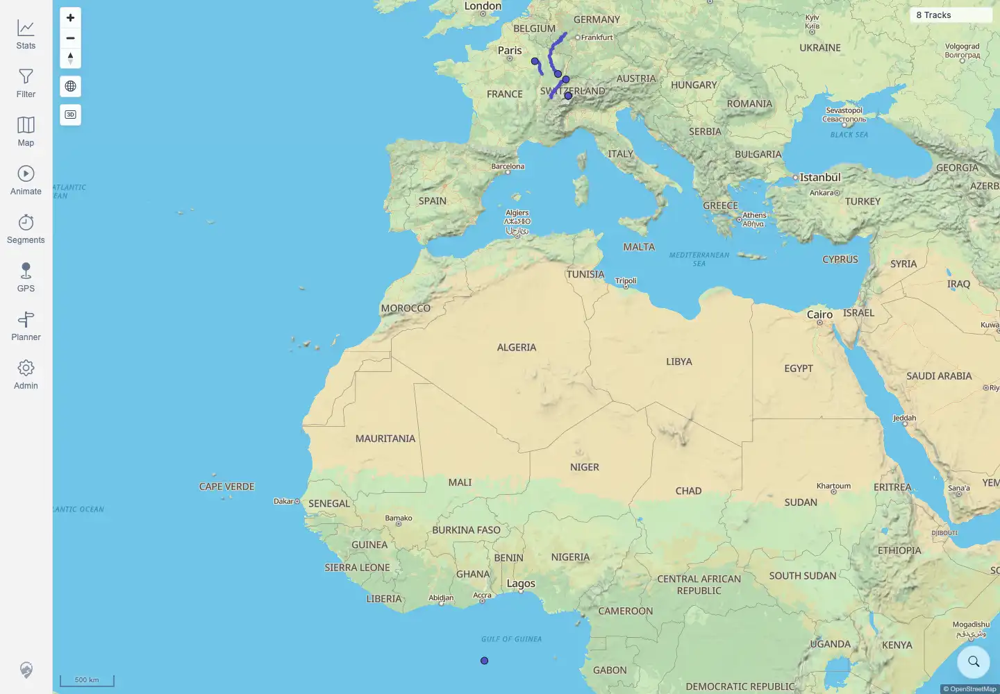
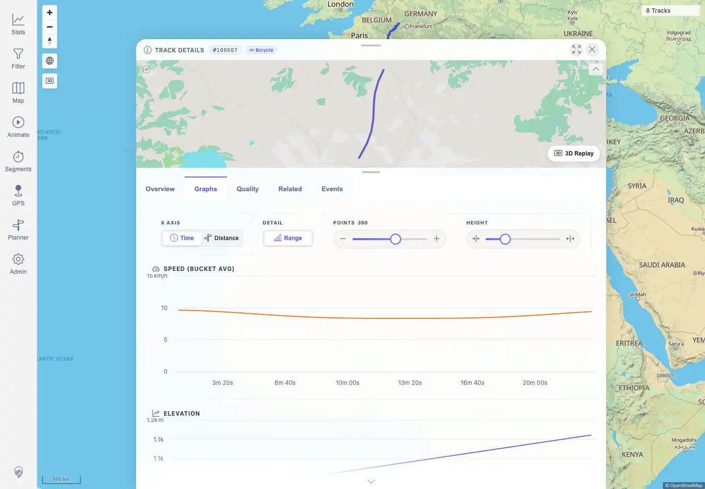
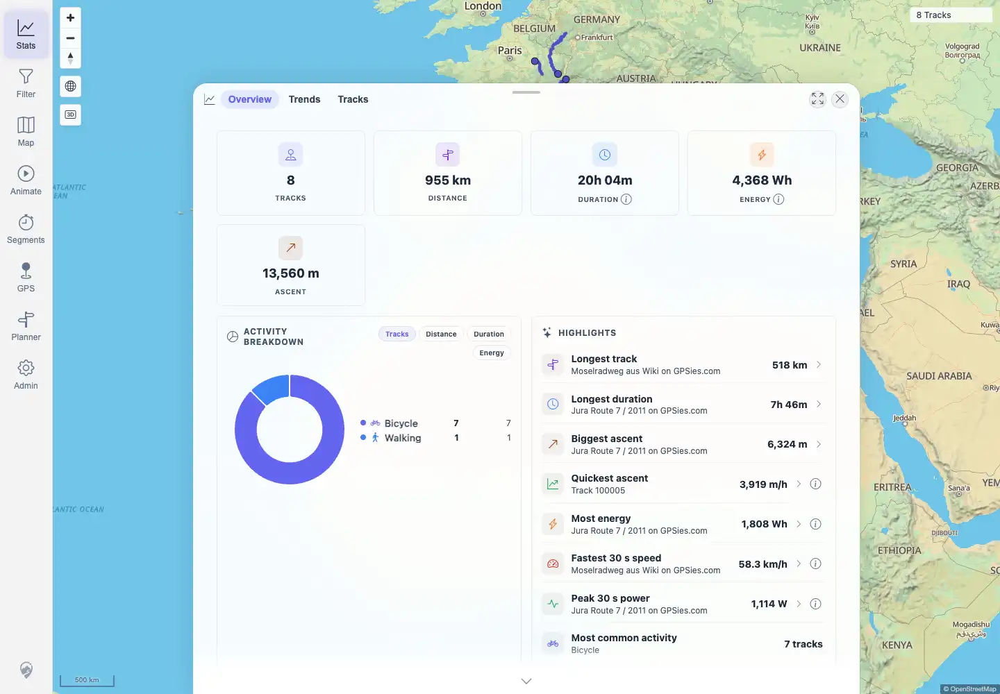

# Packet: FMT_02

## Scope

- Coverage source: `documentation/testing/frontend-regression-test-plan.md`
- Coverage ID or run packet: FMT_02
- In scope: For each tested non-GPX format, verify upload acceptance, GPSBabel conversion, map/detail/chart visibility, statistics inclusion, original download, and GPX download.
- Out of scope: Native GPX acceptance; covered by FMT_01 and earlier import packets.

## Prerequisites

- Required previous coverage IDs or run packets: FMT_01, FIT_02, FIT_04, FIT_05.
- Required app/data state: synthetic non-GPX tracks imported and background jobs settled.
- Required browser context: authenticated desktop browser with downloads enabled.

## Allowed Mutations

- Allowed: open track details and download original/GPX files to temporary local browser download paths.
- Not allowed: import, delete, or edit additional tracks.

## Actions And Results

| Coverage ID | Action | Expected result | Actual result | Status | Evidence |
|---|---|---|---|---|---|
| FMT_02 | For `.tcx`, `.kml`, `.kmz`, `.igc`, `.nmea`, `.geojson`, and `.gdb`, opened detail pages, checked map and graph rendering, downloaded original files through UI buttons and compared hashes, downloaded GPX through UI buttons and counted `trkpt` elements, and checked filtered statistics overview. FIT download/conversion behavior was covered by FIT_04/FIT_05. | For each non-GPX format tested, upload acceptance, GPSBabel conversion, map display, details/charts, statistics inclusion, original source download, and GPX download all work. | PASS: each tested non-GPX format had detail/map/graphs present, original UI download hash matched the uploaded source, GPX UI download contained 24 `trkpt` elements, and stats overview filtered to the seven tested non-GPX IDs reported seven tracks and positive distance. FIT was already covered by FIT_02/FIT_04/FIT_05. | PASS | [assets/FMT_02-format-verification.txt](../assets/FMT_02-format-verification.txt); [assets/FMT_02-map-display.webp](../assets/FMT_02-map-display.webp); [assets/FMT_02-sample-graphs.webp](../assets/FMT_02-sample-graphs.webp); [assets/FMT_02-stats-overview.webp](../assets/FMT_02-stats-overview.webp); [packets/FIT_04.md](FIT_04.md); [packets/FIT_05.md](FIT_05.md) |

## Issues

| ID | Severity | Summary | Reproduction | Expected | Actual | Evidence | Release impact |
|---|---|---|---|---|---|---|---|

## Evidence Files

| File | Purpose |
|---|---|
| [assets/FMT_02-format-verification.txt](../assets/FMT_02-format-verification.txt) | Per-format matrix for detail/map/graphs/download/statistics checks. |
| [assets/FMT_02-map-display.webp](../assets/FMT_02-map-display.webp) | Map surface after the format imports. |
| [assets/FMT_02-sample-graphs.webp](../assets/FMT_02-sample-graphs.webp) | Representative graph tab for the TCX-backed track. |
| [assets/FMT_02-stats-overview.webp](../assets/FMT_02-stats-overview.webp) | Statistics overview after format imports. |
| [packets/FIT_04.md](FIT_04.md) | FIT original source download evidence. |
| [packets/FIT_05.md](FIT_05.md) | FIT GPX download evidence. |

## Screenshot Evidence

## Timings

| Step | Timing |
|---|---:|
| Background job settle | ~30 seconds |
| Per-format detail/download/graph matrix | ~70 seconds |

## Handoff Notes

- Completed: FMT_02 is terminal.
- Remaining unfinished coverage: SGN_01 onward.
- Blocked or not applicable: none.
- State left for the next packet: total visible imported track set includes original GPX/FIT tracks plus synthetic format tracks.
