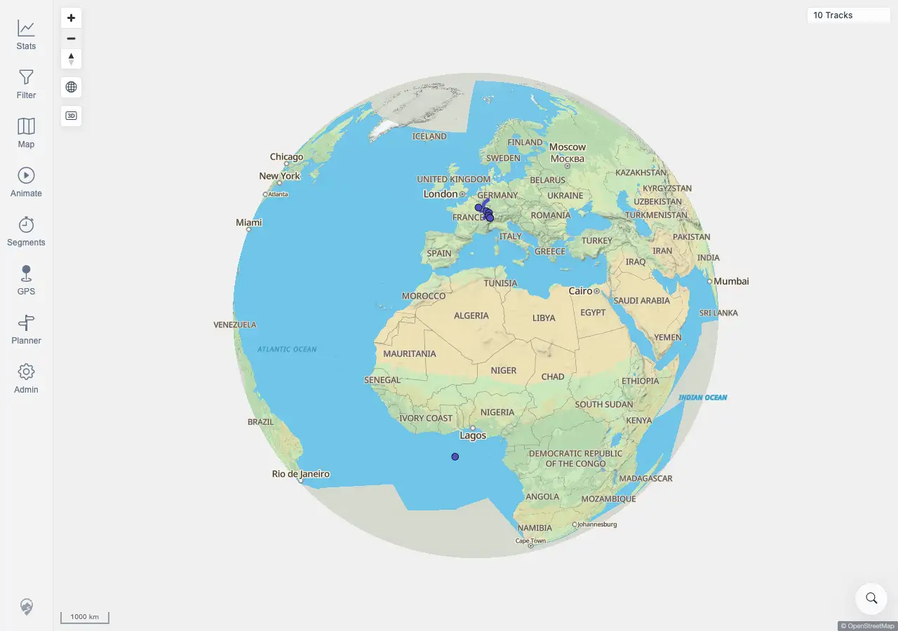

# Packet: GLB_01

## Scope

- Coverage source: `documentation/testing/frontend-regression-test-plan.md`
- Coverage ID or run packet: GLB_01
- In scope: Verify automatic globe projection when zooming out far enough.
- Out of scope: Manual globe disable and zoom-limit recovery.

## Prerequisites

- Required previous coverage IDs or run packets: SRC_04 terminal.
- Required app/data state: Authenticated map view with imported tracks.
- Required browser context: Desktop Chromium context against the remote target.

## Allowed Mutations

- Allowed: Use map zoom controls.
- Not allowed: Change server data or map source configuration.

## Actions And Results

| Coverage ID | Action | Expected result | Actual result | Status | Evidence |
|---|---|---|---|---|---|
| GLB_01 | Used the map zoom-out control until the globe threshold was crossed. | Globe view engages automatically at low zoom. | PASS. After one zoom-out transition, the scale read `1000 km`, the globe control was visible, `.mtl-globe-active` was present, two map canvases remained rendered, and `10 Tracks` stayed visible. | PASS | [assets/GLB_01-auto-globe.webp](../assets/GLB_01-auto-globe.webp); [assets/GLB-globe-mode-results.txt](../assets/GLB-globe-mode-results.txt) |

## Issues

| ID | Severity | Summary | Reproduction | Expected | Actual | Evidence | Release impact |
|---|---|---|---|---|---|---|---|
|  |  |  |  |  |  |  |  |

## Evidence Files

| File | Purpose |
|---|---|
| [assets/GLB_01-auto-globe.webp](../assets/GLB_01-auto-globe.webp) | Globe projection after zooming out. |
| [assets/GLB-globe-mode-results.txt](../assets/GLB-globe-mode-results.txt) | Globe control active/visible state, scale evidence, zoom control state, and assertions. |

## Screenshot Evidence

## Timings

| Step | Timing |
|---|---:|
| Zoom out and capture globe projection | <1 min |

## Handoff Notes

- Completed: GLB_01 is terminal PASS.
- Remaining unfinished coverage: GLB_02 onward.
- Blocked or not applicable: none.
- State left for the next packet: Shared globe evidence captured.
