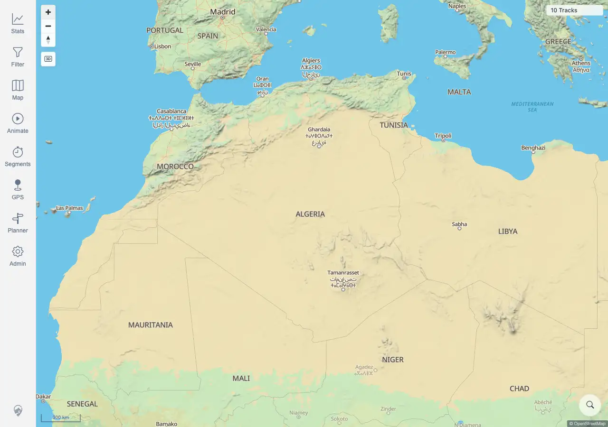

# Packet: GLB_02

## Scope

- Coverage source: `documentation/testing/frontend-regression-test-plan.md`
- Coverage ID or run packet: GLB_02
- In scope: Verify zooming in exits globe mode and returns to flat map view.
- Out of scope: Manual globe disable and zoom-limit recovery.

## Prerequisites

- Required previous coverage IDs or run packets: GLB_01 terminal.
- Required app/data state: Map can enter globe mode at low zoom.
- Required browser context: Desktop Chromium context against the remote target.

## Allowed Mutations

- Allowed: Use map zoom controls.
- Not allowed: Change server data.

## Actions And Results

| Coverage ID | Action | Expected result | Actual result | Status | Evidence |
|---|---|---|---|---|---|
| GLB_02 | Used the map zoom-in control from the active globe state. | Map returns to flat view after zooming in past the exit threshold. | PASS. After two zoom-in clicks, scale read `300 km`, the globe control was hidden, active state was false, two map canvases remained rendered, and `10 Tracks` stayed visible. | PASS | [assets/GLB_02-flat-after-zoom-in.webp](../assets/GLB_02-flat-after-zoom-in.webp); [assets/GLB-globe-mode-results.txt](../assets/GLB-globe-mode-results.txt) |

## Issues

| ID | Severity | Summary | Reproduction | Expected | Actual | Evidence | Release impact |
|---|---|---|---|---|---|---|---|
|  |  |  |  |  |  |  |  |

## Evidence Files

| File | Purpose |
|---|---|
| [assets/GLB_02-flat-after-zoom-in.webp](../assets/GLB_02-flat-after-zoom-in.webp) | Flat map after zooming in from globe mode. |
| [assets/GLB-globe-mode-results.txt](../assets/GLB-globe-mode-results.txt) | Scale, globe visibility, active state, and representative zoom logs. |

## Screenshot Evidence

## Timings

| Step | Timing |
|---|---:|
| Zoom in and capture flat state | <1 min |

## Handoff Notes

- Completed: GLB_02 is terminal PASS.
- Remaining unfinished coverage: GLB_03 onward.
- Blocked or not applicable: none.
- State left for the next packet: Shared manual-disable evidence captured.
