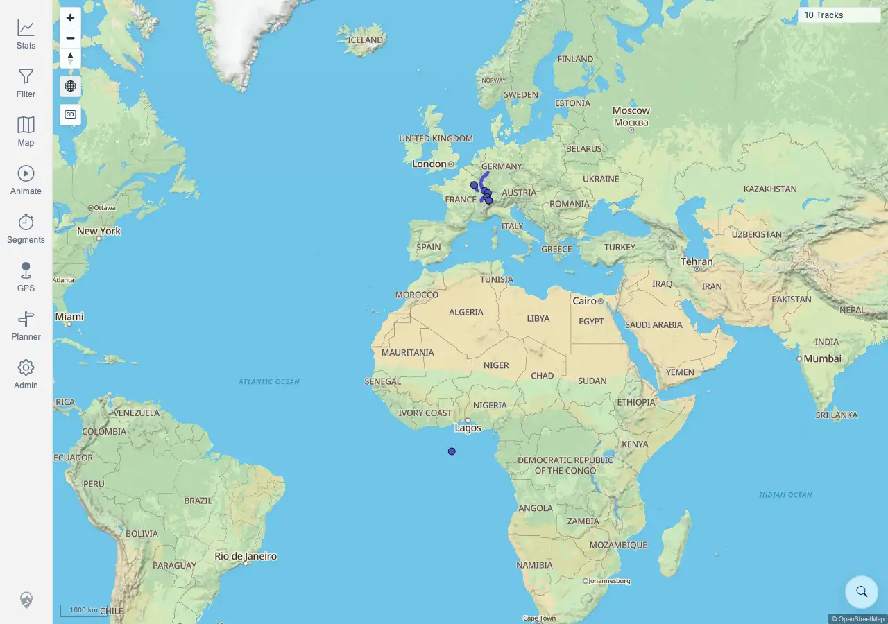

# Packet: GLB_03

## Scope

- Coverage source: `documentation/testing/frontend-regression-test-plan.md`
- Coverage ID or run packet: GLB_03
- In scope: Verify manual globe disable is respected and does not auto-re-enable until the user re-enables it.
- Out of scope: General zoom-limit recovery.

## Prerequisites

- Required previous coverage IDs or run packets: GLB_02 terminal.
- Required app/data state: Map can enter low-zoom globe mode.
- Required browser context: Desktop Chromium context against the remote target.

## Allowed Mutations

- Allowed: Use map zoom and globe controls.
- Not allowed: Change server data or map source configuration.

## Actions And Results

| Coverage ID | Action | Expected result | Actual result | Status | Evidence |
|---|---|---|---|---|---|
| GLB_03 | Re-entered low-zoom globe mode, clicked `Toggle globe mode`, zoomed in and out while disabled, then clicked the toggle again. | Manual disable is respected and globe does not auto-re-enable until the user re-enables it. | PASS. Active state changed true to false after manual disable, stayed false after zooming in to `500 km` and zooming out to `3000 km`, then changed back to true only after clicking the globe toggle again. | PASS | [assets/GLB_03-manual-disabled.webp](../assets/GLB_03-manual-disabled.webp); [assets/GLB-globe-mode-results.txt](../assets/GLB-globe-mode-results.txt) |

## Issues

| ID | Severity | Summary | Reproduction | Expected | Actual | Evidence | Release impact |
|---|---|---|---|---|---|---|---|
|  |  |  |  |  |  |  |  |

## Evidence Files

| File | Purpose |
|---|---|
| [assets/GLB_03-manual-disabled.webp](../assets/GLB_03-manual-disabled.webp) | Low-zoom map with globe manually disabled. |
| [assets/GLB-globe-mode-results.txt](../assets/GLB-globe-mode-results.txt) | Active-state sequence before disable, after disable, after zooms, and after re-enable. |

## Screenshot Evidence

## Timings

| Step | Timing |
|---|---:|
| Disable globe, zoom while disabled, re-enable | <1 min |

## Handoff Notes

- Completed: GLB_03 is terminal PASS.
- Remaining unfinished coverage: GLB_04 onward.
- Blocked or not applicable: none.
- State left for the next packet: Shared zoom-limit recovery evidence captured.
