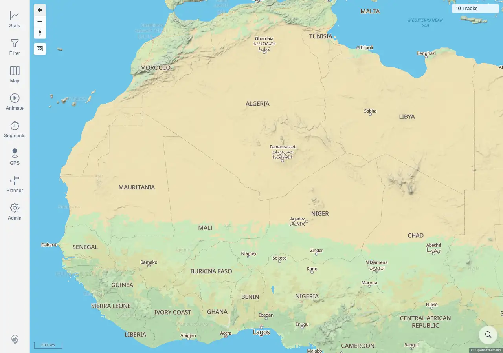

# Packet: GLB_04

## Scope

- Coverage source: `documentation/testing/frontend-regression-test-plan.md`
- Coverage ID or run packet: GLB_04
- In scope: Verify zoom limits do not trap the map at edges.
- Out of scope: Manual globe disable semantics.

## Prerequisites

- Required previous coverage IDs or run packets: GLB_03 terminal.
- Required app/data state: Map controls available; globe mode re-enabled.
- Required browser context: Desktop Chromium context against the remote target.

## Allowed Mutations

- Allowed: Repeated zoom out and zoom in using map controls.
- Not allowed: Change server data.

## Actions And Results

| Coverage ID | Action | Expected result | Actual result | Status | Evidence |
|---|---|---|---|---|---|
| GLB_04 | Repeatedly clicked zoom out until the low-zoom edge, then zoomed back in. | Zoom limits do not trap the map at edges; the map remains controllable and can recover. | PASS. The low-zoom edge had globe active, the zoom-out control disabled, and canvases still rendered; two zoom-in clicks returned to flat mode at `300 km`, with controls enabled and `10 Tracks` visible. | PASS | [assets/GLB_04-zoom-limits-recovered.webp](../assets/GLB_04-zoom-limits-recovered.webp); [assets/GLB-globe-mode-results.txt](../assets/GLB-globe-mode-results.txt) |

## Issues

| ID | Severity | Summary | Reproduction | Expected | Actual | Evidence | Release impact |
|---|---|---|---|---|---|---|---|
|  |  |  |  |  |  |  |  |

## Evidence Files

| File | Purpose |
|---|---|
| [assets/GLB_04-zoom-limits-recovered.webp](../assets/GLB_04-zoom-limits-recovered.webp) | Map after zooming back in from repeated low-zoom interactions. |
| [assets/GLB-globe-mode-results.txt](../assets/GLB-globe-mode-results.txt) | Zoom-out/zoom-in counts, scale states, and control enabled state. |

## Screenshot Evidence

## Timings

| Step | Timing |
|---|---:|
| Repeated zoom out and zoom back in | <1 min |

## Handoff Notes

- Completed: GLB_04 is terminal PASS; globe mode section complete.
- Remaining unfinished coverage: ADM_01 onward.
- Blocked or not applicable: none.
- State left for the next packet: Browser context closed; queue advances to Admin Tools.
