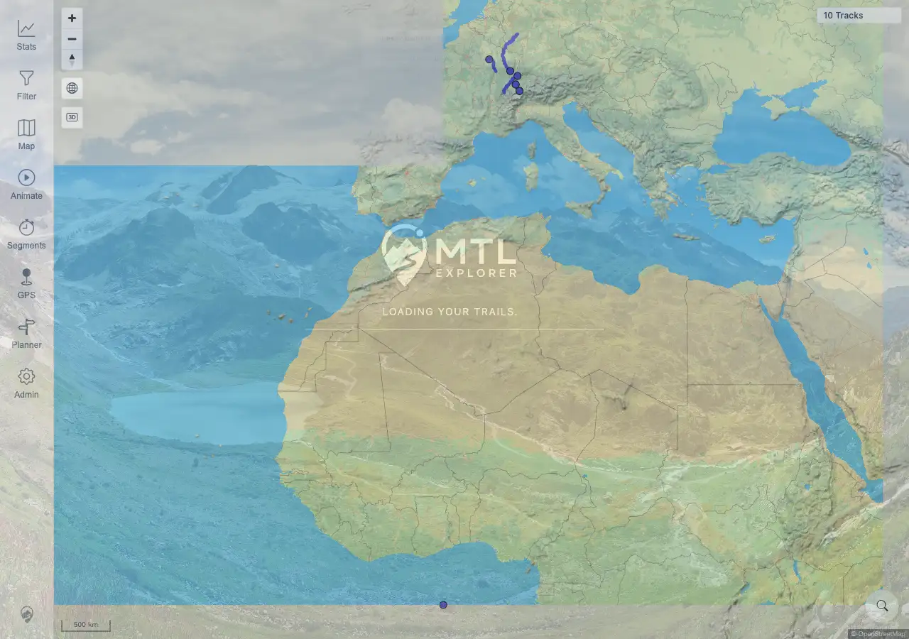

# Packet: GPS_05

## Scope

- Coverage source: `documentation/testing/frontend-regression-test-plan.md`
- Coverage ID or run packet: GPS_05
- In scope: Determine whether the GPS disable/removal flow can be exercised on this target.
- Out of scope: HTTPS/localhost live geolocation stop behavior.

## Prerequisites

- Required previous coverage IDs or run packets: GPS_04 terminal.
- Required app/data state: Authenticated map view on the remote quick-install target.
- Required browser context: Desktop Chromium context against `http://178.104.209.132:18080/mtl/`.

## Allowed Mutations

- Allowed: Check whether GPS starts and can be disabled.
- Not allowed: Change site origin, browser geolocation permissions, or deployment configuration.

## Actions And Results

| Coverage ID | Action | Expected result | Actual result | Status | Evidence |
|---|---|---|---|---|---|
| GPS_05 | Checked whether the GPS disable flow could be exercised after attempting GPS on the remote plain-HTTP target. | On a secure origin after GPS starts, disabling GPS should remove the marker and stop updates. | GPS never started on the configured target because the origin was `http:` and `window.isSecureContext=false`; clicking GPS showed the HTTPS/localhost requirement, so no marker or watch existed to disable. | NOT APPLICABLE | [assets/GPS-geolocation-insecure-context.webp](../assets/GPS-geolocation-insecure-context.webp); [assets/GPS-geolocation-insecure-context.txt](../assets/GPS-geolocation-insecure-context.txt) |

## Issues

| ID | Severity | Summary | Reproduction | Expected | Actual | Evidence | Release impact |
|---|---|---|---|---|---|---|---|
|  |  |  |  |  |  |  |  |

## Evidence Files

| File | Purpose |
|---|---|
| [assets/GPS-geolocation-insecure-context.webp](../assets/GPS-geolocation-insecure-context.webp) | Confirms the target prevents live GPS before marker/watch creation. |
| [assets/GPS-geolocation-insecure-context.txt](../assets/GPS-geolocation-insecure-context.txt) | Captured origin, permission state, and warning evidence reused for GPS applicability rows. |

## Screenshot Evidence

## Timings

| Step | Timing |
|---|---:|
| Reused GPS applicability evidence | <1 min |

## Handoff Notes

- Completed: GPS_05 is terminal as not applicable for this remote plain-HTTP run.
- Remaining unfinished coverage: SRC_01 onward.
- Blocked or not applicable: Disable/marker removal behavior requires a started GPS watch on HTTPS or localhost.
- State left for the next packet: Map state unchanged.
