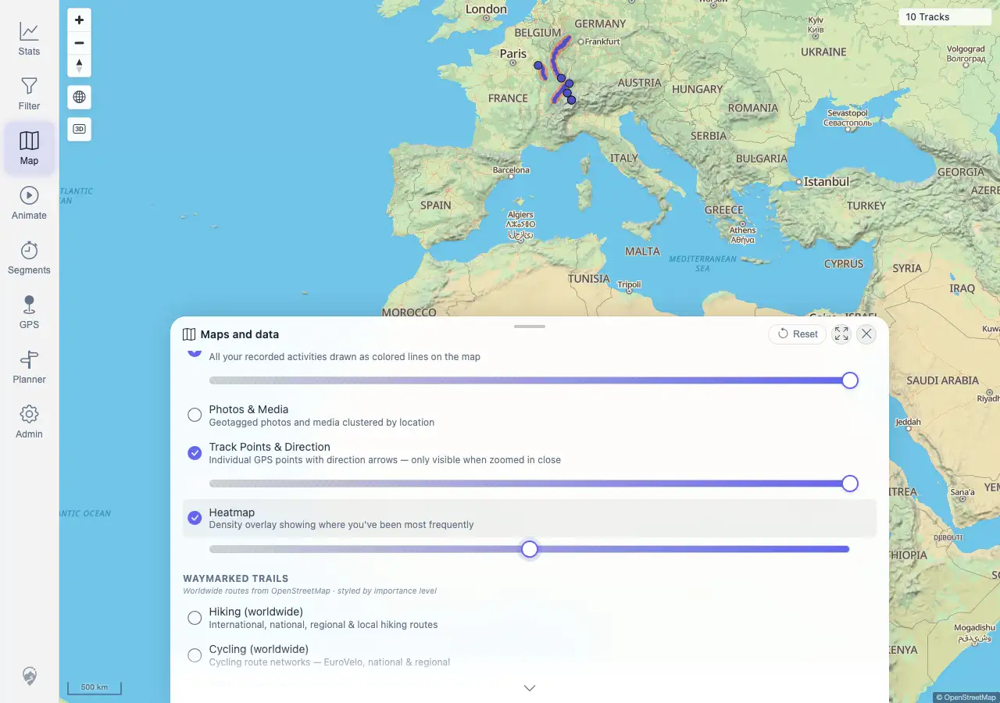

# Packet: HMO_01

## Scope

- Coverage source: `documentation/testing/frontend-regression-test-plan.md`
- Coverage ID or run packet: HMO_01
- In scope: Heatmap layer toggle, visible map state, and heatmap opacity control.
- Out of scope: Other map overlays and filter-driven heatmap refresh; covered by HMO_02 and HMO_03.

## Prerequisites

- Required previous coverage IDs or run packets: MED_05 terminal.
- Required app/data state: Quick-install beta stack running with imported GPS tracks.
- Required browser context: Fresh authenticated desktop context.

## Allowed Mutations

- Allowed: Toggle Heatmap, adjust Heatmap opacity in disposable browser state, capture screenshot/text evidence.
- Not allowed: Change server data.

## Actions And Results

| Coverage ID | Action | Expected result | Actual result | Status | Evidence |
|---|---|---|---|---|---|
| HMO_01 | Opened Map settings, reset the disposable browser's map-layer settings to defaults, toggled Heatmap on, then changed Heatmap opacity from `100` to `50` using the Heatmap row's ARIA slider. | Heatmap draws over the map without hiding tracks and respects opacity. | PASS. Heatmap changed from disabled to enabled, the Heatmap opacity slider reported `50`, persisted map settings recorded `heatmapVisible:true` and `layerOpacities.heatmap:50`, GPS Tracks stayed enabled at opacity `100`, two MapLibre canvases stayed rendered, and screenshots show colored GPS tracks plus the `10 Tracks` chip while heatmap is enabled. | PASS | [assets/HMO_01-heatmap-toggle.txt](../assets/HMO_01-heatmap-toggle.txt); [assets/HMO_01-heatmap-on.webp](../assets/HMO_01-heatmap-on.webp); [assets/HMO_01-heatmap-opacity.webp](../assets/HMO_01-heatmap-opacity.webp) |

## Issues

| ID | Severity | Summary | Reproduction | Expected | Actual | Evidence | Release impact |
|---|---|---|---|---|---|---|---|
|  |  |  |  |  |  |  |  |

## Evidence Files

| File | Purpose |
|---|---|
| [assets/HMO_01-heatmap-toggle.txt](../assets/HMO_01-heatmap-toggle.txt) | Browser evidence for Heatmap/GPS Tracks row state, persisted opacity, canvas count, and assertions. |
| [assets/HMO_01-heatmap-on.webp](../assets/HMO_01-heatmap-on.webp) | Heatmap enabled with GPS tracks still visible. |
| [assets/HMO_01-heatmap-opacity.webp](../assets/HMO_01-heatmap-opacity.webp) | Heatmap opacity reduced to 50 while GPS tracks remain visible. |

## Screenshot Evidence

## Timings

| Step | Timing |
|---|---:|
| Heatmap toggle and opacity check | <1 min |

## Handoff Notes

- Completed: HMO_01 is terminal PASS.
- Remaining unfinished coverage: HMO_02 onward.
- Blocked or not applicable: None.
- State left for the next packet: Browser context closed; no server data changed.
