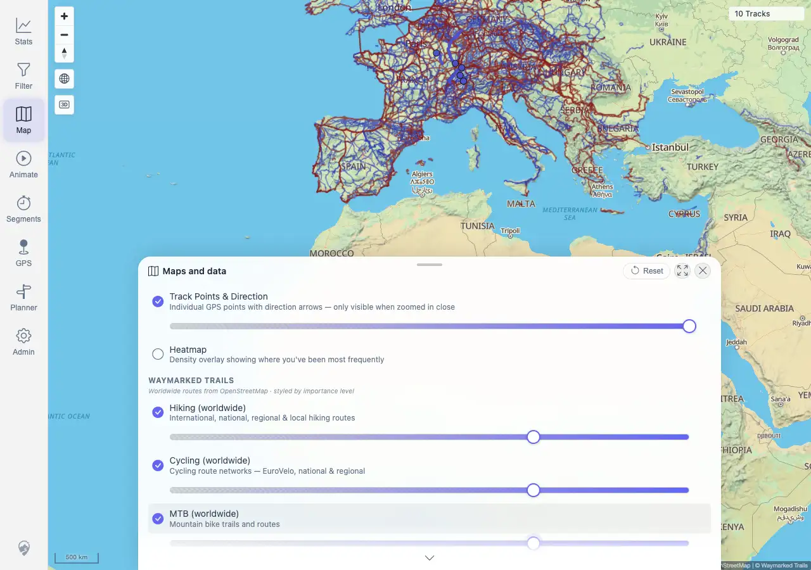
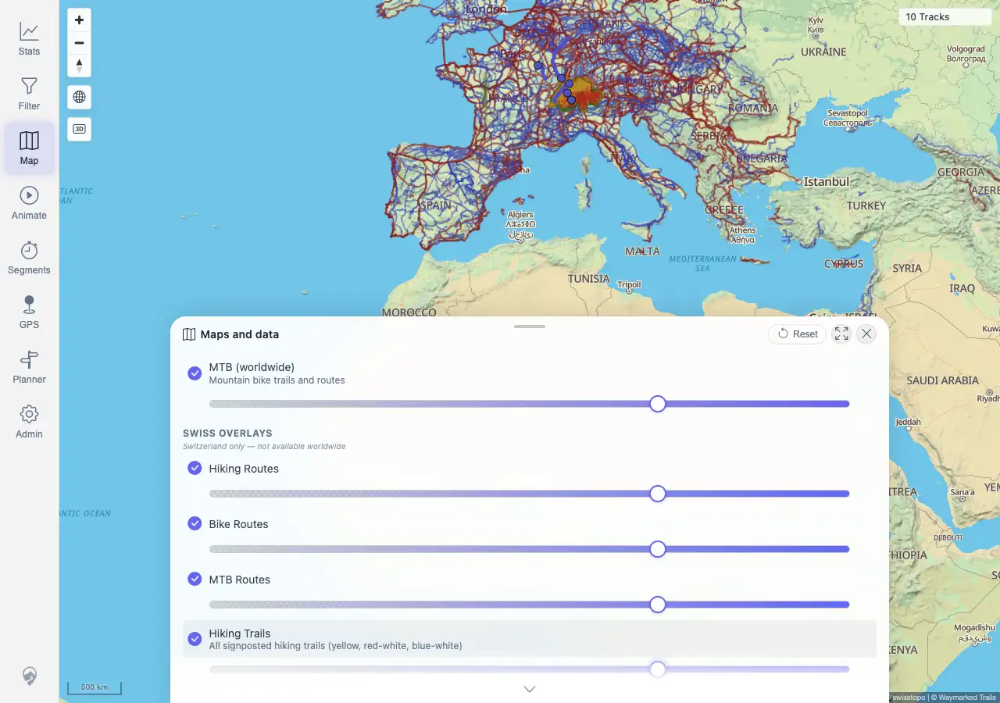

# Packet: HMO_02

## Scope

- Coverage source: `documentation/testing/frontend-regression-test-plan.md`
- Coverage ID or run packet: HMO_02
- In scope: Independent overlay toggles for Waymarked Trails and Swiss route/trail overlays, overlay opacity sliders, persisted map settings, and GPS Tracks layer state.
- Out of scope: Heatmap behavior and filter-driven heatmap refresh; covered by HMO_01 and HMO_03.

## Prerequisites

- Required previous coverage IDs or run packets: HMO_01 terminal.
- Required app/data state: Quick-install beta stack running with imported GPS tracks.
- Required browser context: Fresh authenticated desktop context with disposable map settings reset to defaults.

## Allowed Mutations

- Allowed: Toggle map overlay rows, adjust overlay opacity sliders in disposable browser state, capture screenshot/text evidence.
- Not allowed: Change server track data or admin configuration.

## Actions And Results

| Coverage ID | Action | Expected result | Actual result | Status | Evidence |
|---|---|---|---|---|---|
| HMO_02 | Opened Map settings after resetting disposable browser map settings, then independently enabled `Hiking (worldwide)`, `Cycling (worldwide)`, `MTB (worldwide)`, `Hiking Routes`, `Bike Routes`, `MTB Routes`, and `Hiking Trails`. For each overlay row, focused its ARIA slider and set opacity to `70`. | Each overlay can be toggled independently, each opacity slider works, overlay state persists, and GPS Tracks remain enabled/visible above/below the overlay stack as configured. | PASS. All seven overlay rows started disabled, each became enabled with slider value `70`, persisted settings recorded all seven IDs in `activeOverlays` and opacity `70`, GPS Tracks stayed enabled with opacity `100`, and two MapLibre canvases stayed rendered. Tile traffic included 60 Waymarked requests and 139 Swiss WMTS requests. Swiss WMTS returned some 400 tile responses at the broad all-track overview, consistent with the Switzerland-only hint, and did not block controls or persisted state. | PASS | [assets/HMO_02-overlay-toggles.txt](../assets/HMO_02-overlay-toggles.txt); [assets/HMO_02-waymarked-overlays.webp](../assets/HMO_02-waymarked-overlays.webp); [assets/HMO_02-swiss-overlays.webp](../assets/HMO_02-swiss-overlays.webp) |

## Issues

| ID | Severity | Summary | Reproduction | Expected | Actual | Evidence | Release impact |
|---|---|---|---|---|---|---|---|
|  |  |  |  |  |  |  |  |

## Evidence Files

| File | Purpose |
|---|---|
| [assets/HMO_02-overlay-toggles.txt](../assets/HMO_02-overlay-toggles.txt) | Browser evidence for initial/final row state, persisted overlay IDs/opacities, GPS Tracks row state, canvas count, tile-request counts, and assertions. |
| [assets/HMO_02-waymarked-overlays.webp](../assets/HMO_02-waymarked-overlays.webp) | Waymarked overlay rows enabled with opacity adjusted. |
| [assets/HMO_02-swiss-overlays.webp](../assets/HMO_02-swiss-overlays.webp) | Swiss overlay rows enabled with opacity adjusted. |

## Screenshot Evidence

## Timings

| Step | Timing |
|---|---:|
| Overlay toggle and opacity matrix | <2 min |

## Handoff Notes

- Completed: HMO_02 is terminal PASS.
- Remaining unfinished coverage: HMO_03 onward.
- Blocked or not applicable: None.
- State left for the next packet: Browser context closed; no server data changed.
