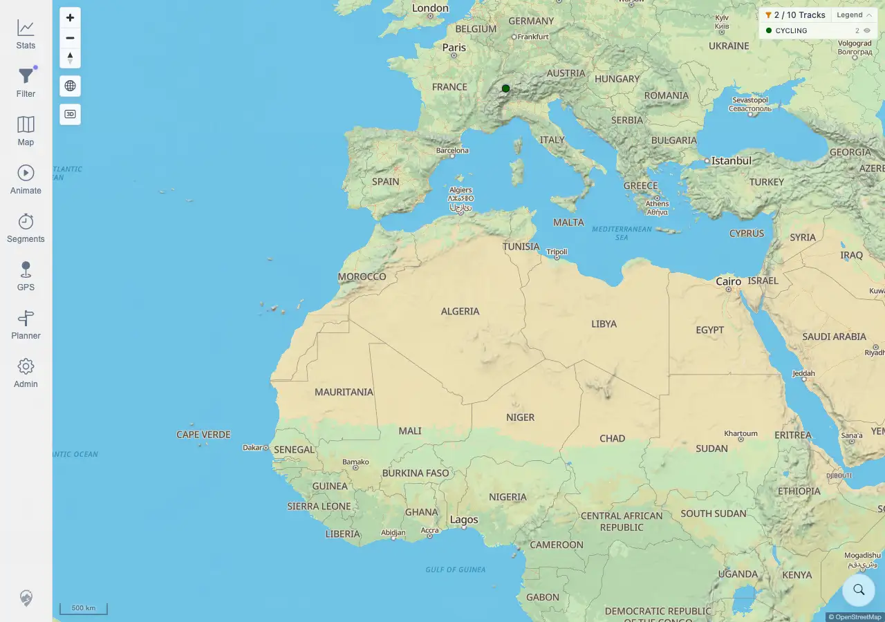

# Packet: HMO_03

## Scope

- Coverage source: `documentation/testing/frontend-regression-test-plan.md`
- Coverage ID or run packet: HMO_03
- In scope: Heatmap behavior after changing the active track filter.
- Out of scope: General filter parameter behavior and overlay toggles; covered by FLT_* and HMO_02.

## Prerequisites

- Required previous coverage IDs or run packets: HMO_02 terminal.
- Required app/data state: Quick-install beta stack running with current imported GPS tracks.
- Required browser context: Fresh authenticated desktop context with disposable map/filter local storage reset.

## Allowed Mutations

- Allowed: Toggle Heatmap, apply a temporary browser-local `Activities by keyword` filter, capture screenshot/text evidence.
- Not allowed: Change server track data or admin configuration.

## Actions And Results

| Coverage ID | Action | Expected result | Actual result | Status | Evidence |
|---|---|---|---|---|---|
| HMO_03 | Opened Map settings, reset disposable map settings, enabled Heatmap, captured the all-track map, then opened Filter, enabled `Activities by keyword`, entered keyword `Path`, returned to the map, and captured the filtered heatmap state. | After changing filters, the heatmap updates accordingly. | PASS. The heatmap-enabled baseline map showed `10 Tracks`; the keyword filter resolved through the UI to `2 matching tracks`, and the map returned to `2 / 10 Tracks` with `heatmapVisible:true`. Persisted filter state recorded `ActivitiesByKeyword` with `SEARCH_WORD=Path`, two MapLibre canvases stayed rendered, and the before/after screenshots differed by 1,151,773 pixels. | PASS | [assets/HMO_03-heatmap-filter-update.txt](../assets/HMO_03-heatmap-filter-update.txt); [assets/HMO_03-heatmap-before-filter.webp](../assets/HMO_03-heatmap-before-filter.webp); [assets/HMO_03-heatmap-after-filter.webp](../assets/HMO_03-heatmap-after-filter.webp) |

## Issues

| ID | Severity | Summary | Reproduction | Expected | Actual | Evidence | Release impact |
|---|---|---|---|---|---|---|---|
|  |  |  |  |  |  |  |  |

## Evidence Files

| File | Purpose |
|---|---|
| [assets/HMO_03-heatmap-filter-update.txt](../assets/HMO_03-heatmap-filter-update.txt) | Browser evidence for count transition, heatmap/filter persistence, canvas count, screenshot hashes/diff, and assertions. |
| [assets/HMO_03-heatmap-before-filter.webp](../assets/HMO_03-heatmap-before-filter.webp) | Heatmap-enabled map before applying the keyword filter. |
| [assets/HMO_03-heatmap-after-filter.webp](../assets/HMO_03-heatmap-after-filter.webp) | Heatmap-enabled map after applying keyword `Path`. |

## Screenshot Evidence

## Timings

| Step | Timing |
|---|---:|
| Heatmap filter update check | <1 min |

## Handoff Notes

- Completed: HMO_03 is terminal PASS.
- Remaining unfinished coverage: GPS_01 onward.
- Blocked or not applicable: none.
- State left for the next packet: Browser context closed; no server data changed.
