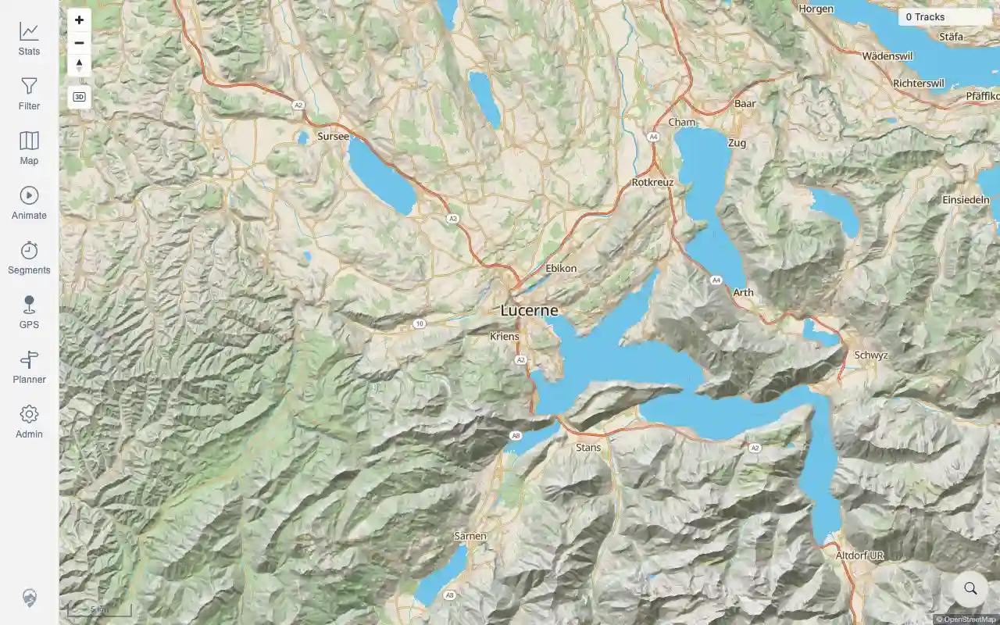
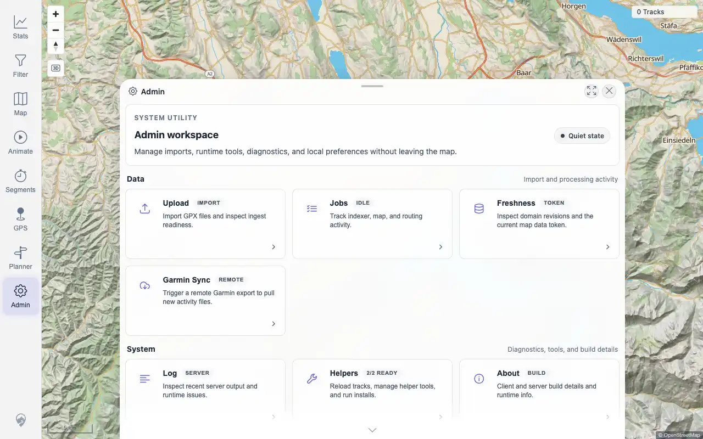

# Packet: IMP_01

## Scope

- Coverage source: `documentation/testing/frontend-regression-test-plan.md`
- Coverage ID or run packet: IMP_01
- In scope: Capture baseline map count, track-browser count, statistics totals, data-freshness token, and GPS indexer status before imports.
- Out of scope: Importing files.

## Prerequisites

- Required previous coverage IDs or run packets: DAT_01 through DAT_07.
- Required app/data state: fresh installed app with no imported tracks.
- Required browser context: desktop authenticated browser.

## Allowed Mutations

- Allowed: authenticate, open Stats/Admin, query app APIs in the authenticated browser context.
- Not allowed: copy data into the import folder.

## Actions And Results

| Coverage ID | Action | Expected result | Actual result | Status | Evidence |
|---|---|---|---|---|---|
| IMP_01 | Signed in, captured map/Stats/Admin baseline, and queried freshness, indexer, jobs, simplified track IDs, overview, and statistics endpoints before import. | Baseline map count, track-browser count, statistics totals, data-freshness token, and GPS indexer status are recorded before data changes. | PASS: UI shows `0 Tracks`; Stats says no tracks match; simplified track count is 0; overview summary has `trackCount:0`, `distanceM:0`, `durationMs:0`, `ascentM:0`, `energyWh:0`; freshness token has `tracks:0`, `track_geometry:0`, `index:0`; GPS indexer has total/pending/completed/failed/removed all 0 and progress 100; jobs are idle at 0. | PASS | [assets/IMP_01-baseline.txt](../assets/IMP_01-baseline.txt); [assets/IMP_01-baseline-map.webp](../assets/IMP_01-baseline-map.webp); [assets/IMP_01-baseline-stats.webp](../assets/IMP_01-baseline-stats.webp); [assets/IMP_01-baseline-admin.webp](../assets/IMP_01-baseline-admin.webp) |

## Issues

| ID | Severity | Summary | Reproduction | Expected | Actual | Evidence | Release impact |
|---|---|---|---|---|---|---|---|

## Evidence Files

| File | Purpose |
|---|---|
| [assets/IMP_01-baseline.txt](../assets/IMP_01-baseline.txt) | Baseline UI text and API summaries. |
| [assets/IMP_01-baseline-map.webp](../assets/IMP_01-baseline-map.webp) | Baseline map with 0 tracks. |
| [assets/IMP_01-baseline-stats.webp](../assets/IMP_01-baseline-stats.webp) | Baseline Stats empty state. |
| [assets/IMP_01-baseline-admin.webp](../assets/IMP_01-baseline-admin.webp) | Baseline Admin quiet state. |

## Screenshot Evidence

## Timings

| Step | Timing |
|---|---:|
| Baseline UI/API capture | ~16 seconds |

## Handoff Notes

- Completed: IMP_01 is terminal.
- Remaining unfinished coverage: IMP_02 onward; DAT_03 still needs imported IDs after import.
- Blocked or not applicable: none.
- State left for the next packet: no files have been copied into the watched import folder yet.
