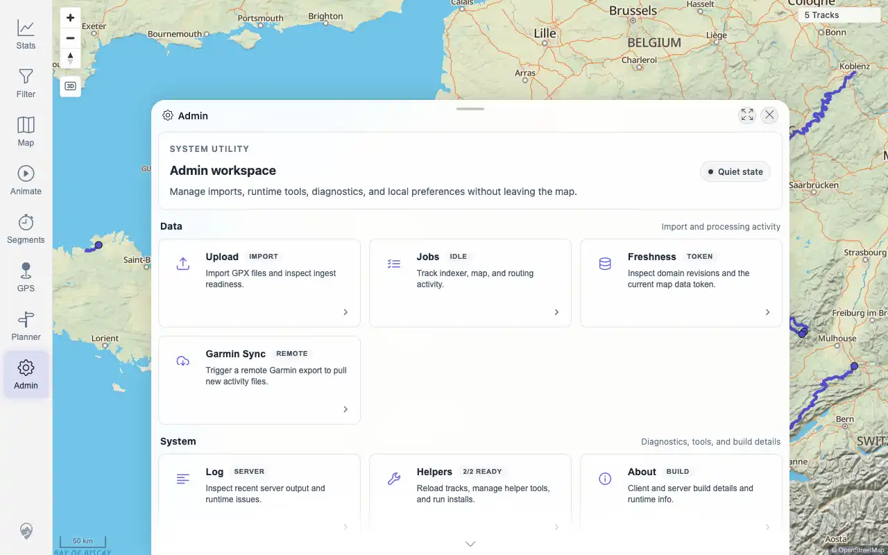

# Packet: IMP_04

## Scope

- Coverage source: `documentation/testing/frontend-regression-test-plan.md`
- Coverage ID or run packet: IMP_04
- In scope: Confirm upload/index status, data freshness change, no GPS index failures, and settled background jobs after five-GPX import.
- Out of scope: Per-file UI search/map/stat verification; covered by IMP_05 through IMP_09.

## Prerequisites

- Required previous coverage IDs or run packets: IMP_03.
- Required app/data state: five GPX files indexed.
- Required browser context: desktop authenticated browser.

## Allowed Mutations

- Allowed: open Admin and query authenticated status APIs.
- Not allowed: import or delete additional files.

## Actions And Results

| Coverage ID | Action | Expected result | Actual result | Status | Evidence |
|---|---|---|---|---|---|
| IMP_04 | Queried freshness, indexer, job, and simplified-track APIs and captured Admin after the five-GPX import. | All five source files reach completed state, no unexpected GPS index failures appear, data freshness changes, and Duplicate Finder/Exploration Score jobs settle. | PASS: track count is 5; freshness token changed from baseline `tracks:0/index:0` to `tracks:30/index:15`; GPS indexer total/completed 5, pending/failed/removed 0; Duplicate Finder, Activity Classifier, and Exploration Score are all 5/5 done with pending 0; Admin shows quiet/idle state. | PASS | [assets/IMP_04-status.txt](../assets/IMP_04-status.txt); [assets/IMP_04-admin-upload.webp](../assets/IMP_04-admin-upload.webp) |

## Issues

| ID | Severity | Summary | Reproduction | Expected | Actual | Evidence | Release impact |
|---|---|---|---|---|---|---|---|

## Evidence Files

| File | Purpose |
|---|---|
| [assets/IMP_04-status.txt](../assets/IMP_04-status.txt) | Post-import freshness, indexer, job, track-count, and Admin text evidence. |
| [assets/IMP_04-admin-upload.webp](../assets/IMP_04-admin-upload.webp) | Admin state after import and job settling. |

## Screenshot Evidence

## Timings

| Step | Timing |
|---|---:|
| Post-import status capture | ~7 seconds |

## Handoff Notes

- Completed: IMP_04 is terminal.
- Remaining unfinished coverage: IMP_05 onward; DAT_03 still needs imported IDs after IMP_06.
- Blocked or not applicable: none.
- State left for the next packet: five GPX tracks are indexed and visible to authenticated APIs.
