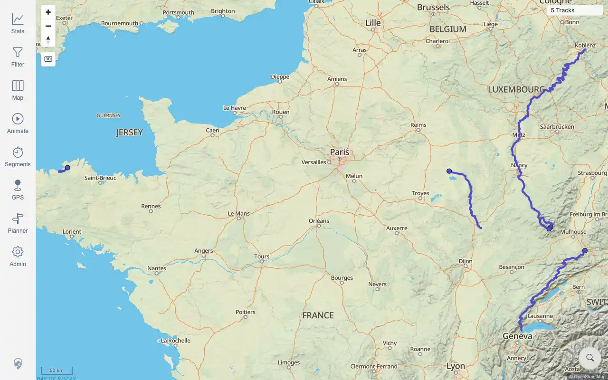
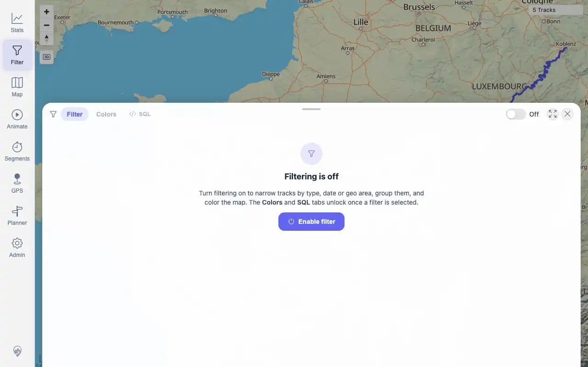
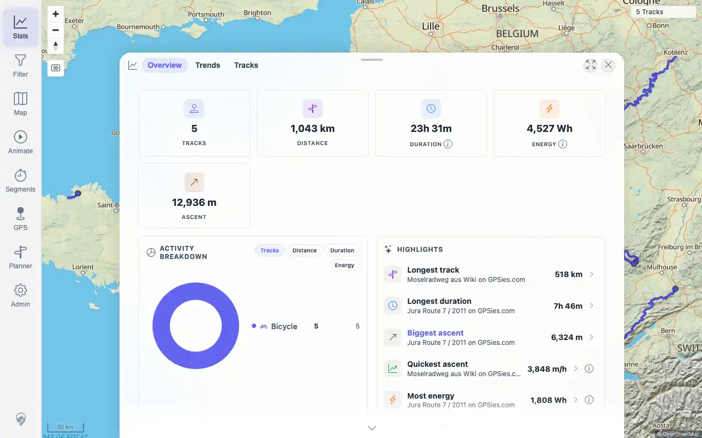
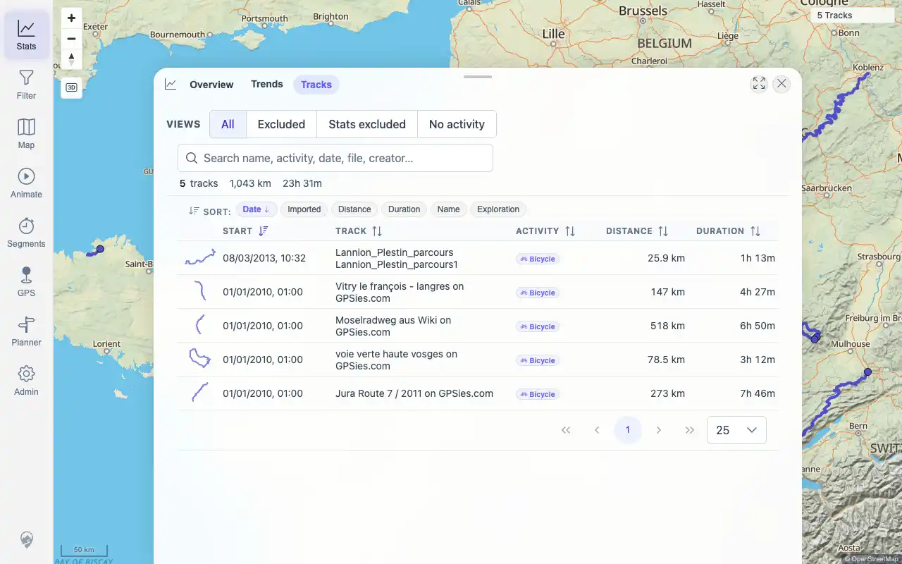

# Packet: IMP_05

## Scope

- Coverage source: `documentation/testing/frontend-regression-test-plan.md`
- Coverage ID or run packet: IMP_05
- In scope: Use helper reload after import and verify map, track browser, filters, and statistics show new data.
- Out of scope: Per-file search and map click verification; covered by IMP_06 and IMP_07.

## Prerequisites

- Required previous coverage IDs or run packets: IMP_01 through IMP_04.
- Required app/data state: five GPX tracks indexed and jobs settled.
- Required browser context: authenticated desktop browser.

## Allowed Mutations

- Allowed: click Admin Helpers `Reload` action.
- Not allowed: import or delete files.

## Actions And Results

| Coverage ID | Action | Expected result | Actual result | Status | Evidence |
|---|---|---|---|---|---|
| IMP_05 | Opened Admin Helpers, clicked the visible `Reload` helper action, then checked map, Filter, Stats Overview, and Stats Tracks surfaces. | Reloaded client caches show the imported data in map, track browser, filters, and statistics. | PASS: map and filter showed `5 Tracks`; Stats Overview showed `5 TRACKS`, 1,043 km distance, 23h 31m duration, 12,936 m ascent, and imported track names; Stats Tracks showed 5 track rows and imported file names; authenticated API confirmed five track IDs `100000` through `100004`. | PASS | [assets/IMP_05-helper-reload.txt](../assets/IMP_05-helper-reload.txt); [assets/IMP_05-map-after-reload.webp](../assets/IMP_05-map-after-reload.webp); [assets/IMP_05-filter-after-reload.webp](../assets/IMP_05-filter-after-reload.webp); [assets/IMP_05-stats-after-reload.webp](../assets/IMP_05-stats-after-reload.webp); [assets/IMP_05-tracks-after-reload.webp](../assets/IMP_05-tracks-after-reload.webp) |

## Issues

| ID | Severity | Summary | Reproduction | Expected | Actual | Evidence | Release impact |
|---|---|---|---|---|---|---|---|

## Evidence Files

| File | Purpose |
|---|---|
| [assets/IMP_05-helper-reload.txt](../assets/IMP_05-helper-reload.txt) | Helper reload, UI summary, and API count evidence. |
| [assets/IMP_05-map-after-reload.webp](../assets/IMP_05-map-after-reload.webp) | Map after helper reload. |
| [assets/IMP_05-filter-after-reload.webp](../assets/IMP_05-filter-after-reload.webp) | Filter panel after helper reload. |
| [assets/IMP_05-stats-after-reload.webp](../assets/IMP_05-stats-after-reload.webp) | Stats overview after helper reload. |
| [assets/IMP_05-tracks-after-reload.webp](../assets/IMP_05-tracks-after-reload.webp) | Track browser/table area after helper reload. |

## Screenshot Evidence

## Timings

| Step | Timing |
|---|---:|
| Helper reload and surface verification | ~52 seconds |

## Handoff Notes

- Completed: IMP_05 is terminal.
- Remaining unfinished coverage: IMP_06 onward; DAT_03 still needs imported IDs/names.
- Blocked or not applicable: none.
- State left for the next packet: five imported GPX tracks visible in map/filter/stats/browser surfaces.
