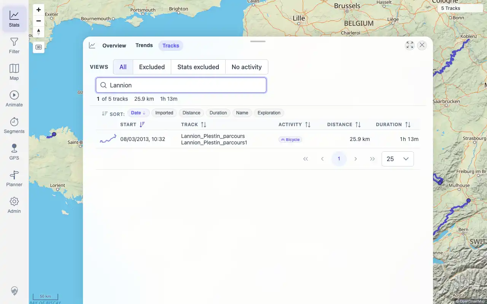
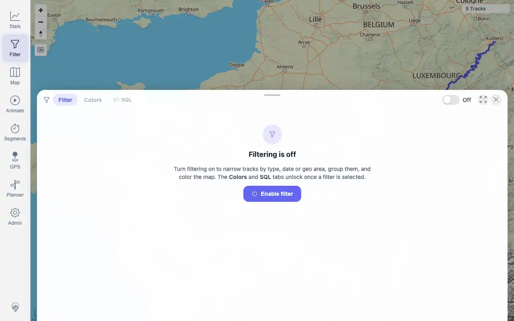

# Packet: IMP_06

## Scope

- Coverage source: `documentation/testing/frontend-regression-test-plan.md`
- Coverage ID or run packet: IMP_06
- In scope: Verify each imported GPX file by name in track-browser search, map, statistics summaries, and filter results.
- Out of scope: Track click/popups and line geometry; covered by IMP_07.

## Prerequisites

- Required previous coverage IDs or run packets: IMP_01 through IMP_05.
- Required app/data state: five GPX tracks imported and client cache reloaded.
- Required browser context: authenticated desktop browser.

## Allowed Mutations

- Allowed: search track browser, navigate map/filter/stats, collect imported ID mapping.
- Not allowed: import/delete additional files.

## Actions And Results

| Coverage ID | Action | Expected result | Actual result | Status | Evidence |
|---|---|---|---|---|---|
| IMP_06 | Searched each imported track by name in Stats > Tracks, checked stats summaries, map count, filter count, and recorded source-to-track ID mapping from authenticated track data. | Each imported file appears by name in track browser search, on the map, in statistics summaries, and in at least one filter result. | PASS: all five searches filtered the track-browser table to exactly one expected row; Stats overview contained all imported names; map/filter showed `5 Tracks`; API simplified count was 5; imported ID/name mappings were recorded for all five GPX source files. | PASS | [assets/IMP_06-per-file.txt](../assets/IMP_06-per-file.txt); [assets/DAT_03-imported-mapping.txt](../assets/DAT_03-imported-mapping.txt); [assets/IMP_06-browser-search.webp](../assets/IMP_06-browser-search.webp); [assets/IMP_06-map-count.webp](../assets/IMP_06-map-count.webp); [assets/IMP_06-filter-count.webp](../assets/IMP_06-filter-count.webp) |

## Issues

| ID | Severity | Summary | Reproduction | Expected | Actual | Evidence | Release impact |
|---|---|---|---|---|---|---|---|

## Evidence Files

| File | Purpose |
|---|---|
| [assets/IMP_06-per-file.txt](../assets/IMP_06-per-file.txt) | Per-source search matrix, map/filter count, and stats-name evidence. |
| [assets/DAT_03-imported-mapping.txt](../assets/DAT_03-imported-mapping.txt) | Source file to imported GPX track ID/name mapping. |
| [assets/IMP_06-browser-search.webp](../assets/IMP_06-browser-search.webp) | Track-browser search evidence. |
| [assets/IMP_06-map-count.webp](../assets/IMP_06-map-count.webp) | Map count evidence. |
| [assets/IMP_06-filter-count.webp](../assets/IMP_06-filter-count.webp) | Filter count evidence. |

## Screenshot Evidence

## Timings

| Step | Timing |
|---|---:|
| Per-file UI search and surface checks | ~70 seconds |
| Imported ID mapping | included in the same pass |

## Handoff Notes

- Completed: IMP_06 is terminal; GPX imported ID/name evidence for DAT_03 is available.
- Remaining unfinished coverage: IMP_07 onward; DAT_03 still needs the FIT imported ID/name after FIT_02.
- Blocked or not applicable: none.
- State left for the next packet: five GPX tracks remain imported and visible.
