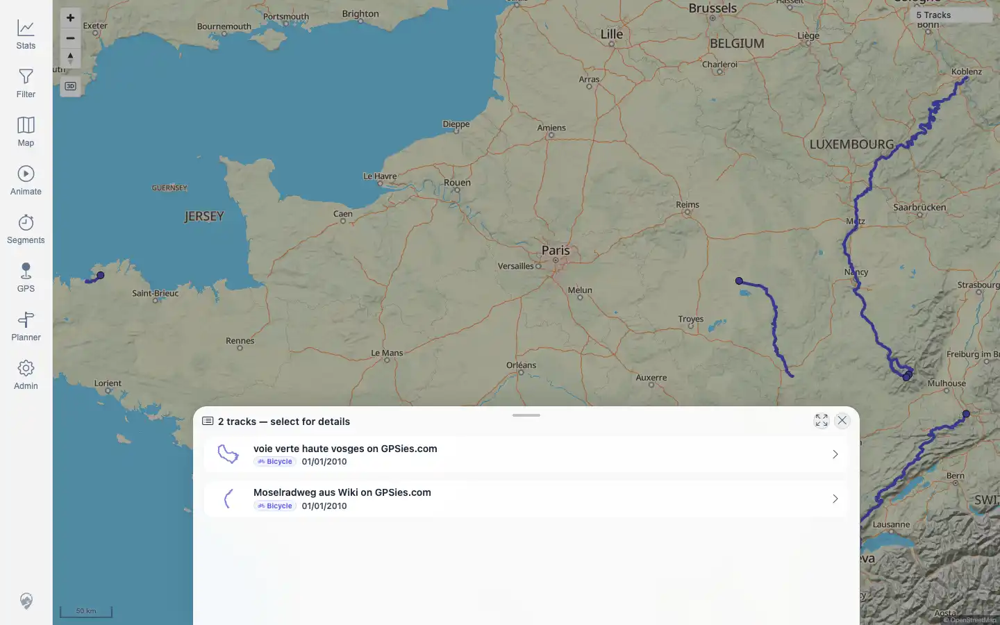
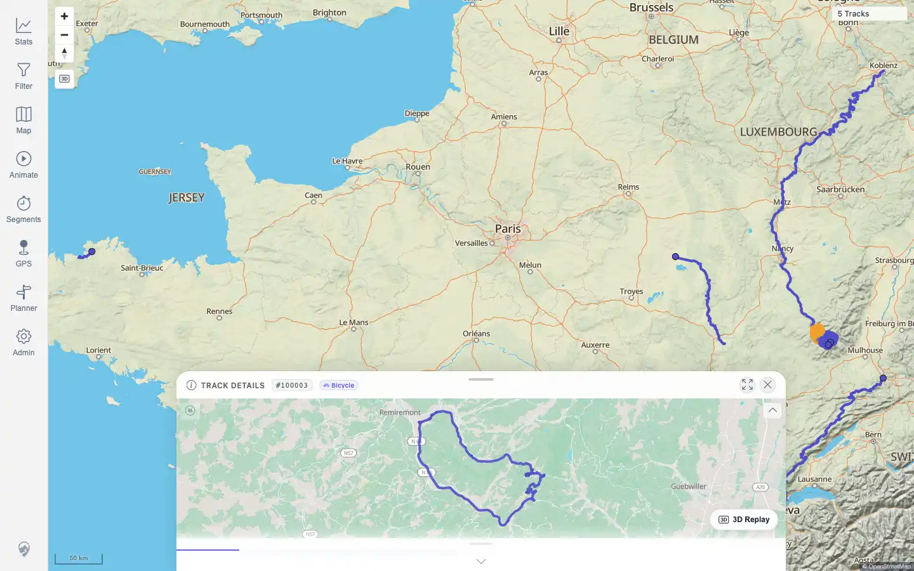

# Packet: IMP_07

## Scope

- Coverage source: `documentation/testing/frontend-regression-test-plan.md`
- Coverage ID or run packet: IMP_07
- In scope: Map visibility, clicking imported rendered tracks, detail/selection opening, map popup behavior, visible line geometry, and stale/duplicate line check.
- Out of scope: Dedicated high-zoom direction-arrow/track-point metric popup checks; covered later by MAP_07 and MAP_11.

## Prerequisites

- Required previous coverage IDs or run packets: IMP_01 through IMP_06.
- Required app/data state: five GPX tracks imported and visible on map.
- Required browser context: authenticated desktop browser.

## Allowed Mutations

- Allowed: click rendered map tracks and selection popup entries.
- Not allowed: import/delete data.

## Actions And Results

| Coverage ID | Action | Expected result | Actual result | Status | Evidence |
|---|---|---|---|---|---|
| IMP_07 | Used a clean map view, clicked rendered track geometries for all five imported tracks, and selected the Voie track from the overlap popup. | Imported tracks are visible on the map; clicking each track opens details or a selection popup; visible line geometry is not stale, duplicated, or broken. | PASS: Lannion, Vitry, Mosel, and Jura clicks opened their detail pages directly; the Voie/Mosel overlap click opened a two-track selection popup and selecting Voie opened its detail page; no stale or duplicated geometry was observed on the clean map. | PASS | [assets/IMP_07-map-clicks.txt](../assets/IMP_07-map-clicks.txt); [assets/IMP_07-clean-map-confirm.webp](../assets/IMP_07-clean-map-confirm.webp); [assets/IMP_07-overlap-selection.webp](../assets/IMP_07-overlap-selection.webp); [assets/IMP_07-voie-detail-from-map.webp](../assets/IMP_07-voie-detail-from-map.webp) |

## Issues

| ID | Severity | Summary | Reproduction | Expected | Actual | Evidence | Release impact |
|---|---|---|---|---|---|---|---|

## Evidence Files

| File | Purpose |
|---|---|
| [assets/IMP_07-map-clicks.txt](../assets/IMP_07-map-clicks.txt) | Per-track map click coordinates and results. |
| [assets/IMP_07-clean-map-confirm.webp](../assets/IMP_07-clean-map-confirm.webp) | Clean map with imported geometries visible. |
| [assets/IMP_07-overlap-selection.webp](../assets/IMP_07-overlap-selection.webp) | Overlapping track selection popup. |
| [assets/IMP_07-voie-detail-from-map.webp](../assets/IMP_07-voie-detail-from-map.webp) | Voie detail opened from map selection popup. |

## Screenshot Evidence

## Timings

| Step | Timing |
|---|---:|
| Map click coordinate pass | ~3 minutes |
| Successful coordinate refinement | included |

## Handoff Notes

- Completed: IMP_07 is terminal.
- Remaining unfinished coverage: IMP_08 onward.
- Blocked or not applicable: none.
- State left for the next packet: five GPX tracks remain imported and visible; track IDs 100000-100004 are known.
