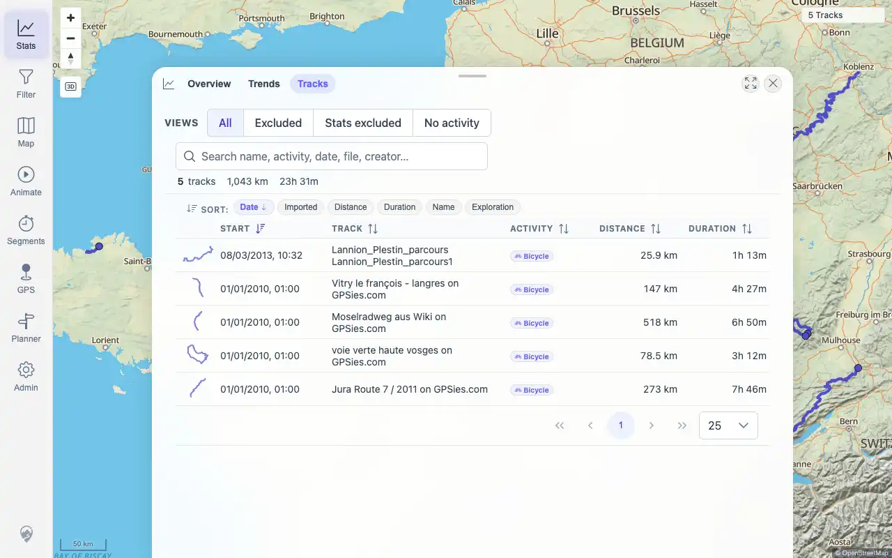
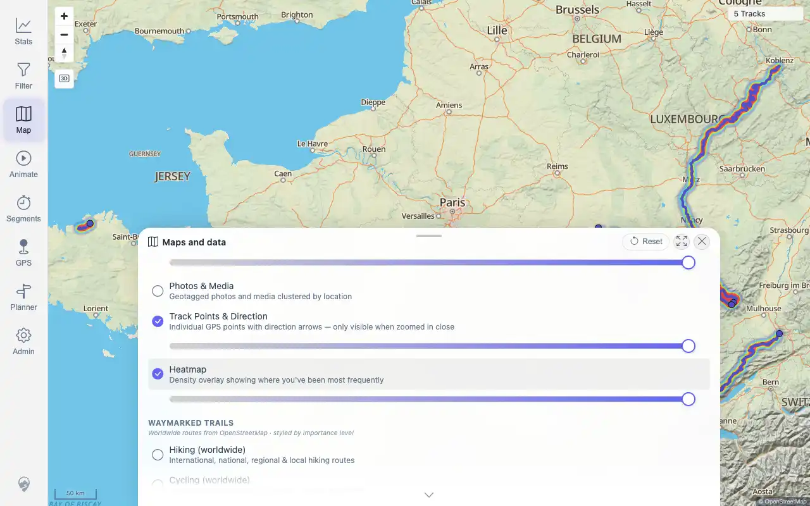

# Packet: IMP_09

## Scope

- Coverage source: `documentation/testing/frontend-regression-test-plan.md`
- Coverage ID or run packet: IMP_09
- In scope: Verify totals changed in the correct direction after five-GPX import, including distance, duration, ascent, activity breakdown, period charts, rankings, heatmap density, and track-browser summary.
- Out of scope: Deletion delta; covered by DEL packets.

## Prerequisites

- Required previous coverage IDs or run packets: IMP_01 through IMP_08.
- Required app/data state: five GPX tracks imported.
- Required browser context: authenticated desktop browser.

## Allowed Mutations

- Allowed: toggle heatmap for evidence, then restore it off.
- Not allowed: import/delete data.

## Actions And Results

| Coverage ID | Action | Expected result | Actual result | Status | Evidence |
|---|---|---|---|---|---|
| IMP_09 | Compared baseline zero totals to current Stats/API totals; captured Stats overview, track-browser summary, and heatmap density; restored Heatmap off afterward. | Totals change in the correct direction: distance, duration, ascent/descent where surfaced, activity breakdown, period charts, rankings, heatmap density, and track-browser summary reflect imported data. | PASS: current API summary shows 5 tracks, 1,042,712 m distance, 84,660,000 ms duration, 12,936 m ascent, and 4,527 Wh energy; Stats UI shows 5 tracks, 1,043 km, 23h 31m, Bicycle breakdown, rankings/highlights, period rows, and track-browser summary; Heatmap density rendered over imported tracks. Descent is not surfaced in the overview API/UI checked here. | PASS | [assets/IMP_09-totals.txt](../assets/IMP_09-totals.txt); [assets/IMP_09-stats-totals.webp](../assets/IMP_09-stats-totals.webp); [assets/IMP_09-track-browser-summary.webp](../assets/IMP_09-track-browser-summary.webp); [assets/IMP_09-heatmap-density.webp](../assets/IMP_09-heatmap-density.webp) |

## Issues

| ID | Severity | Summary | Reproduction | Expected | Actual | Evidence | Release impact |
|---|---|---|---|---|---|---|---|

## Evidence Files

| File | Purpose |
|---|---|
| [assets/IMP_09-totals.txt](../assets/IMP_09-totals.txt) | Baseline/current totals, activity breakdown, rankings, periods, track-browser text, and heatmap note. |
| [assets/IMP_09-stats-totals.webp](../assets/IMP_09-stats-totals.webp) | Stats overview totals after import. |
| [assets/IMP_09-track-browser-summary.webp](../assets/IMP_09-track-browser-summary.webp) | Track-browser summary after import. |
| [assets/IMP_09-heatmap-density.webp](../assets/IMP_09-heatmap-density.webp) | Heatmap density over imported tracks. |

## Screenshot Evidence

## Timings

| Step | Timing |
|---|---:|
| Totals and heatmap capture | ~17 seconds |
| Heatmap restore off | ~1 second |

## Handoff Notes

- Completed: IMP_09 is terminal.
- Remaining unfinished coverage: DEL_01 onward.
- Blocked or not applicable: Descent is not surfaced in the checked overview API/UI; no failure because ascent/distance/duration/activity/period/ranking/heatmap/browser requirements were directly verified.
- State left for the next packet: Heatmap restored off; five GPX files remain imported and present in watched folder.
