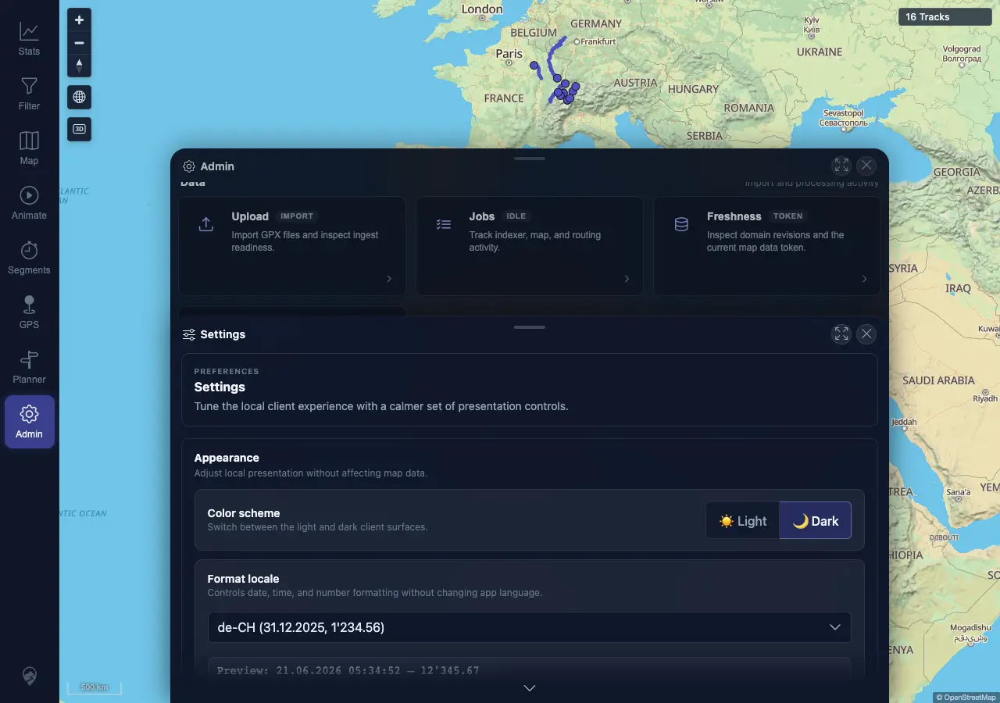
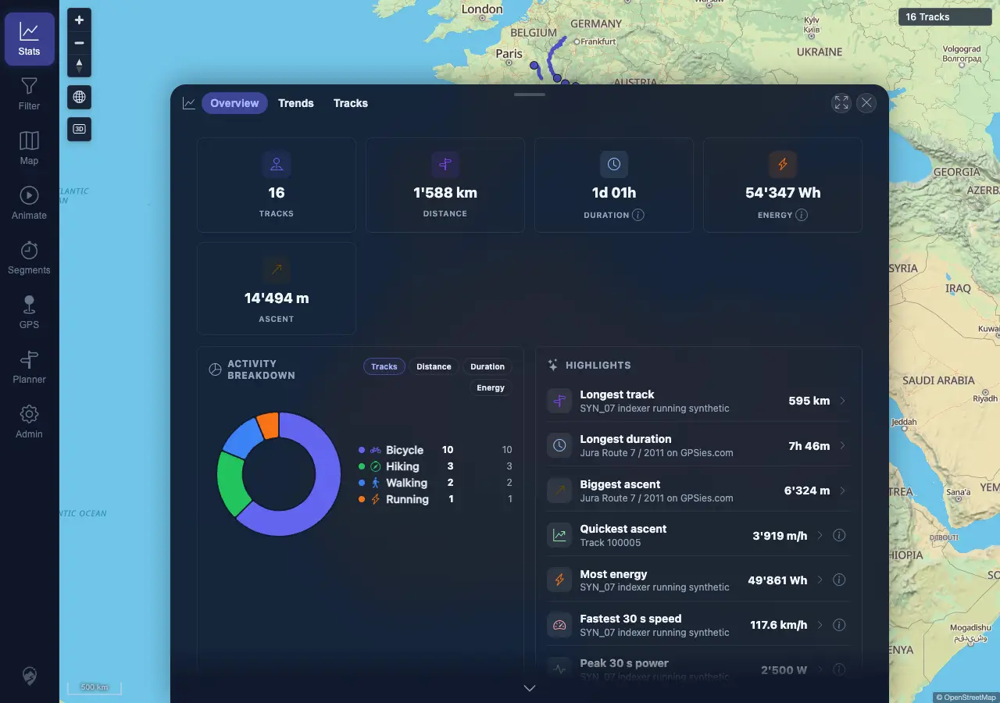

# Packet: LOC_01

## Scope

- Coverage source: `documentation/testing/frontend-regression-test-plan.md`
- Coverage ID or run packet: LOC_01
- In scope: Numbers, distances, durations, and dates rendered with the selected format locale.
- Out of scope: Locale switching persistence; covered by LOC_02 and LOC_03.

## Prerequisites

- Required previous coverage IDs or run packets: APP_08
- Required app/data state: Signed-in desktop session with 16 synced tracks after SYN_07.
- Required browser context: Desktop Chromium/Chrome context against `http://178.104.209.132:18080/mtl/`.

## Allowed Mutations

- Allowed: Change the local client `Format locale` preference to `de-CH`.
- Not allowed: Server data mutation or track import/delete.

## Actions And Results

| Coverage ID | Action | Expected result | Actual result | Status | Evidence |
|---|---|---|---|---|---|
| LOC_01 | Opened Admin > Settings, selected `de-CH`, then opened Stats > Overview and sampled rendered summary, recent activity, and milestone values. | Locale preference is stored and user-facing dates, numbers, distances, and durations use the expected `de-CH` formatting without `NaN` or `undefined`. | `mtl.locale` was `de-CH`; Settings preview showed `21.06.2026 ... 12'345.67`; Stats showed `1'588 km`, `54'347 Wh`, `14'494 m`, `21.06.2026, 08:10`, `01.01.2010, 01:00`, and durations such as `1d 01h` / `7h 46m`; visible scan found no `NaN` or `undefined`. | PASS | [assets/LOC_01-locale-formatting.txt](../assets/LOC_01-locale-formatting.txt); [assets/LOC_01-settings-de-ch.webp](../assets/LOC_01-settings-de-ch.webp); [assets/LOC_01-stats-overview-de-ch.webp](../assets/LOC_01-stats-overview-de-ch.webp) |

## Issues

| ID | Severity | Summary | Reproduction | Expected | Actual | Evidence | Release impact |
|---|---|---|---|---|---|---|---|

## Evidence Files

| File | Purpose |
|---|---|
| [assets/LOC_01-locale-formatting.txt](../assets/LOC_01-locale-formatting.txt) | Locale value, checks, and sampled rendered snippets. |
| [assets/LOC_01-settings-de-ch.webp](../assets/LOC_01-settings-de-ch.webp) | Admin Settings with `de-CH` selected and preview visible. |
| [assets/LOC_01-stats-overview-de-ch.webp](../assets/LOC_01-stats-overview-de-ch.webp) | Stats overview rendered with `de-CH` dates/numbers. |

## Screenshot Evidence

## Timings

| Step | Timing |
|---|---:|
| Select locale and capture Settings | ~3 s |
| Load Stats and capture overview | ~4 s |

## Handoff Notes

- Completed: LOC_01 passed with direct UI evidence.
- Remaining unfinished coverage: LOC_02 through ERR_02.
- Blocked or not applicable: None for this packet.
- State left for the next packet: Desktop browser session remains signed in with local locale preference `de-CH`.
