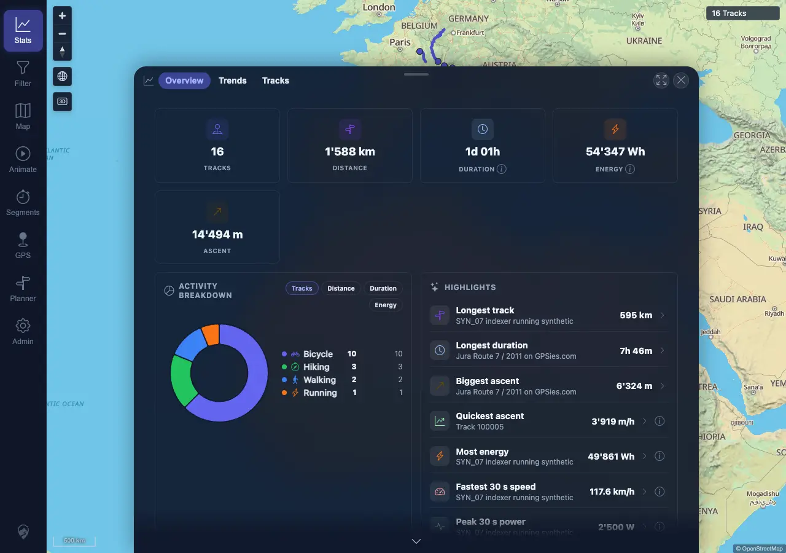
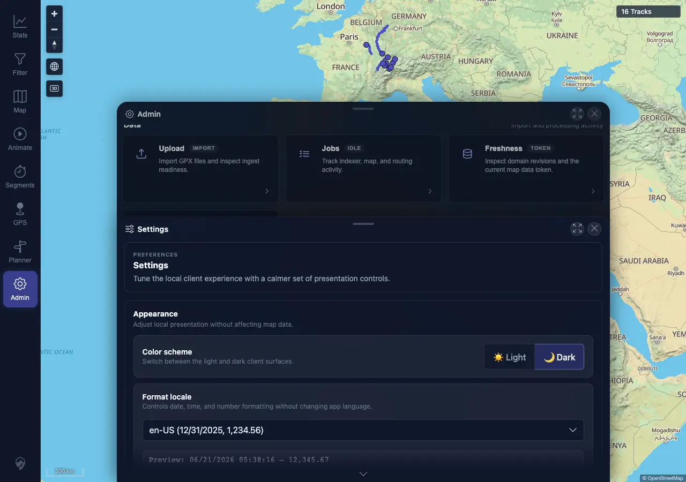
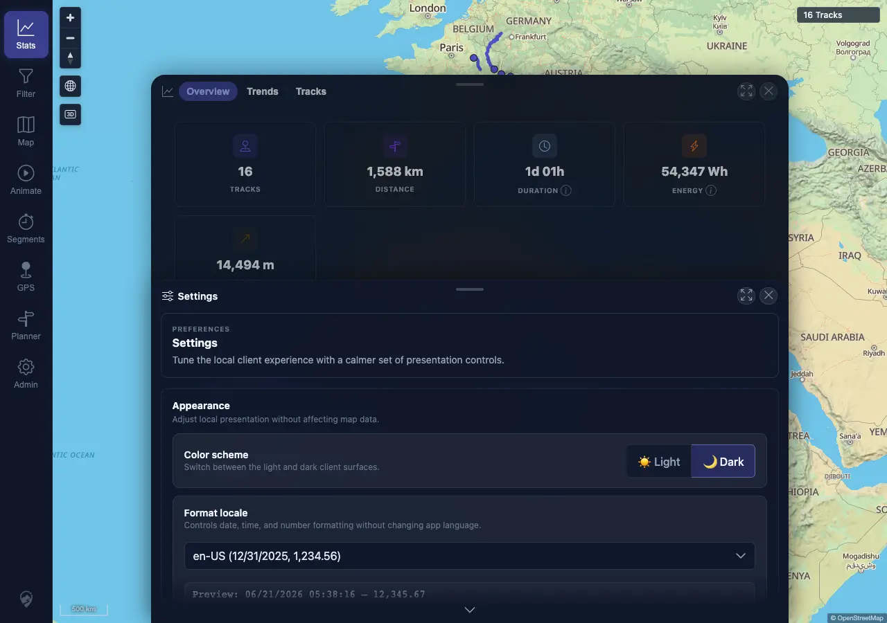

# Packet: LOC_02

## Scope

- Coverage source: `documentation/testing/frontend-regression-test-plan.md`
- Coverage ID or run packet: LOC_02
- In scope: Changing locale updates formatting across the app without reload artifacts.
- Out of scope: Persistence across reload; covered by LOC_03.

## Prerequisites

- Required previous coverage IDs or run packets: LOC_01
- Required app/data state: Desktop session signed in with local locale initially set to `de-CH`.
- Required browser context: Desktop Chromium/Chrome context against `http://178.104.209.132:18080/mtl/`.

## Allowed Mutations

- Allowed: Change local client `Format locale` from `de-CH` to `en-US`.
- Not allowed: Server data mutation or track import/delete.

## Actions And Results

| Coverage ID | Action | Expected result | Actual result | Status | Evidence |
|---|---|---|---|---|---|
| LOC_02 | Loaded Stats with `de-CH`, opened Admin > Settings through the SPA toolbar, changed `Format locale` to `en-US`, then returned to Stats through the SPA toolbar. | Settings preview and Stats values update to `en-US` formatting without a full page reload, stale mixed formatting, blank screen, or visible errors. | Before switch Stats showed `1'588 km`, `54'347 Wh`, and `21.06.2026, 08:10`; after switch Settings preview showed `06/21/2026 ... 12,345.67`, Stats showed `1,588 km`, `54,347 Wh`, `14,494 m`, and `06/21/2026, 08:10`; `performance.timeOrigin` was unchanged and no post-initial load events or console/page errors were recorded. | PASS | [assets/LOC_02-locale-switch.txt](../assets/LOC_02-locale-switch.txt); [assets/LOC_02-before-de-ch-stats.webp](../assets/LOC_02-before-de-ch-stats.webp); [assets/LOC_02-settings-en-us.webp](../assets/LOC_02-settings-en-us.webp); [assets/LOC_02-after-en-us-stats.webp](../assets/LOC_02-after-en-us-stats.webp) |

## Issues

| ID | Severity | Summary | Reproduction | Expected | Actual | Evidence | Release impact |
|---|---|---|---|---|---|---|---|

## Evidence Files

| File | Purpose |
|---|---|
| [assets/LOC_02-locale-switch.txt](../assets/LOC_02-locale-switch.txt) | Before/after locale values, reload check, and rendered snippets. |
| [assets/LOC_02-before-de-ch-stats.webp](../assets/LOC_02-before-de-ch-stats.webp) | Stats before switching away from `de-CH`. |
| [assets/LOC_02-settings-en-us.webp](../assets/LOC_02-settings-en-us.webp) | Admin Settings after selecting `en-US`. |
| [assets/LOC_02-after-en-us-stats.webp](../assets/LOC_02-after-en-us-stats.webp) | Stats after the SPA switch to `en-US`. |

## Screenshot Evidence

## Timings

| Step | Timing |
|---|---:|
| Load and capture pre-switch Stats | ~4 s |
| Switch locale in Settings | ~2 s |
| Return to Stats and capture post-switch state | ~2 s |

## Handoff Notes

- Completed: LOC_02 passed with direct before/after UI evidence and no full reload during the switch.
- Remaining unfinished coverage: LOC_03 through ERR_02.
- Blocked or not applicable: None for this packet.
- State left for the next packet: Desktop browser session remains signed in with local locale preference `en-US`.
