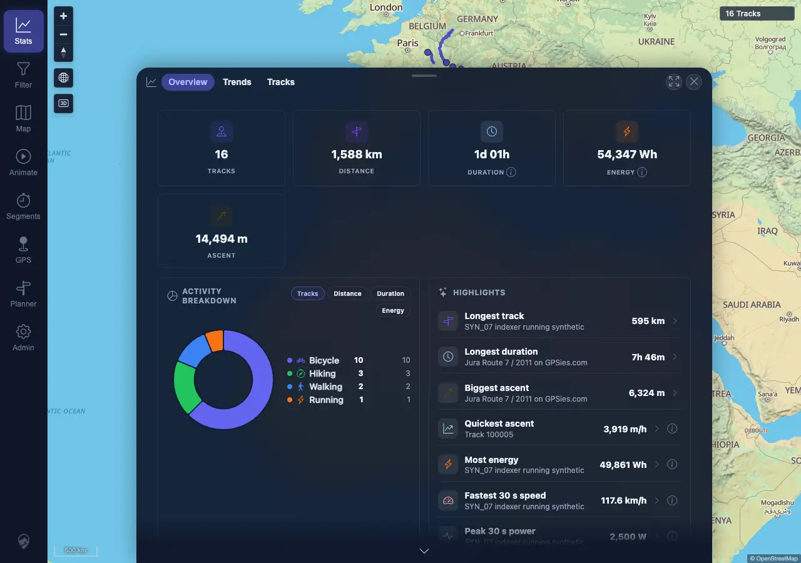
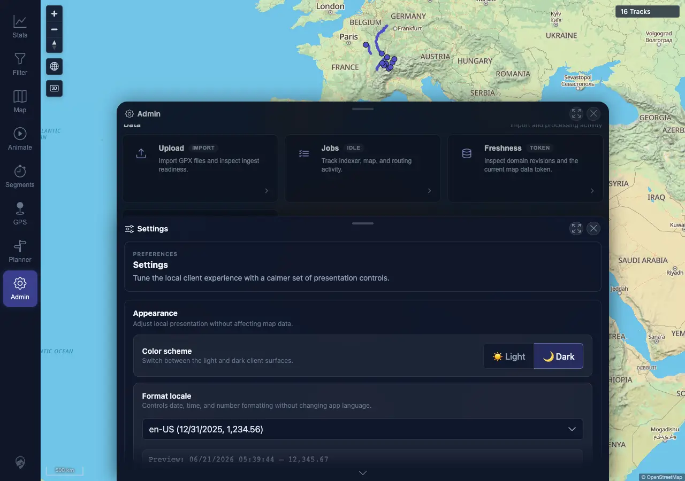

# Packet: LOC_03

## Scope

- Coverage source: `documentation/testing/frontend-regression-test-plan.md`
- Coverage ID or run packet: LOC_03
- In scope: Locale preference persistence across browser reload.
- Out of scope: Locale switching without reload; covered by LOC_02.

## Prerequisites

- Required previous coverage IDs or run packets: LOC_02
- Required app/data state: Desktop session signed in with local locale preference `en-US`.
- Required browser context: Desktop Chromium/Chrome context against `http://178.104.209.132:18080/mtl/`.

## Allowed Mutations

- Allowed: Browser reload and local preference readback.
- Not allowed: Server data mutation or track import/delete.

## Actions And Results

| Coverage ID | Action | Expected result | Actual result | Status | Evidence |
|---|---|---|---|---|---|
| LOC_03 | Loaded Stats with `en-US`, performed a real browser reload, verified post-reload Stats formatting, then opened Admin > Settings to inspect the selected locale and preview. | `en-US` persists through reload and both Stats and Settings keep `en-US` formatting. | `mtl.locale` was `en-US` before and after reload; `performance.timeOrigin` changed, confirming a reload occurred; post-reload Stats showed `1,588 km`, `54,347 Wh`, `14,494 m`, and `06/21/2026, 08:10`; Settings still showed `en-US (12/31/2025, 1,234.56)` and `06/21/2026 ... 12,345.67`. | PASS | [assets/LOC_03-locale-persistence.txt](../assets/LOC_03-locale-persistence.txt); [assets/LOC_03-stats-after-reload-en-us.webp](../assets/LOC_03-stats-after-reload-en-us.webp); [assets/LOC_03-settings-after-reload-en-us.webp](../assets/LOC_03-settings-after-reload-en-us.webp) |

## Issues

| ID | Severity | Summary | Reproduction | Expected | Actual | Evidence | Release impact |
|---|---|---|---|---|---|---|---|

## Evidence Files

| File | Purpose |
|---|---|
| [assets/LOC_03-locale-persistence.txt](../assets/LOC_03-locale-persistence.txt) | Reload check, persisted locale value, and rendered snippets. |
| [assets/LOC_03-stats-after-reload-en-us.webp](../assets/LOC_03-stats-after-reload-en-us.webp) | Stats after reload using persisted `en-US`. |
| [assets/LOC_03-settings-after-reload-en-us.webp](../assets/LOC_03-settings-after-reload-en-us.webp) | Settings after reload showing `en-US` selected. |

## Screenshot Evidence

## Timings

| Step | Timing |
|---|---:|
| Load and reload Stats | ~7 s |
| Open Settings and capture persisted preview | ~2 s |

## Handoff Notes

- Completed: LOC_03 passed with direct reload evidence.
- Remaining unfinished coverage: LOC_04 through ERR_02.
- Blocked or not applicable: None for this packet.
- State left for the next packet: Desktop browser session remains signed in with local locale preference `en-US`.
