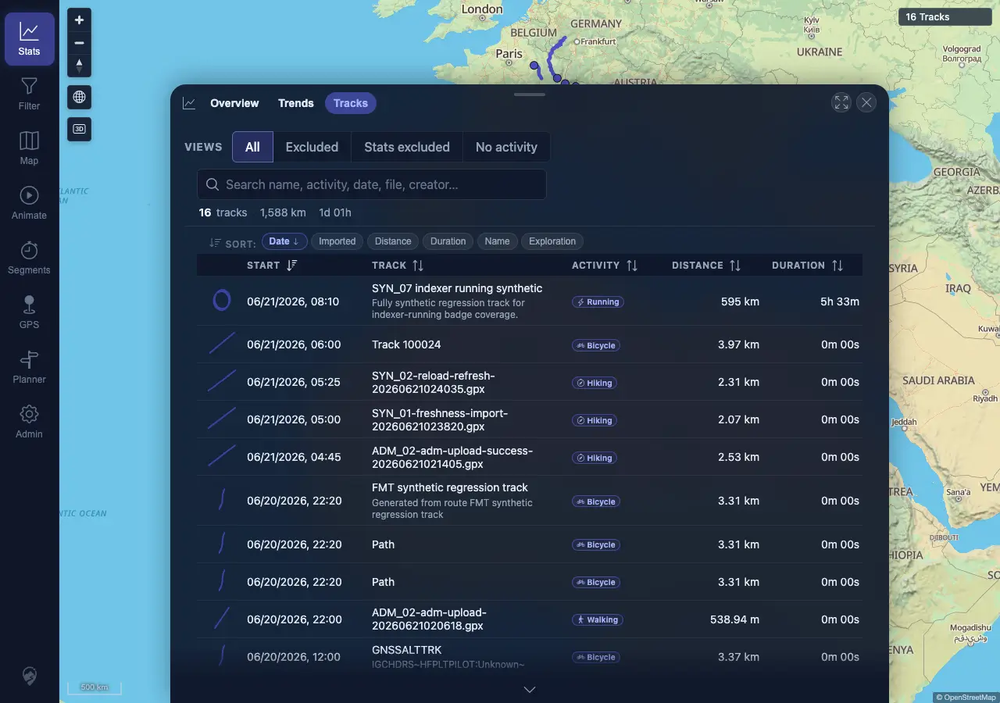
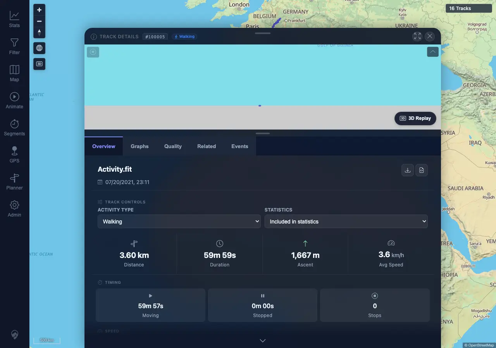
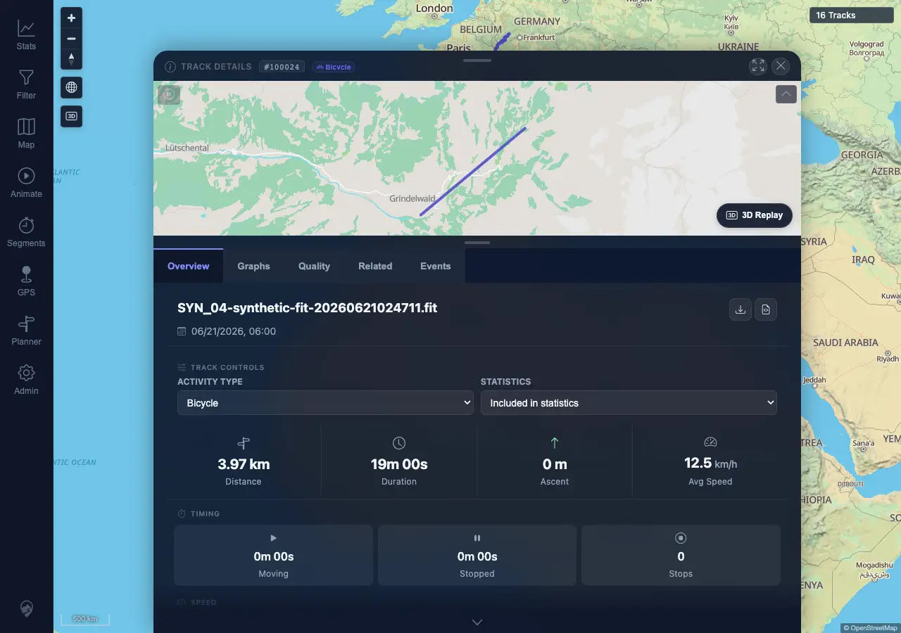

# Packet: LOC_04

## Scope

- Coverage source: `documentation/testing/frontend-regression-test-plan.md`
- Coverage ID or run packet: LOC_04
- In scope: Boundary formatting for zero, large, negative, and null-elevation values.
- Out of scope: Server calculation correctness; this packet checks frontend rendering/fallback behavior.

## Prerequisites

- Required previous coverage IDs or run packets: LOC_03
- Required app/data state: Signed-in desktop session with 16 visible tracks and `en-US` locale.
- Required browser context: Desktop Chromium/Chrome context against `http://178.104.209.132:18080/mtl/`.

## Allowed Mutations

- Allowed: Page-local response override for a single `Track 100024` detail request to simulate null elevation fields.
- Not allowed: Server data mutation or track import/delete.

## Actions And Results

| Coverage ID | Action | Expected result | Actual result | Status | Evidence |
|---|---|---|---|---|---|
| LOC_04 | Opened Stats > Tracks, Track 100005 detail, and a page-local null-elevation simulation for Track 100024. | Zero, very large, negative, and null-elevation values render as readable values/fallbacks, not `NaN`, `undefined`, `null`, or blank metric tiles. | Stats table showed zero durations as `0m 00s`, visible large values such as `1,588 km`, `595 km`, and `49,861 Wh`; Track 100005 showed `Max Desc. Slope -100.7%`; the null-elevation override changed altitude/ascent/descent fields to `null`, and the detail UI rendered `0 m` / `0.0%` fallbacks with no visible `NaN`, `undefined`, or `null`. | PASS | [assets/LOC_04-boundary-values.txt](../assets/LOC_04-boundary-values.txt); [assets/LOC_04-boundary-stats-table.webp](../assets/LOC_04-boundary-stats-table.webp); [assets/LOC_04-negative-slope-detail.webp](../assets/LOC_04-negative-slope-detail.webp); [assets/LOC_04-null-elevation-sim.webp](../assets/LOC_04-null-elevation-sim.webp) |

## Issues

| ID | Severity | Summary | Reproduction | Expected | Actual | Evidence | Release impact |
|---|---|---|---|---|---|---|---|

## Evidence Files

| File | Purpose |
|---|---|
| [assets/LOC_04-boundary-values.txt](../assets/LOC_04-boundary-values.txt) | Boundary checks, API scan, and rendered snippets. |
| [assets/LOC_04-boundary-stats-table.webp](../assets/LOC_04-boundary-stats-table.webp) | Stats track table with zero and large values. |
| [assets/LOC_04-negative-slope-detail.webp](../assets/LOC_04-negative-slope-detail.webp) | Track 100005 detail with negative descent slope. |
| [assets/LOC_04-null-elevation-sim.webp](../assets/LOC_04-null-elevation-sim.webp) | Track 100024 detail with simulated null elevation fields. |

## Screenshot Evidence

## Timings

| Step | Timing |
|---|---:|
| Stats table boundary check | ~5 s |
| Negative slope detail check | ~4 s |
| Null-elevation simulation check | ~4 s |

## Handoff Notes

- Completed: LOC_04 passed with direct UI evidence and one page-local null-elevation simulation.
- Remaining unfinished coverage: MOB_01 through ERR_02.
- Blocked or not applicable: None for this packet.
- State left for the next packet: No server data changed; desktop browser remains signed in with `en-US` locale.
