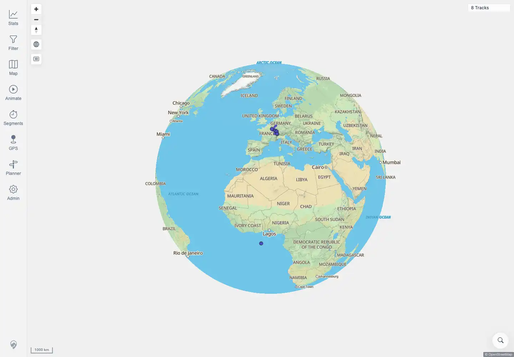

# Packet: MAP_01

## Scope

- Coverage source: `documentation/testing/frontend-regression-test-plan.md`
- Coverage ID or run packet: MAP_01
- In scope: Base map and overlays load on first authenticated map open.
- Out of scope: per-track count correctness; covered by MAP_02.

## Prerequisites

- Required previous coverage IDs or run packets: SGN_02.
- Required app/data state: authenticated session with imported tracks.
- Required browser context: authenticated desktop browser context.

## Allowed Mutations

- Allowed: open the map and zoom out.
- Not allowed: change map source settings.

## Actions And Results

| Coverage ID | Action | Expected result | Actual result | Status | Evidence |
|---|---|---|---|---|---|
| MAP_01 | Opened `/mtl/`, waited for network idle, zoomed out, and recorded map/tile/style requests and rendered canvases. | Base map and overlays load on first open. | PASS: two MapLibre canvases rendered and map config/status, style, sprite, and tile requests completed; the map UI showed OpenStreetMap attribution and track controls. | PASS | [assets/MAP_01_02-map-counts.txt](../assets/MAP_01_02-map-counts.txt); [assets/MAP_01_02-map-first-open.webp](../assets/MAP_01_02-map-first-open.webp) |

## Issues

| ID | Severity | Summary | Reproduction | Expected | Actual | Evidence | Release impact |
|---|---|---|---|---|---|---|---|

## Evidence Files

| File | Purpose |
|---|---|
| [assets/MAP_01_02-map-counts.txt](../assets/MAP_01_02-map-counts.txt) | Map canvas count, tile/style requests, and text evidence. |
| [assets/MAP_01_02-map-first-open.webp](../assets/MAP_01_02-map-first-open.webp) | First-open map screenshot after zooming out. |

## Screenshot Evidence

## Timings

| Step | Timing |
|---|---:|
| First map open and zoom-out check | ~7 seconds |

## Handoff Notes

- Completed: MAP_01 is terminal.
- Remaining unfinished coverage: MAP_02 onward.
- Blocked or not applicable: none.
- State left for the next packet: no app state changes.
