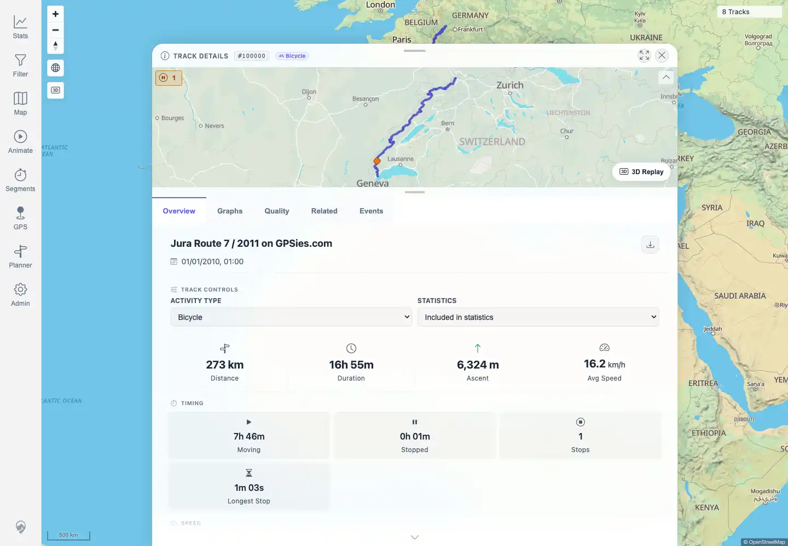
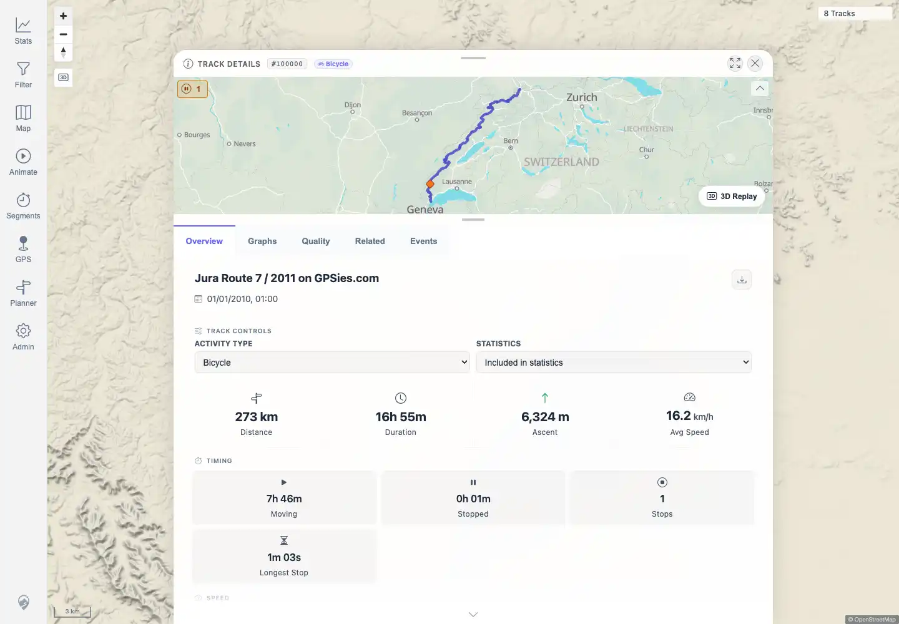

# Packet: MAP_05

## Scope

- Coverage source: `documentation/testing/frontend-regression-test-plan.md`
- Coverage ID or run packet: MAP_05
- In scope: Zooming into a real GPX-backed track increases available detail/precision without obvious broken lines.
- Out of scope: direction-arrow point markers; covered by MAP_07 and MAP_11.

## Prerequisites

- Required previous coverage IDs or run packets: MAP_01.
- Required app/data state: GPX-backed track `100000` available.
- Required browser context: authenticated desktop browser context.

## Allowed Mutations

- Allowed: open track detail and zoom the map.
- Not allowed: edit track data.

## Actions And Results

| Coverage ID | Action | Expected result | Actual result | Status | Evidence |
|---|---|---|---|---|---|
| MAP_05 | Opened `/mtl/track/100000`, captured map/detail state, zoomed in seven steps, and compared coarse and fine geometry. | Zoom in on a track -> detail/precision improves with no duplicate or broken lines. | PASS: track detail stayed open, map canvases rendered, track API requests loaded track `100000`, and 1m simplified geometry had 1,383 points versus 465 points at 100m, confirming higher precision was available after zoom/detail loading. | PASS | [assets/MAP_05-zoom-detail.txt](../assets/MAP_05-zoom-detail.txt); [assets/MAP_05-before-zoom.webp](../assets/MAP_05-before-zoom.webp); [assets/MAP_05-after-zoom.webp](../assets/MAP_05-after-zoom.webp) |

## Issues

| ID | Severity | Summary | Reproduction | Expected | Actual | Evidence | Release impact |
|---|---|---|---|---|---|---|---|

## Evidence Files

| File | Purpose |
|---|---|
| [assets/MAP_05-zoom-detail.txt](../assets/MAP_05-zoom-detail.txt) | Geometry precision and track API request evidence. |
| [assets/MAP_05-before-zoom.webp](../assets/MAP_05-before-zoom.webp) | Track detail before zoom-in sequence. |
| [assets/MAP_05-after-zoom.webp](../assets/MAP_05-after-zoom.webp) | Track detail after zoom-in sequence. |

## Screenshot Evidence

## Timings

| Step | Timing |
|---|---:|
| Track open and zoom check | ~10 seconds |

## Handoff Notes

- Completed: MAP_05 is terminal.
- Remaining unfinished coverage: MAP_06 onward.
- Blocked or not applicable: none.
- State left for the next packet: no app state changes.
