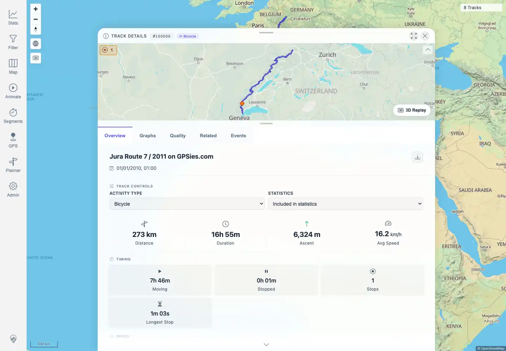
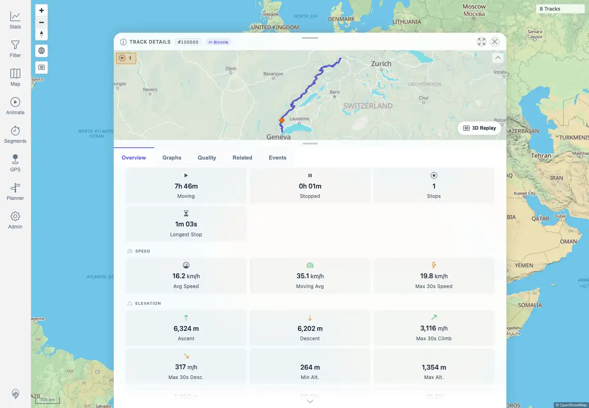

# Packet: MAP_06

## Scope

- Coverage source: `documentation/testing/frontend-regression-test-plan.md`
- Coverage ID or run packet: MAP_06
- In scope: Fast pan/zoom stress should not leave stale lines, missing tiles, or runaway loading spinners.
- Out of scope: normal zoom precision; covered by MAP_05.

## Prerequisites

- Required previous coverage IDs or run packets: MAP_05.
- Required app/data state: GPX-backed track `100000` available.
- Required browser context: authenticated desktop browser context.

## Allowed Mutations

- Allowed: rapidly pan and zoom the map around an imported track.
- Not allowed: change map source settings.

## Actions And Results

| Coverage ID | Action | Expected result | Actual result | Status | Evidence |
|---|---|---|---|---|---|
| MAP_06 | Opened `/mtl/track/100000`, rapidly dragged and zoomed the map, waited for settle, and monitored map/tile/API failures and visible loaders. | Fast pan/zoom does not leave stale lines, missing tiles, or runaway loading spinners. | PASS: the UI settled with track detail still open, map canvases rendered, and no visible loading/spinner/progress classes. The only 4xx/5xx responses were external Mapterhorn DEM tile 404s; follow-up triage rejected those as a product failure because the URL also returns 404 outside MTL Explorer and no app/API request failed. | PASS | [assets/MAP_06-pan-zoom-stress.txt](../assets/MAP_06-pan-zoom-stress.txt); [assets/MAP_06-mapterhorn-triage.txt](../assets/MAP_06-mapterhorn-triage.txt); [assets/MAP_06-before-stress.webp](../assets/MAP_06-before-stress.webp); [assets/MAP_06-after-stress.webp](../assets/MAP_06-after-stress.webp) |

## Issues

| ID | Severity | Summary | Reproduction | Expected | Actual | Evidence | Release impact |
|---|---|---|---|---|---|---|---|
| MAP-06-P3 | P3 | Rejected product issue: fast pan/zoom observes repeated external Mapterhorn DEM tile 404 responses. | Open `/mtl/track/100000`, rapidly pan/zoom around the track, and monitor map/tile responses. | No app-owned map/API request failures, stale lines, missing app-served tiles, or runaway loading state remain during the settled map interaction. | The app settled and loaders cleared; app/API failures were 0. `https://tiles.mapterhorn.com/4/6/5.webp` returned repeated 404 responses during the stress run, and follow-up triage confirmed the same URL returns 404 outside MTL Explorer while Mapterhorn TileJSON and another low-zoom tile return successfully. Code evidence shows this URL is used by the default topo hillshade/DEM source, not by an MTL-served app/API tile endpoint. | [assets/MAP_06-pan-zoom-stress.txt](../assets/MAP_06-pan-zoom-stress.txt); [assets/MAP_06-mapterhorn-triage.txt](../assets/MAP_06-mapterhorn-triage.txt); [assets/MAP_06-after-stress.webp](../assets/MAP_06-after-stress.webp) | REJECTED as a product defect: non-blocking upstream-provider gap from current evidence. Users may see missing hillshade/terrain pixels at that provider tile position, but the MTL Explorer workflow remained usable and app/API failures were 0. |

## Evidence Files

| File | Purpose |
|---|---|
| [assets/MAP_06-pan-zoom-stress.txt](../assets/MAP_06-pan-zoom-stress.txt) | Request failure/HTTP status and loader-settle evidence. |
| [assets/MAP_06-mapterhorn-triage.txt](../assets/MAP_06-mapterhorn-triage.txt) | Direct Mapterhorn provider checks and code-path evidence for non-blocking upstream classification. |
| [assets/MAP_06-before-stress.webp](../assets/MAP_06-before-stress.webp) | Before stress interaction. |
| [assets/MAP_06-after-stress.webp](../assets/MAP_06-after-stress.webp) | After stress interaction with map settled. |

## Screenshot Evidence

## Timings

| Step | Timing |
|---|---:|
| Pan/zoom stress and settle | ~9 seconds |

## Handoff Notes

- Completed: MAP_06 is terminal `PASS`; MAP-06-P3 is rejected as a product defect and retained as a non-blocking upstream-provider note.
- Remaining unfinished coverage: MAP_07 onward.
- Blocked or not applicable: none.
- State left for the next packet: no app state changes.
