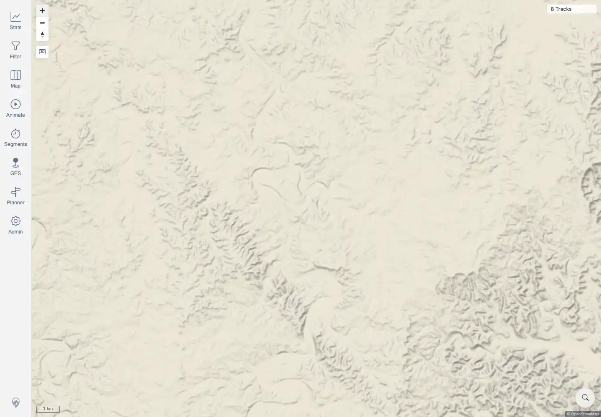

# Packet: MAP_07

## Scope

- Coverage source: `documentation/testing/frontend-regression-test-plan.md`
- Coverage ID or run packet: MAP_07
- In scope: Direction-arrow point markers at high zoom with Track Points & Direction enabled.
- Out of scope: point-popup behavior; covered by MAP_11.

## Prerequisites

- Required previous coverage IDs or run packets: MAP_05.
- Required app/data state: GPX-backed track `100000` available.
- Required browser context: authenticated desktop browser context.

## Allowed Mutations

- Allowed: enable Track Points & Direction and zoom/pan the map.
- Not allowed: fabricate marker evidence from API data alone.

## Actions And Results

| Coverage ID | Action | Expected result | Actual result | Status | Evidence |
|---|---|---|---|---|---|
| MAP_07 | Enabled Track Points & Direction, opened track `100000`, loaded 1m details, and attempted route-detail and cluster-targeted high-zoom positioning. | Direction arrows appear on tracks at high zoom when Track Points & Direction is enabled, using an actual visible point vertex. | BLOCKED: the layer could be enabled and track `100000` had 1,383 fine-geometry points, but repeated browser-controlled zoom attempts did not place a visible track/point vertex in the high-zoom screenshot. The MapLibre instance is not exposed for direct `queryRenderedFeatures` verification. | BLOCKED | [assets/MAP_07-track-points-direction.txt](../assets/MAP_07-track-points-direction.txt); [assets/MAP_07-invalid-high-zoom.webp](../assets/MAP_07-invalid-high-zoom.webp) |

## Issues

| ID | Severity | Summary | Reproduction | Expected | Actual | Evidence | Release impact |
|---|---|---|---|---|---|---|---|

## Evidence Files

| File | Purpose |
|---|---|
| [assets/MAP_07-track-points-direction.txt](../assets/MAP_07-track-points-direction.txt) | Blocker details and invalid-evidence explanation. |
| [assets/MAP_07-invalid-high-zoom.webp](../assets/MAP_07-invalid-high-zoom.webp) | High-zoom screenshot that lacks a visible track/point vertex. |

## Screenshot Evidence

## Timings

| Step | Timing |
|---|---:|
| Layer enable and high-zoom attempts | ~90 seconds |

## Handoff Notes

- Completed: MAP_07 is terminal as BLOCKED.
- Remaining unfinished coverage: MAP_08 onward.
- Blocked or not applicable: MAP_07 blocked by inability to reliably place/query a high-zoom rendered point vertex through browser-accessible controls.
- State left for the next packet: Track Points & Direction may remain enabled in local settings.
