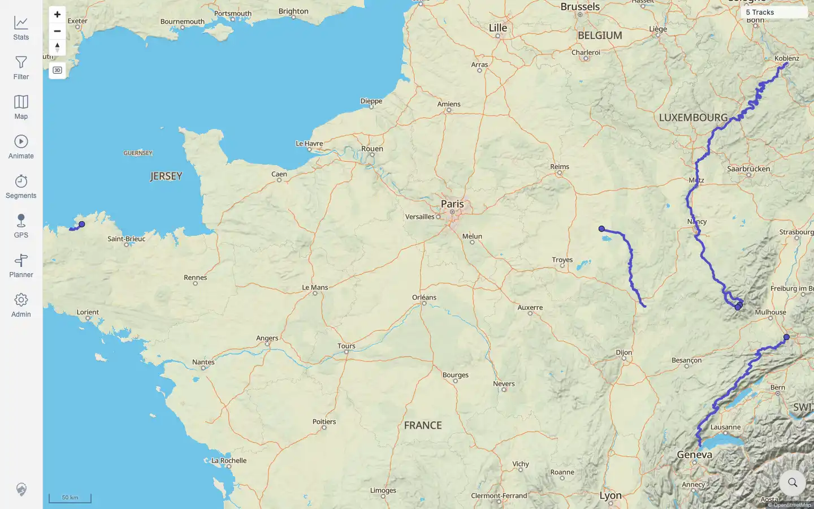

# Packet: MAP_08

## Scope

- Coverage source: `documentation/testing/frontend-regression-test-plan.md`
- Coverage ID or run packet: MAP_08
- In scope: Clicking a single rendered track opens details/highlight state.
- Out of scope: overlapping-track selection list; covered by MAP_09.

## Prerequisites

- Required previous coverage IDs or run packets: IMP_07.
- Required app/data state: imported GPX tracks visible during the earlier map-click pass.
- Required browser context: authenticated desktop browser.

## Allowed Mutations

- Allowed: use completed map-click evidence.
- Not allowed: re-import deleted tracks just to repeat this coverage.

## Actions And Results

| Coverage ID | Action | Expected result | Actual result | Status | Evidence |
|---|---|---|---|---|---|
| MAP_08 | Reused IMP_07 map-click evidence where rendered single-track geometries were clicked. | Clicking a single track highlights it and details open. | PASS: rendered map clicks for Lannion, Vitry, Mosel, and Jura opened their detail pages directly; clean map geometry was visible and no stale/duplicated geometry was observed. | PASS | [packets/IMP_07.md](IMP_07.md); [assets/IMP_07-map-clicks.txt](../assets/IMP_07-map-clicks.txt); [assets/IMP_07-clean-map-confirm.webp](../assets/IMP_07-clean-map-confirm.webp) |

## Issues

| ID | Severity | Summary | Reproduction | Expected | Actual | Evidence | Release impact |
|---|---|---|---|---|---|---|---|

## Evidence Files

| File | Purpose |
|---|---|
| [packets/IMP_07.md](IMP_07.md) | Original rendered-track map click packet. |
| [assets/IMP_07-map-clicks.txt](../assets/IMP_07-map-clicks.txt) | Per-track click coordinates and results. |
| [assets/IMP_07-clean-map-confirm.webp](../assets/IMP_07-clean-map-confirm.webp) | Clean map geometry used for click targeting. |

## Screenshot Evidence

## Timings

| Step | Timing |
|---|---:|
| Cross-reference assessment | ~2 seconds |

## Handoff Notes

- Completed: MAP_08 is terminal.
- Remaining unfinished coverage: MAP_09 onward.
- Blocked or not applicable: none.
- State left for the next packet: no new mutations for MAP_08.
