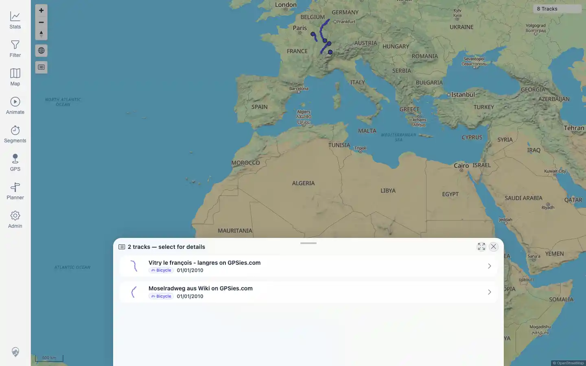
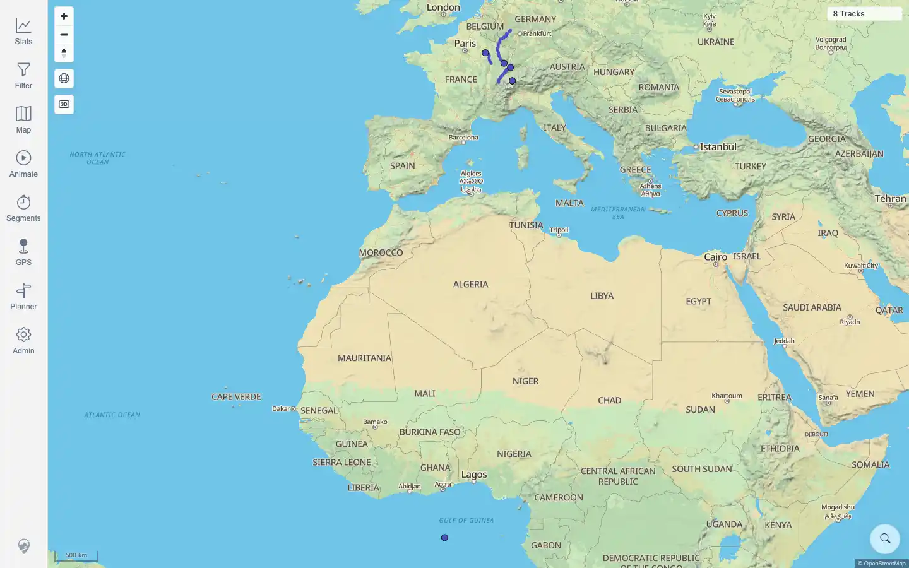

# Packet: MAP_10

## Scope

- Coverage source: `documentation/testing/frontend-regression-test-plan.md`
- Coverage ID or run packet: MAP_10
- In scope: Closing an open overlapping-track selection list and verifying the map returns to its normal state.
- Out of scope: selecting an item from the list; covered by MAP_09.

## Prerequisites

- Required previous coverage IDs or run packets: MAP_09.
- Required app/data state: current imported tracks visible on the map.
- Required browser context: authenticated desktop browser.

## Allowed Mutations

- Allowed: open and close map selection UI.
- Not allowed: change track data or persistent settings.

## Actions And Results

| Coverage ID | Action | Expected result | Actual result | Status | Evidence |
|---|---|---|---|---|---|
| MAP_10 | Opened the current overlap selection at viewport coordinate `(790,97)`, captured the two-track selection sheet, clicked the visible `Close` control, and verified map text/canvases afterward. | Closing the selection removes the selection list/details and returns the user to the normal map state. | PASS: the selection sheet opened for Vitry and Mosel, the close control removed the sheet, no detail page opened, the URL remained `/mtl/`, and two map canvases plus the `8 Tracks` legend remained. | PASS | [assets/MAP_10-selection-open.webp](../assets/MAP_10-selection-open.webp); [assets/MAP_10-selection-closed.webp](../assets/MAP_10-selection-closed.webp); [assets/MAP_10-selection-close.txt](../assets/MAP_10-selection-close.txt) |

## Issues

| ID | Severity | Summary | Reproduction | Expected | Actual | Evidence | Release impact |
|---|---|---|---|---|---|---|---|

## Evidence Files

| File | Purpose |
|---|---|
| [assets/MAP_10-selection-open.webp](../assets/MAP_10-selection-open.webp) | Selection list opened from overlapping rendered tracks. |
| [assets/MAP_10-selection-closed.webp](../assets/MAP_10-selection-closed.webp) | Normal map after closing the selection list. |
| [assets/MAP_10-selection-close.txt](../assets/MAP_10-selection-close.txt) | Click coordinates, close-button metadata, and pass/fail checks. |

## Screenshot Evidence

## Timings

| Step | Timing |
|---|---:|
| Open and close selection check | ~8.6 seconds |

## Handoff Notes

- Completed: MAP_10 is terminal.
- Remaining unfinished coverage: MAP_11 onward.
- Blocked or not applicable: none.
- State left for the next packet: normal map state; no data or persistent settings changed.
