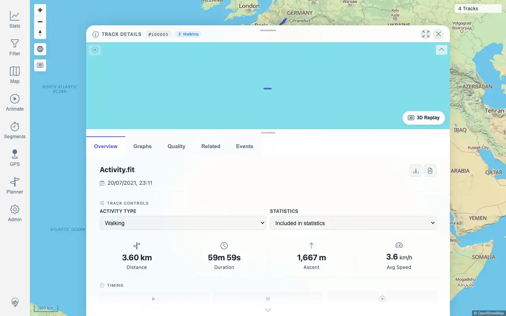

# Packet: MAP_11

## Scope

- Coverage source: `documentation/testing/frontend-regression-test-plan.md`
- Coverage ID or run packet: MAP_11
- In scope: Clicking a rendered track-point/direction marker and verifying the metric popup.
- Out of scope: Line-click or mini-map popup behavior when the click is not on an actual point marker.

## Prerequisites

- Required previous coverage IDs or run packets: MAP_07 and FIT_03.
- Required app/data state: Track Points & Direction available; a visible in-viewport point marker.
- Required browser context: authenticated desktop map with reliable marker targeting.

## Allowed Mutations

- Allowed: navigate the map and use existing point-popup evidence for comparison.
- Not allowed: fabricate a marker click from API data or non-marker line clicks.

## Actions And Results

| Coverage ID | Action | Expected result | Actual result | Status | Evidence |
|---|---|---|---|---|---|
| MAP_11 | Reviewed the MAP_07 marker-visibility attempt and FIT_03 point-popup evidence, then assessed whether a direct marker click could be executed in the current browser-controlled run. | Clicking an actual rendered track-point/direction marker opens a popup with point metrics such as time, speed, elevation, distance, and duration. | BLOCKED: FIT_03 proves the popup metric content path exists, but MAP_07 could not produce a visible/clickable marker, and the MapLibre `track-points-layer` is canvas-rendered without a deterministic browser-accessible query/targeting hook in this run. | BLOCKED | [assets/MAP_11-point-marker-blocked.txt](../assets/MAP_11-point-marker-blocked.txt); [assets/MAP_07-track-points-direction.txt](../assets/MAP_07-track-points-direction.txt); [assets/FIT_03-point-popup.webp](../assets/FIT_03-point-popup.webp); [assets/FIT_03-detail-tabs.txt](../assets/FIT_03-detail-tabs.txt) |

## Issues

| ID | Severity | Summary | Reproduction | Expected | Actual | Evidence | Release impact |
|---|---|---|---|---|---|---|---|

## Evidence Files

| File | Purpose |
|---|---|
| [assets/MAP_11-point-marker-blocked.txt](../assets/MAP_11-point-marker-blocked.txt) | Direct-marker-click blocking rationale and related popup evidence summary. |
| [assets/MAP_07-track-points-direction.txt](../assets/MAP_07-track-points-direction.txt) | Original high-zoom marker visibility blocker. |
| [assets/FIT_03-point-popup.webp](../assets/FIT_03-point-popup.webp) | Existing point-popup screenshot proving metric popup content, though not from a direct marker click. |
| [assets/FIT_03-detail-tabs.txt](../assets/FIT_03-detail-tabs.txt) | FIT_03 detail and popup observation log. |

## Screenshot Evidence

## Timings

| Step | Timing |
|---|---:|
| Marker dependency review | ~3 minutes |

## Handoff Notes

- Completed: MAP_11 is terminal as BLOCKED.
- Remaining unfinished coverage: MAP_12 onward.
- Blocked or not applicable: direct marker click requires a visible point marker plus deterministic canvas feature targeting or manual visual interaction.
- State left for the next packet: normal map state; no data or persistent settings changed.
