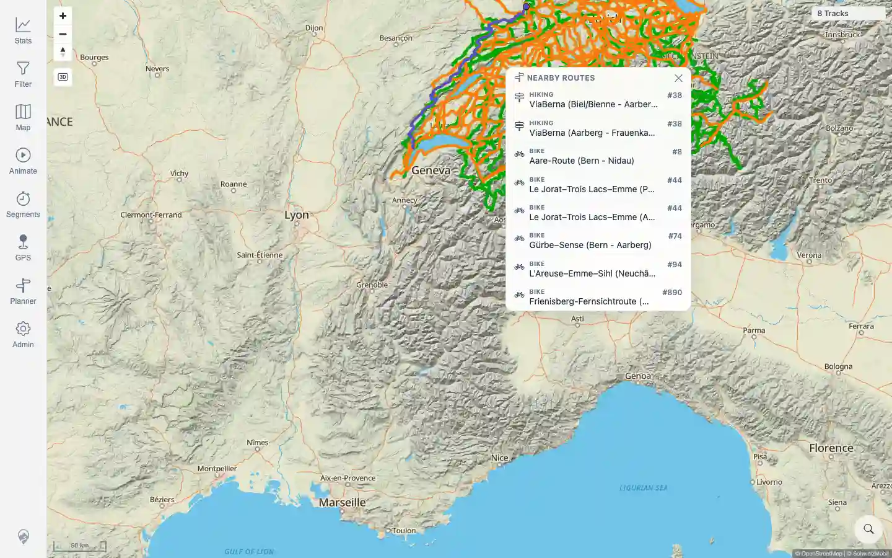
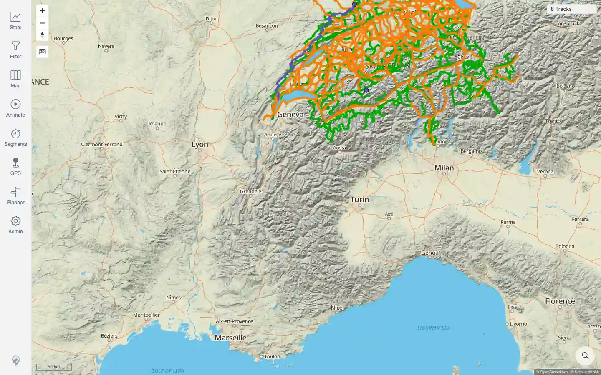

# Packet: MAP_12

## Scope

- Coverage source: `documentation/testing/frontend-regression-test-plan.md`
- Coverage ID or run packet: MAP_12
- In scope: Swiss Mobility route popup where Swiss overlays are applicable.
- Out of scope: changing persistent map settings for later packets.

## Prerequisites

- Required previous coverage IDs or run packets: MAP_01.
- Required app/data state: map loaded with Swiss overlay support available.
- Required browser context: authenticated desktop browser with transient Swiss overlay settings.

## Allowed Mutations

- Allowed: enable Swiss overlays in a transient browser context, zoom/pan, click route area, close popup.
- Not allowed: rewrite shared browser-state storage or mutate track data.

## Actions And Results

| Coverage ID | Action | Expected result | Actual result | Status | Evidence |
|---|---|---|---|---|---|
| MAP_12 | Enabled `wanderland` and `veloland` overlays in a transient browser context, zoomed toward Switzerland, clicked a Swiss route area, captured the popup, clicked its close control, and verified the popup disappeared. | Swiss Mobility popup shows nearby official routes and closes cleanly. | PASS: the map loaded SchweizMobil overlays, geo.admin identify returned route data, the popup listed official Hiking/Bike routes such as ViaBerna and Aare-Route, and closing removed `Nearby Routes` while the map remained usable. | PASS | [assets/MAP_12-swiss-popup.webp](../assets/MAP_12-swiss-popup.webp); [assets/MAP_12-swiss-popup-closed.webp](../assets/MAP_12-swiss-popup-closed.webp); [assets/MAP_12-swiss-mobility.txt](../assets/MAP_12-swiss-mobility.txt) |

## Issues

| ID | Severity | Summary | Reproduction | Expected | Actual | Evidence | Release impact |
|---|---|---|---|---|---|---|---|

## Evidence Files

| File | Purpose |
|---|---|
| [assets/MAP_12-swiss-popup.webp](../assets/MAP_12-swiss-popup.webp) | Swiss Mobility nearby-routes popup with official route names/numbers. |
| [assets/MAP_12-swiss-popup-closed.webp](../assets/MAP_12-swiss-popup-closed.webp) | Map after closing the popup. |
| [assets/MAP_12-swiss-mobility.txt](../assets/MAP_12-swiss-mobility.txt) | Overlay request counts, identify request/response, popup text, and close verification. |

## Screenshot Evidence

## Timings

| Step | Timing |
|---|---:|
| Overlay load, identify, close check | ~18 seconds |

## Handoff Notes

- Completed: MAP_12 is terminal.
- Remaining unfinished coverage: MAP_13 onward.
- Blocked or not applicable: none.
- State left for the next packet: saved browser-state file was not rewritten; no persistent setting or data mutation.
