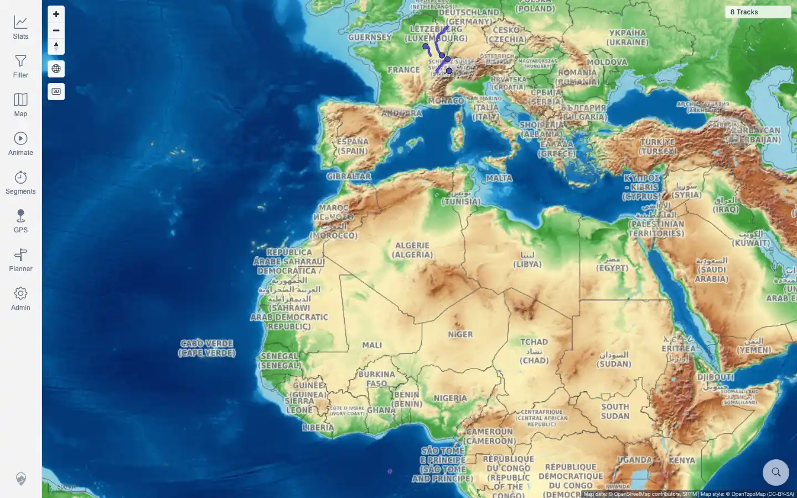
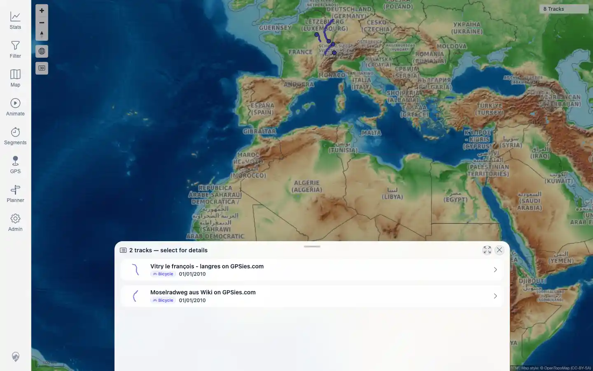

# Packet: MAP_14

## Scope

- Coverage source: `documentation/testing/frontend-regression-test-plan.md`
- Coverage ID or run packet: MAP_14
- In scope: Remote raster fallback when local-vector PMTiles fail at runtime.
- Out of scope: server-level remote tile mode; covered by MAP_13, and manual user override; covered by MAP_15.

## Prerequisites

- Required previous coverage IDs or run packets: MAP_13.
- Required app/data state: local-vector deployment with configured remote raster fallback styles.
- Required browser context: authenticated desktop browser where PMTiles requests can be safely aborted.

## Allowed Mutations

- Allowed: abort local PMTiles requests inside a single Playwright page context; pan/zoom/click map.
- Not allowed: alter server files, stop sidecars, or persist browser settings.

## Actions And Results

| Coverage ID | Action | Expected result | Actual result | Status | Evidence |
|---|---|---|---|---|---|
| MAP_14 | Aborted only `/mtl/api/map-proxy/prod/*.pmtiles` requests in the browser, waited for runtime recovery, then verified remote tile traffic, attribution, map canvases, track display, overlap selection, and pan/zoom behavior. | If local vector PMTiles fail at runtime, the map switches to remote raster, keeps attribution, and remains interactive with tracks/selectability. | PASS: local PMTiles fetches were aborted, the client logged `switched base map to raster fallback`, remote OpenTopoMap/OpenStreetMap tile requests loaded, two canvases and the 8-track map remained visible, overlap selection opened, and pan/zoom stayed usable. | PASS | [assets/MAP_14-runtime-fallback-map.webp](../assets/MAP_14-runtime-fallback-map.webp); [assets/MAP_14-runtime-fallback-selection.webp](../assets/MAP_14-runtime-fallback-selection.webp); [assets/MAP_14-runtime-fallback.txt](../assets/MAP_14-runtime-fallback.txt) |

## Issues

| ID | Severity | Summary | Reproduction | Expected | Actual | Evidence | Release impact |
|---|---|---|---|---|---|---|---|

## Evidence Files

| File | Purpose |
|---|---|
| [assets/MAP_14-runtime-fallback-map.webp](../assets/MAP_14-runtime-fallback-map.webp) | Remote raster fallback map after local PMTiles failure. |
| [assets/MAP_14-runtime-fallback-selection.webp](../assets/MAP_14-runtime-fallback-selection.webp) | Track selection still works over the fallback base map. |
| [assets/MAP_14-runtime-fallback.txt](../assets/MAP_14-runtime-fallback.txt) | Aborted local requests, remote tile samples, console fallback message, and interaction checks. |

## Screenshot Evidence

## Timings

| Step | Timing |
|---|---:|
| Runtime failure simulation and interaction check | ~17 seconds |

## Handoff Notes

- Completed: MAP_14 is terminal.
- Remaining unfinished coverage: MAP_15 onward.
- Blocked or not applicable: none.
- State left for the next packet: no server mutation and no saved browser-state rewrite; failure simulation was page-local.
