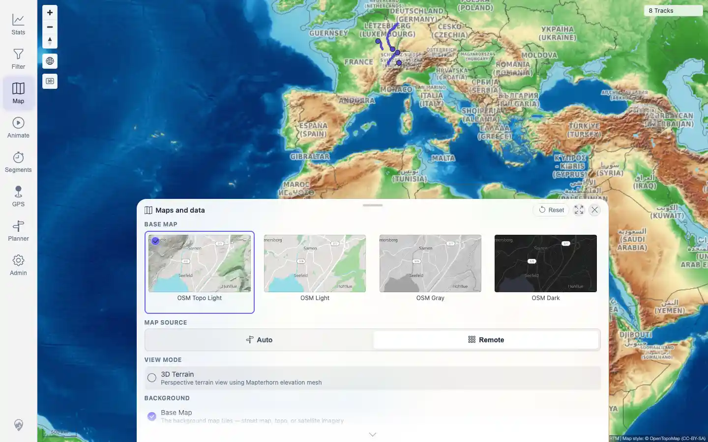
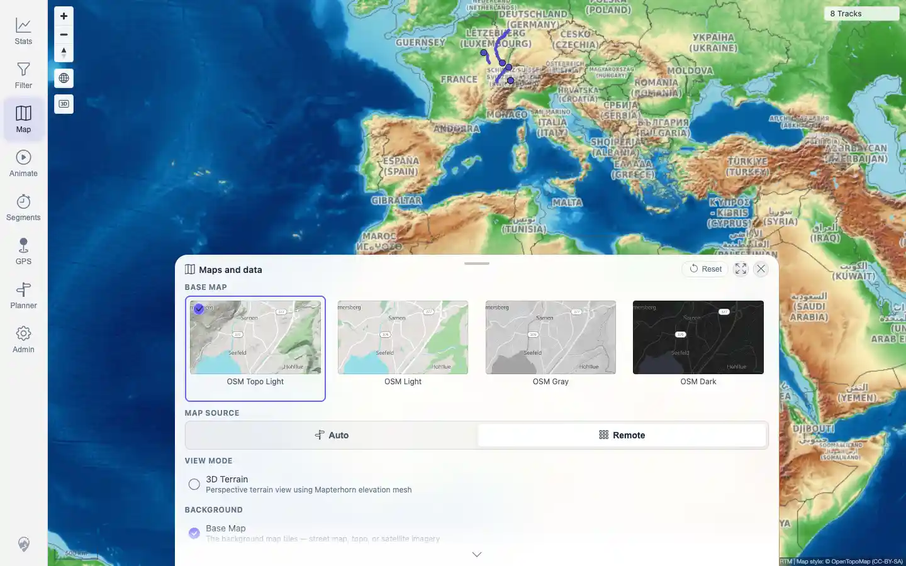
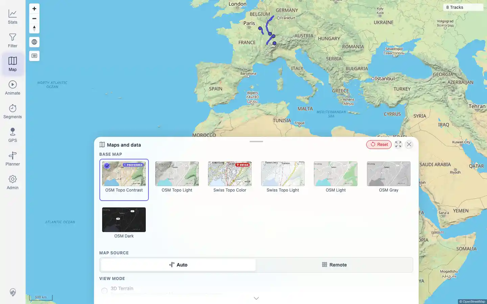

# Packet: MAP_15

## Scope

- Coverage source: `documentation/testing/frontend-regression-test-plan.md`
- Coverage ID or run packet: MAP_15
- In scope: Manual Remote map-source override in a local-vector deployment, reload persistence, theme filtering, and Reset.
- Out of scope: server-level remote tile mode; covered by MAP_13.

## Prerequisites

- Required previous coverage IDs or run packets: MAP_13 and MAP_14.
- Required app/data state: local-vector deployment with configured remote raster providers.
- Required browser context: authenticated desktop browser.

## Allowed Mutations

- Allowed: transient browser-context map settings changes; click Remote and Reset.
- Not allowed: rewrite shared browser-state storage or alter server configuration.

## Actions And Results

| Coverage ID | Action | Expected result | Actual result | Status | Evidence |
|---|---|---|---|---|---|
| MAP_15 | Opened Maps and data, switched Map Source from Auto to Remote, verified remote tile requests and theme filtering, reloaded and verified Remote persisted, then clicked Reset and verified Auto plus full theme list returned. | Remote mode loads configured remote raster tiles without `/api/map-proxy`; OSM raster themes remain, Swiss vector themes are hidden, setting persists after reload, and Reset restores Auto. | PASS: Remote mode used OpenTopoMap remote tiles with 0 map-proxy requests, showed only OSM Topo Light/Light/Gray/Dark, persisted after reload with 0 map-proxy requests, and Reset restored Auto plus Swiss Topo themes. | PASS | [assets/MAP_15-remote-source-panel.webp](../assets/MAP_15-remote-source-panel.webp); [assets/MAP_15-remote-persisted.webp](../assets/MAP_15-remote-persisted.webp); [assets/MAP_15-reset-auto.webp](../assets/MAP_15-reset-auto.webp); [assets/MAP_15-manual-remote-override.txt](../assets/MAP_15-manual-remote-override.txt) |

## Issues

| ID | Severity | Summary | Reproduction | Expected | Actual | Evidence | Release impact |
|---|---|---|---|---|---|---|---|

## Evidence Files

| File | Purpose |
|---|---|
| [assets/MAP_15-remote-source-panel.webp](../assets/MAP_15-remote-source-panel.webp) | Remote source active with only remote raster themes visible. |
| [assets/MAP_15-remote-persisted.webp](../assets/MAP_15-remote-persisted.webp) | Remote source still active after page reload. |
| [assets/MAP_15-reset-auto.webp](../assets/MAP_15-reset-auto.webp) | Reset restored Auto and full theme list including Swiss Topo themes. |
| [assets/MAP_15-manual-remote-override.txt](../assets/MAP_15-manual-remote-override.txt) | Request counts, source-mode state, visible theme lists, and persistence checks. |

## Screenshot Evidence

## Timings

| Step | Timing |
|---|---:|
| Remote switch, reload persistence, and reset | ~33 seconds |

## Handoff Notes

- Completed: MAP_15 is terminal.
- Remaining unfinished coverage: TRD_01 onward.
- Blocked or not applicable: none.
- State left for the next packet: no saved browser-state rewrite; Reset restored Auto inside the transient context.
